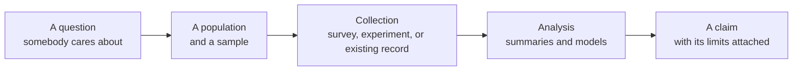

Before any technique, a question worth asking: why does anybody collect
data at all? The answer decides everything downstream — what to
collect, from whom, and what the eventual number is allowed to claim.

## Data does one of four jobs

- **Describe** what is happening: how many, how much, how often. A
  school's attendance figures, a census, a stock count.
- **Compare** two or more groups: did the students who used the
  drop-in centre pass at a higher rate?
- **Predict**: given this relationship, what should we expect next year?
- **Decide**: which of these two options should we fund, approve, or
  stop?

Each job puts different demands on the data. Describing needs
completeness. Comparing needs groups that are alike in every way except
the one being compared. Predicting needs the relationship to hold
outside the range you measured — an assumption that is often wrong and
almost never stated. Deciding needs all three plus an honest account of
what happens if the number is wrong.

## The chain from question to claim

Every link can break, and a broken link earlier is worse than a broken
one later. A brilliant analysis of a biased sample is a brilliant
analysis of nothing — which is why [[Sampling Techniques]] and [[Bias]]
come before the mathematics in this course rather than after it.

## Three sources, three sets of problems

| Where the data came from | Good for | Watch for |
| --- | --- | --- |
| A survey you ran | Questions nobody else asked | Who answered, and who did not |
| An experiment | Cause, not just association | Whether the groups were really alike |
| An existing record or open data set | Scale and history | It was collected for somebody else's purpose |

That last row is the one students meet most, because it is the easiest
data to get. A data set built for administration — enrolments, weather
stations, transit taps — was designed to answer somebody else's
question, and every one of its definitions was chosen for that purpose.
[[Reading a Data Dictionary]] is how you find out what its columns
actually mean before you use them.

## What a study cannot do

- It cannot make a biased sample representative by analysing it harder.
- It cannot turn a correlation into a cause without a design that
  supports it — [[Correlation and Causation]] is the whole argument.
- It cannot answer a question the data was never able to see. If nobody
  under 18 was surveyed, no amount of technique tells you what they
  think.

Being able to say what a study cannot support is the professional skill
here, and it is what [[The Statistical Claim Report]] is marked on.

## Who does this for a living

Data management is not one job; it is a layer inside dozens of them.

| Role | What the data work actually is |
| --- | --- |
| Actuary | Pricing risk — insurance and pensions — from mortality and claims data. Qualification is by a long series of professional examinations rather than by a single degree |
| Statistician | Designing studies and analysing them, in government, health, and research |
| Data analyst | Turning an organisation's own records into decisions somebody can act on |
| Epidemiologist | Disease patterns in populations: who, where, and what changed |
| Market researcher | Sampling, surveys, and what people will actually do rather than say |
| Quality control analyst | Sampling a production line and deciding when a process has drifted |
| Operations research analyst | Scheduling, routing, and capacity — optimisation with real constraints |
| Sports analyst | Performance and strategy from event-level data |

Two things are worth noticing about that list. Every role needs somebody
who understands the *subject* as well as the statistics — an
epidemiologist knows disease, a sports analyst knows the game — which is
the same pattern the collaborative fields show everywhere. And several
of them are qualified by examinations, licensing, or a professional body
rather than by a degree alone; the actuarial route is the clearest
example, and it starts with courses you could take next year.

If any of these interests you, the useful next step is not more reading
about the job. It is finding one person who does it and asking what
their week actually looks like.

%%curriculum-start%%
## Curriculum connection

![[C1.1]]

![[C1.2]]

![[D3.3]]

![[E1.5]]
%%curriculum-end%%
