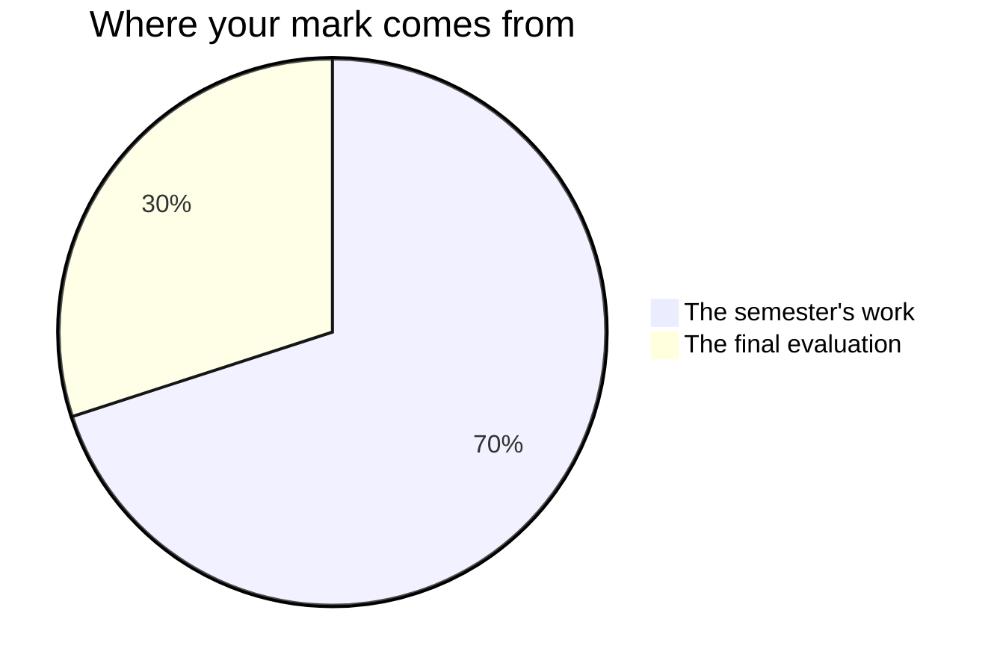

Marks in mathematics worry people, usually because of one
misunderstanding: that you are marked on speed, or on being a "math
person". You are not — no such person exists.[^1] You are marked on
**reasoning, growth, and communication** — things entirely inside
your control. In this course communication carries more weight than
it did in any earlier one, because a statistical result that nobody
can follow is not a result. It is a number.

## The seventy and the thirty

Every Grade 12 credit in Ontario is built the same way. Seventy per cent of
your mark comes from work you hand in across the semester, and it leans
towards your **most recent and most consistent** work rather than averaging
the start of the course against the end of it. The other thirty per cent
comes from a final evaluation at the end.

**The seventy** is the four tasks you hand in during the semester,
plus the milestone entries you write in your [[Math Journal]] during
class. In the order they launch: [[The Fair Game Audit]] in the first
unit, [[The Culminating Investigation]] in the second,
[[The Survey Autopsy]] in the third, and
[[The Statistical Claim Report]] in the fourth. The investigation
outweighs the other three together, because it runs longest, collects
a milestone every few classes all the way to the final fortnight, and
asks for everything at once; the three shorter tasks are the
rehearsals that make it survivable. Ask me for the exact split
whenever you like. It is not a secret; it is just not the useful
thing to memorise.

**The thirty** is two things, in two very different rooms.
[[The Data Symposium]] is the first: your investigation presented and
defended in front of the class and invited guests, plus the three
written critiques you produce there. [[The Final Examination]] is the
second, written on paper in the examination period, reaching across
the whole course rather than the last unit of it. The examination is
the larger of the two, and the split is deliberate: neither one
afternoon nor one project decides this on its own.

## Four kinds of thinking, not one

Every task asks for more than one of these, and the balance shifts
from task to task. A correct number is never the whole of it.

| What is being judged | What it means here |
| --- | --- |
| What you know | Terminology, notation, which distribution is which, what a sample is |
| How you think | Choosing a method, spotting the flaw in a study, deciding what the data cannot say |
| How you communicate | Graphs, captions, a conclusion in a sentence, your defence out loud |
| Where you apply it | Answering a question nobody worked through with you first |

The fourth is why [[The Culminating Investigation]] exists. Anyone can
analyse the data set the class analysed together; the course is asking
whether you can do it to a question of your own that nobody has solved
in front of you.

## Three kinds of evidence, and two of them are not paper

**What you make** is the obvious one: reports, tables, graphs,
critique sheets, journal entries. **What I watch you do** is the
second: whether you check who a sample missed before you run the
numbers, whether you look at the data before choosing a summary,
what you do when a result contradicts what you expected. **What you
tell me** is the third — the conferences inside every task's working
periods are not a progress check, they are evidence in their own
right, and some of what you understand will only ever appear there.

If you are quiet and your report is half-written, the conference is
often where the strongest evidence of the day comes from. That is not
a consolation. It is how the mark is meant to work.

## What is not in your mark

**The checkpoints are not marked.** The papers you write on your own
near the end of the first three units, and the retrieval clinics
before them, are marked by you, from the answers, with
[[Checking Your Own Work]] as the method — and the class after each
one opens with fifteen minutes to work the revision list it produced.
Their whole job is to tell you, and me, what to work on next while
there is still time to do it.

**Practice is not marked.** The check-your-understanding questions and
the nightly journal entries are yours. There is no graded homework in
this course. The journal entries that carry a mark are the milestone
ones written **in class** at the end of Units 1, 2 and 3, and
[[Final Reflection]], written in class on the last day before the
review classes begin.

**Class thinking is not marked, and it is not optional either.**
Whiteboard work is group work; nobody is graded on how much they
said, how fast they answered, or who held the marker. What I take
from those periods is evidence about *the mathematics* — a conjecture
you defended, an argument you repaired — which shows up in the same
places as everything else.

**Your judgement, and your classmates', are not part of your mark.**
You will assess your own work against the criteria constantly — see
[[Judging Your Own Work]] — because it is the fastest way to improve
it. The critique sheets you write at [[The Data Symposium]] are marked
on how useful *they* are to their author, and they change nobody's
mark but your own. Determining a mark is my job, from evidence.

**How you work is reported separately.** Responsibility, organization,
independent work, collaboration, initiative and self-regulation appear
on the same report card as **E, G, S or N**. They matter, we will talk
about them, and they do not move your percentage: the percentage is
about the work, that column is about the worker, and mixing the two
tells you less about both.

> [!note] The one exception, and it is narrow
> Where a habit is itself part of what the curriculum asks this course
> to teach, it is marked like anything else in the curriculum. In
> mathematics that is the process expectation on **reflecting** —
> monitoring your own thinking, judging whether a result is
> reasonable, verifying a solution. That is why every task asks you to
> name your own limitations, and why the limitations section of your
> investigation carries real weight. It is not a licence to mark
> effort.

## Group work, and the part that is yours

[[The Fair Game Audit]] and [[The Survey Autopsy]] are done in pairs,
and [[The Culminating Investigation]] may be a pair by agreement.
There is no shared mark. Each task page names the piece that is
evaluated as yours alone — a signed section, your own analysis of
particular questions, your own defence in the conference — and that
piece, plus what I see and hear from you while the pair works, is what
your mark is built from.

> [!important] First attempts are never penalised
> Rough work, wrong turns, and revised answers are how mathematics
> actually gets done. The mark follows where your understanding ends
> up and how visibly you got there. A dataset you abandoned for a
> reason you can name is evidence of learning, not a wasted month.

Every task page lists its success criteria before you start, in words
that describe what a reader could see in the work. If a mark ever
surprises you, ask — those criteria are the whole story, and
[[Getting Help]] lists the ways to reach me.

[^1]: Decades of research find no "math brain" — only differences in
    preparation, confidence, and how safe people feel making
    mistakes. That last one is why [[Our Classroom Norms]] exist.
