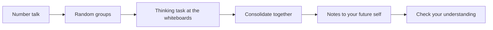

If your last math room ran on random groups and vertical whiteboards,
this will feel like coming home. If it did not: you will spend most
of class standing up, working at whiteboards, in groups you did not
choose — because that is how people think best, and thinking is the
whole point.[^1] This is the room where numbers get interrogated
before they get believed, and that is not a thing anyone can be
lectured into doing.

## Number talk

Most classes open with ten minutes of mental mathematics — a
[[Number Talks/index|number talk]] — done in heads, defended out
loud. No pencils, no calculators, no single right method. The method
you defend today becomes the method someone else reaches for
tomorrow.

About four classes in five have one. The days that do not are the ones
that need every minute for something else: the retrieval clinics and
the checkpoints at the end of each unit, the revision-and-journal day
that follows each checkpoint, the symposium, and the review classes at
the very end.

## Random groups, every day

Groups of three, drawn visibly at random at the door — cards, not
choices. Nobody owns a seat, nobody gets stuck being "the one who
writes", and within a few weeks you will have thought hard alongside
everyone in the room. It feels strange for about a week; then it
feels like the obvious way to run a room. There is also a joke buried
in it that this course is uniquely positioned to appreciate: the
cards are the only genuinely random sample any of us will meet all
semester.

## The thinking task

The heart of class: a problem worth standing up for, worked at the
vertical whiteboards — often an [[Explorations/index|exploration]],
often a problem you have NOT been shown how to do. That is
deliberate, and in this course it is usually a problem designed to
*surprise* you first. The shared birthday arrives before the word
"complement"; a survey that lies arrives before the word "bias"; a
gorgeous correlation between two unrelated things arrives before
anyone says "confounding variable". The idea gets its name and its
clean statement *after* you have been ambushed by the need for it.
Marker in hand, one rule: the person holding the marker writes only
other people's ideas.

Stuck is expected and useful — it is where the learning is
([[Getting Unstuck]] is a whole tutorial on being stuck well). I
answer questions that keep thinking alive and decline the ones that
would end it.

## Consolidate together

We tour the boards and rebuild the key ideas from what groups
actually did — starting from the simplest approach and climbing.
Seeing four routes to one answer is how you learn to choose routes;
your route being on a board matters more than it being finished.

## Notes to your future self

Then, and only then, notes: a few sentences and one worked example in
your own words, written for the version of you who opens the binder
in exam week having forgotten today. The
[[Concepts/index|concept pages]] hold the clean, complete statements
— your notes hold what YOU need to remember about them.

## Check your understanding, and the long thread

Class ends with two or three questions you try alone, and an entry in
your [[Math Journal]] the same evening. Neither is marked — the
journal entry that carries a mark is the milestone one you write in
class at the end of each unit, and [[How Marks Work]] sets out why.
The nightly pair exist so that you, not the checkpoint next week, are
the first to know what stuck and what needs
[[Getting Help|another pass]].

One thing runs underneath all of it from the second unit onward:
[[The Culminating Investigation]]. It is not a final assignment; it
is a semester-long piece of work that most classes touch in some
small way — a source found, a question narrowed, a technique tried on
your own data the day after we learn it.

> [!tip] If you were away
> Check the class page in All Classes, try the thinking task before
> reading anything else about it, then do the check-your-understanding
> questions. A genuine attempt teaches more than a perfect summary.

[^1]: The structure of this classroom — random groups, vertical
    whiteboards, tasks before technique — comes from Peter
    Liljedahl's research in *Building Thinking Classrooms in
    Mathematics* (2020), which measured where and how students
    actually think.
