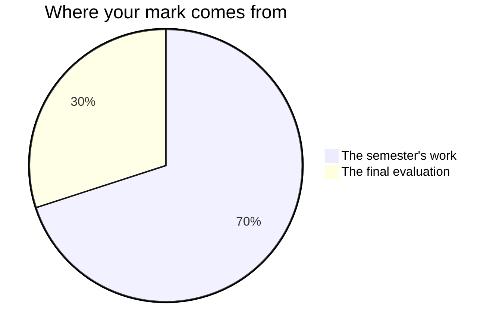

Marks in mathematics worry people, usually because of one misunderstanding:
that you are marked on speed, or on being a "math person". You are not —
no such person exists.[^1] You are marked on **reasoning, growth, and
communication** — things entirely inside your control. That does not
change in Grade 12, and it will not change in the course after this one.

## The seventy and the thirty

Every Grade 12 credit in Ontario is built to the same plan. Seventy per cent
of your mark is gathered while the course runs, and it is not an average: it
leans on your **most consistent** level of work and on your **most recent**
work, because a course is a thing you get better at and the mark is meant to
describe the mathematician who walks out at the end of the course. The
remaining thirty per cent comes from a final evaluation at the end.

**The seventy** is the four tasks you hand in as the units close —
[[The Rollercoaster]], [[Safe Concentration]],
[[The Sound of Two Waves]] and [[The Signature Function]] — each of them
together with the milestone journal entry you write **in class** on the
day it is handed in. That entry belongs to its task, not to your
[[Math Journal]], and each task page has a criteria row saying what it
has to do.

The four do not weigh the same. [[The Signature Function]] carries the
most: it is the culminating task, it runs across four periods, the
phenomenon is yours rather than mine, and it asks for a family defended
against a rival, two different rates of change, and an honest edge.
[[Safe Concentration]] carries the least — one data table, one model, one
window. Ask me for the exact split whenever you want it; it is not a
secret, it is just a poor thing to carry around in your head, and the
numbers are a professional judgement rather than a measurement.

**The thirty** is two evaluations in two rooms that could not be less
alike. At [[The Functions Symposium]] you stand beside your own model and
defend it to people who never took this course. At the
[[Final Examination]] you sit alone with paper, a calculator and one
formula sheet, and answer for all four strands. The examination is the
larger of the two. Two rooms on purpose: neither one afternoon of
talking nor one morning of writing should decide a semester by itself.

## Feedback, and where it lands

Each of the four tasks has a conference with me inside one of its
working periods, and the task time in the next working period opens
with acting on what that conference found — on
[[The Signature Function]], after ten minutes of self-check. On
[[The Rollercoaster]] the conference is about which constraint decides
the degree; on [[Safe Concentration]] it is what your model claims at
$t = 0$; on [[The Sound of Two Waves]] it is whether your predicted
period survived the throb you timed; on
[[The Signature Function]] it is what your function claims outside your
data. None of those is a progress check. Each one is a piece of the
evidence in its own right, and the period afterwards is where you act.

You also judge your own work against the criteria table before I ever
see it — [[Judging Your Own Work]] is the routine, and we run it together
the first time before you run it alone.

## Four kinds of thinking, not one

Every task asks for more than one of these, and which one leads changes
from task to task. The final number is never the whole of it.

| What is being judged | What it means here |
| --- | --- |
| What you know | Notation, vocabulary, what a factored or transformed form tells you at a glance |
| How you think | Choosing a method, conjecturing, proving, deciding whether an answer deserves belief |
| How you communicate | Graphs, sketches, notation, the written argument, and saying it out loud |
| Where you apply it | Getting the mathematics onto a situation nobody worked through for you first |

The fourth is why every task here is set in the world rather than on a
worksheet. Anybody can analyse the function they were handed; this course
asks whether you can find the function inside a ride, a dose, a pair of
tones, or a phenomenon nobody has ever set as a question.

## Three kinds of evidence, and only one is paper

**What you make** is the obvious one: profiles, models, proofs, write-ups,
milestone entries. **What I watch you do** is the second — whether the
sketch gets drawn before the screen is opened, what your pair does in the
ten seconds after two answers disagree, whether the domain gets written
down or remembered. **What you tell me** is the third, and the
conferences on task days are evidence in their own right: some of what
you understand will only ever appear there.

Board work is group work. On the days a task is running, what I watch you
do at the boards is evidence for that task, judged against the same
expectations as everything it hands in. On every other day the boards are
for learning and nothing at them is a mark. Either way there is no score
anywhere for taking part. If you are quiet and your page is unfinished,
the conference is often where the strongest evidence of the day comes
from — that is not a consolation prize, it is how the mark is built.

**Work done in pairs gets an individual mark, never a shared one.** Every
task page that puts you with somebody else names the piece that is
evaluated as yours alone — the constraint paragraphs with your initials
beside them, the half of the proof you wrote, the milestone entry, and
what you say when I ask you about it.

## What is not in your mark

**Practice is not marked.** The check-your-understanding questions, the
[[Exercises/index|practice sets]], the work you do between classes: none
of it is collected for a mark. It exists so that you, and not a piece of
paper next week, are the first to know where you stand.

**The unit checkpoints are not marked either.** At the close of each of
the first three units you write one alone, mark it yourself, and leave
with a revision list; the fourth unit ends in the review classes
instead. A judgement you make about your own work is never part of your
mark — that is Ontario policy rather than a house rule, and it is also
what makes those days safe to be honest on. Your classmates' judgements
are not part of it either, which is why trading pages and attacking each
other's reasoning costs nobody anything.

**Your [[Math Journal]] is read, not scored.** It comes in at the end of
each unit; I read every page and write back. The only entries that carry a
mark are the four written in class on hand-in days, and those belong to
their tasks. What you write at home is yours, and so is
[[Final Reflection]] — the piece of writing in this course I most want to
read and least want to put a number on. [[Showing Growth]] explains why
it becomes the best evidence you own; it is still not something I mark.

**Number talks carry no line of their own.** Asking the question half the
room needed is how this course runs, and it is not a category in your
percentage.

**How you work is reported separately**, on the same report card, as
**E, G, S or N** — six habits: responsibility, organization, independent
work, collaboration, initiative, and self-regulation. They matter, we
will talk about them, and they do not move your percentage. How often you
volunteer at the boards and how tidy your binder is belong in that column
and nowhere else.

There is one exception, and it is narrower than it looks. Of the seven
mathematical processes this course is built on — see [[Learning Goals]] —
one is a habit that the curriculum then defines precisely: *reflecting on
and monitoring your thinking*, spelled out as judging whether a result is
reasonable and verifying your own solutions. That is not self-regulation
smuggled back in. It is an expectation, and it is where the measured
misfit in [[Safe Concentration]], the miss you name and argue in
[[The Rollercoaster]], the gap you find in your own proof in
[[The Sound of Two Waves]], and the domain of honesty in
[[The Signature Function]] all come from. Where a task asks for it, it is
marked like anything else in the curriculum.

> [!important] First attempts are never penalised
> Rough work, wrong turns, and revised answers are how mathematics
> actually gets done. The mark follows where your understanding ends up
> and how visibly you got there — [[Showing Your Thinking]] is most of
> the discipline, and a model whose every parameter you can defend
> outranks a perfect fit you cannot explain. That standard is
> [[What Makes a Model Good]], and every task applies it.

Each task page lists its success criteria before you start, phrased as
things an observer could see in your work. If a mark ever surprises you,
ask — those criteria are the whole story, and [[Getting Help]] lists the
ways to reach me.

[^1]: Decades of research find no "math brain" — only differences in
    preparation, confidence, and how safe people feel making mistakes.
    That last one is why [[Our Classroom Norms]] exist.
