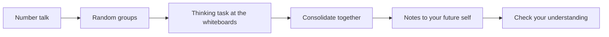

If your Grade 11 room ran on random groups and vertical whiteboards,
this will feel like coming home. If it did not: you will spend most
of class standing up, working at whiteboards, in groups you did not
choose — because that is how people think best, and thinking is the
whole point.[^1]

## Number talk

We open with ten minutes of mental mathematics — a
[[Number Talks/index|number talk]] — done in heads, defended out loud.
No pencils, no calculators, no single right method. The method you
defend today becomes the method someone else reaches for tomorrow.

## Random groups, every day

Groups of three, drawn visibly at random at the door — cards, not
choices. Nobody owns a seat, nobody gets stuck being "the one who
writes", and within a few weeks you will have thought hard alongside
everyone in the room. It feels strange for about a week; then it feels
like the obvious way to run a room.

## The thinking task

The heart of class: a problem worth standing up for, worked at the
vertical whiteboards — often an [[Explorations/index|exploration]],
often a problem you have NOT been shown how to do. That is
deliberate. The idea gets its name and its clean statement *after*
you have wrestled with it, not before — the graph sort before the
words "end behaviour", the wrapped radius before the word "radian".
Marker in hand, one rule: the person holding the marker writes only
other people's ideas.

Stuck is expected and useful — it is where the learning is
([[Getting Unstuck]] is a whole tutorial on being stuck well). I answer
questions that keep thinking alive and decline the ones that would end
it.

## Consolidate together

We tour the boards and rebuild the key ideas from what groups actually
did — starting from the simplest approach and climbing. Seeing four
routes to one answer is how you learn to choose routes; your route
being on a board matters more than it being finished.

## Notes to your future self

Then, and only then, notes: a few sentences and one worked example in
your own words, written for the version of you who opens the binder in
exam week having forgotten today. The
[[Concepts/index|concept pages]] hold the clean, complete statements —
your notes hold what YOU need to remember about them.

## Check your understanding

Class ends with two or three questions you try alone, and your
[[Math Journal]]. The questions are not collected, and nothing here
carries a mark — the journal comes in each unit to be read, not
scored, as [[How Marks Work]] sets out. They exist so
that you, rather than a paper at the end of the unit, are the first to
know what stuck and what needs [[Getting Help|another pass]].

> [!tip] If you were away
> Check the class page in All Classes, try the thinking task before
> reading anything else about it, then do the check-your-understanding
> questions. A genuine attempt teaches more than a perfect summary.

[^1]: The structure of this classroom — random groups, vertical
    whiteboards, tasks before technique — comes from Peter Liljedahl's
    research in *Building Thinking Classrooms in Mathematics* (2020),
    which measured where and how students actually think.
