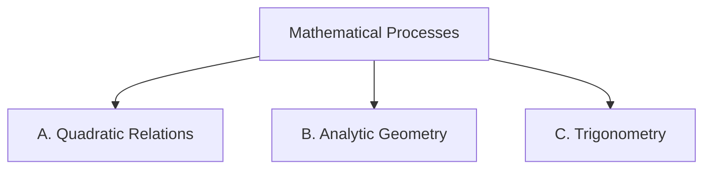

Everything we do in this course points at one or more of these
expectations, from **MPM2D — Principles of Mathematics, Grade 10,
Academic**. Lesson pages link here so you can always see *why* we are
doing something.

> [!info] Where these come from
> The wording below is the Ontario curriculum's own. See
> [[About These Expectations]] — including a note about the codes.

Seven mathematical processes run through every strand; the strands
name the mathematics itself.

## The mathematical processes

![[Mathematical Process Expectations]]

## Strand A. Quadratic Relations of the Form y = ax² + bx + c

*By the end of this course, students will:*

![[A1. Investigating the Basic Properties of Quadratic Relations]]
![[A1.1]]
![[A1.2]]
![[A1.3]]
![[A1.4]]

![[A2. Relating the Graph of y = x² and Its Transformations]]
![[A2.1]]
![[A2.2]]
![[A2.3]]
![[A2.4]]

![[A3. Solving Quadratic Equations]]
![[A3.1]]
![[A3.2]]
![[A3.3]]
![[A3.4]]
![[A3.5]]
![[A3.6]]
![[A3.7]]
![[A3.8]]

![[A4. Solving Problems Involving Quadratic Relations]]
![[A4.1]]
![[A4.2]]

## Strand B. Analytic Geometry

*By the end of this course, students will:*

![[B1. Using Linear Systems to Solve Problems]]
![[B1.1]]
![[B1.2]]
![[B1.3]]
![[B1.4]]
![[B1.5]]

![[B2. Solving Problems Involving Properties of Line Segments]]
![[B2.1]]
![[B2.2]]
![[B2.3]]
![[B2.4]]
![[B2.5]]

![[B3. Using Analytic Geometry to Verify Geometric Properties]]
![[B3.1]]
![[B3.2]]
![[B3.3]]

## Strand C. Trigonometry

*By the end of this course, students will:*

![[C1. Investigating Similarity and Solving Problems Involving Similar Triangles]]
![[C1.1]]
![[C1.2]]
![[C1.3]]

![[C2. Solving Problems Involving the Trigonometry of Right Triangles]]
![[C2.1]]
![[C2.2]]
![[C2.3]]

![[C3. Solving Problems Involving the Trigonometry of Acute Triangles]]
![[C3.1]]
![[C3.2]]
![[C3.3]]
![[C3.4]]
