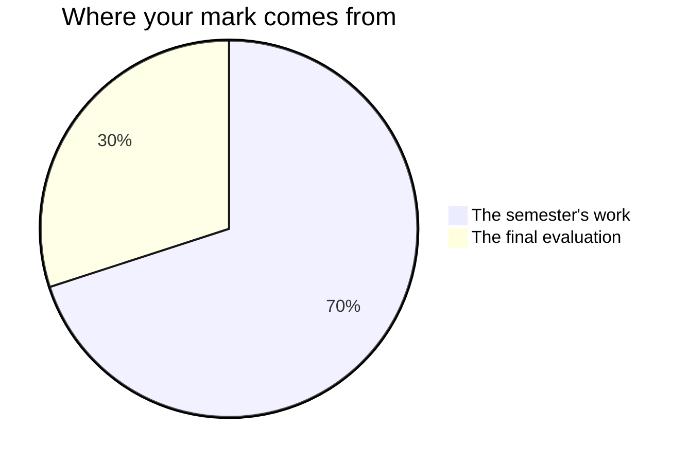

Marks in mathematics worry people, usually because of one misunderstanding:
that you are marked on speed, or on being a "math person". You are not —
no such person exists.[^1] You are marked on **reasoning, growth, and
communication** — things entirely inside your control.

## The seventy and the thirty

Every Grade 10 credit in Ontario is built the same way. Seventy per cent of
your mark comes from work spread across the whole semester, and it leans
towards your **most recent and most consistent** work rather than averaging
the start of the course against the end of it — the mathematician who
finishes this course is the one being reported on. The remaining thirty per
cent comes from a final evaluation at the end of it.

**The seventy** is the four tasks you hand in during the semester —
[[Break-Even]], [[The Quadrilateral Case File]], [[The Perfect Arc]] and
[[Inaccessible Heights]] — plus the milestone entries in your
[[Math Journal]]. They are not equally weighted: [[The Perfect Arc]] and
[[Inaccessible Heights]] carry the most, because each one asks for a
model, an honest account of its error, and a written defence of both, on
data you went out and gathered yourselves. [[Break-Even]] and
[[The Quadrilateral Case File]] are narrower — one situation, one
verdict — and count for less. Ask me for the exact split whenever you
want it — it is not a secret, it is just not the useful thing to
memorise.

A task's evidence is not only the thing you hand in. What you tell me in
its working-period conference belongs to that task too, and so does what
I watch you do while the group works — three sources, one mark, as below.
There is no separate line in the mark for turning up or joining in.

**The thirty** is two things, on two different days: [[The Math Symposium]],
where you defend a piece of your own work in conversation, and the
[[Final Examination]], written on paper under the same conditions as
everyone else. The examination is the larger of the two. Two very
different rooms, deliberately, so that neither one afternoon nor one
project decides this alone.

The [[Math Journal]] entries that count are the ones written **in class,
at a milestone** — the ten minutes set aside on each unit's collection day.
What you write at home between classes is yours, and it is worth writing,
but practice you do between classes is practice.

Three things you do constantly in this course are **not** in your mark at
all: the check-your-understanding questions after class, the practice sets,
and the end-of-unit checkpoint papers you mark yourself. Those exist so
that you — not a mark — are the first to know where you stand. A checkpoint
that told you what to work on has done its whole job.

## Four kinds of thinking, not one

Every task asks for more than one of these, and the balance shifts with
the task. A correct final number is never the whole of it.

| What is being judged | What it means here |
| --- | --- |
| What you know | Terminology, what a form of an equation tells you, which rule applies |
| How you think | Choosing a method, conjecturing, proving, judging whether an answer is reasonable |
| How you communicate | Diagrams, notation, the written argument, and saying it out loud |
| Where you apply it | Getting the mathematics onto a situation nobody worked through for you |

The fourth is why the tasks are set in the world rather than on a
worksheet. Anybody can solve the system that is handed to them; the course
is asking whether you can find the system inside a bake sale, a
photograph, or a tree you cannot walk up to.

## Three kinds of evidence, and two of them are not paper

**What you make** is the obvious one: pitches, case files, reports,
milestone journal entries. **What I watch you do** is the second — how a
group at the boards recovers when the first method fails, whether you
check an answer before you announce it, whether the diagram gets drawn
before the arithmetic starts. **What you tell me** is the third: the
conferences on task working days are not a progress check, they are
evidence in their own right, and some of what you understand will only
ever show up there.

Whiteboard work is group work, and what I take from it is evidence of
mathematical thinking, judged against the same expectations as everything
else — never a score for taking part. If you are quiet and your page is
unfinished, the conference is often where the strongest evidence of the
day comes from. That is not a consolation prize. It is how the mark is
meant to work.

## What is not in your mark

How you work is reported separately, on the same report card, as **E, G, S
or N** — six habits: responsibility, organization, independent work,
collaboration, initiative, and self-regulation. They matter, we will talk
about them, and they do not move your percentage. Your mark is about the
work; that column is about the worker, and mixing the two tells you less
about both.

The one exception is where a habit is itself part of what this course is
required to teach. Mathematics has seven process expectations running
through every strand, and two of them are habits by any other name:
*reflecting on and monitoring your own thinking*, and *communicating
mathematical thinking orally, visually, and in writing*. Where the
curriculum names it, it is assessed like anything else in the curriculum —
which is why your journal and your explanations count, and "took part
enthusiastically" never will.

Your own judgement of your work, and your classmates', are not part of
your mark either. You will judge your own work against the criteria often
— see [[Judging Your Own Work]] — because it is the fastest way to get
better, and trading work to have your reasoning attacked is how a proof
gets strong. But the mark is mine to determine, from evidence.

Work done in pairs and teams gets an **individual** mark, never a shared
one. Every task page that puts you in a group names the piece of it that
is evaluated as yours alone — usually the part you wrote, plus what you
said when I asked you about it.

> [!important] First attempts are never penalised
> Rough work, wrong turns, and revised answers are how mathematics
> actually gets done. The mark follows where your understanding ends up
> and how visibly you got there — [[Showing Your Thinking]] is most of
> the discipline.

If a mark ever surprises you, ask — the criteria on each task page are
the whole story, published before you start and phrased as things an
observer could see in your work, and [[Getting Help]] lists the ways to
reach me.

[^1]: Decades of research find no "math brain" — only differences in
    preparation, confidence, and how safe people feel making mistakes.
    That last one is why [[Our Classroom Norms]] exist.

%%curriculum-start%%
## Curriculum connection

![[Mathematical Process Expectations]]
%%curriculum-end%%
