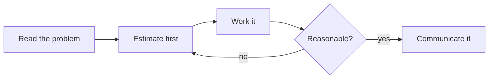
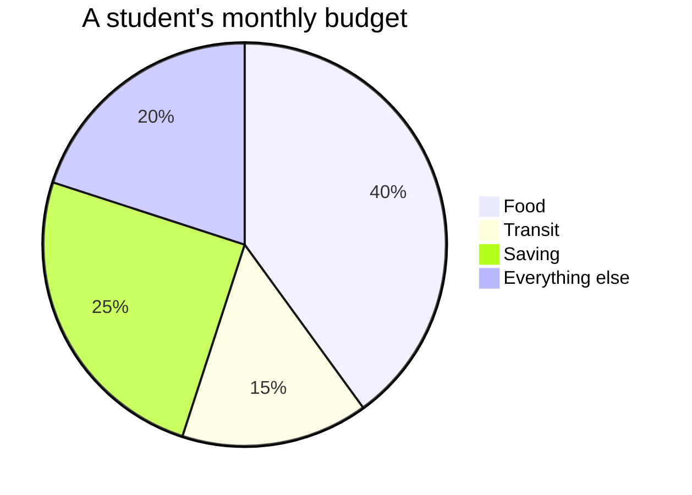
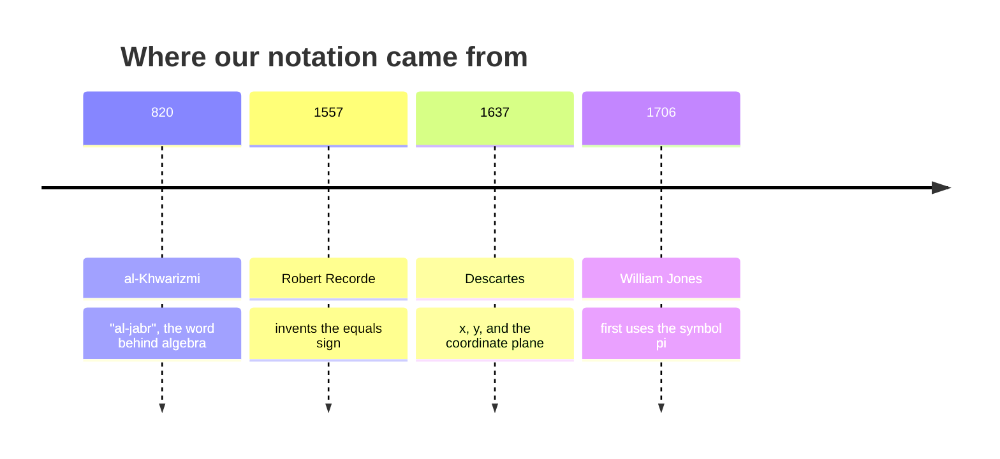

This page exists for two audiences. Students: it shows why the notes look
the way they do. Teachers: it is a working reference for everything you
can put in a page, with the source visible in every example.

Everything below is written in **Markdown** — plain text with a few marks
of punctuation that mean something. If you can write a text message, you
can write this.

---

## Text that carries meaning

You get **bold**, *italic*, ~~struck through~~, and ==highlighted== text.
Highlighting is the one worth knowing: it draws the eye better than bold
when you want a single ==key term== to stand out in a paragraph.

**How that was made:**

```markdown
**bold**, *italic*, ~~struck through~~, ==highlighted==
```

Arrows written as `->` become proper arrows: estimate -> refine -> check.

Keyboard keys look like keys: press <kbd>⌘</kbd> + <kbd>K</kbd> to search.

---

## Mathematics, typeset properly

This is the feature a mathematics course lives on. Inline maths sits in a
sentence: the slope is $m = 3$, so each step across climbs three. Display
maths gets its own centred line:

$$
\text{slope} = \frac{\Delta y}{\Delta x} = \frac{17 - 5}{6 - 2} = 3
$$

Fractions, exponents, roots, and symbols all come out exactly as they
should:

$$
\left(\frac{2}{3}\right)^2 = \frac{4}{9}
\qquad
\sqrt{a^2 + b^2}
\qquad
3.2 \times 10^{8}
$$

**How that was made:** single dollar signs keep it in the sentence,
double ones give it a line of its own.

```markdown
Inline: $m = 3$

Display:
$$
\text{slope} = \frac{\Delta y}{\Delta x}
$$
```

No more screenshotting equations out of a document — edit the text and
the mathematics re-typesets itself.

---

## Code (not used in this course — but here if you need it)

This course has no coding expectations, so you will not meet program
code in our pages. The site can carry it anyway — coloured, exact,
spacing preserved — which matters if you also teach a course that codes:

```python
def slope(x1, y1, x2, y2):
    return (y2 - y1) / (x2 - x1)

print(slope(2, 5, 6, 17))   # 3.0
```

**How that was made:** three backticks and the language name, the code,
then three backticks to close it.

---

## Headings, and the table of contents

Every `##` heading on a page becomes a link in **Navigate this page**,
over on the right — built automatically from the headings, so it can
never fall out of step with the page. Deeper headings nest underneath.

A short page reads better without a contents panel; one frontmatter line
(`enableToc: false`) turns it off. Every class page in
[[All Classes/index|All Classes]] does this — an agenda of six items does
not need navigating.

---

## Callouts

Callouts pull something out of the flow of the page, each kind with its
own colour and icon:

> [!note] Note
> Neutral information worth setting apart.

> [!tip] Tip
> A shortcut, a habit, or something that makes the work easier.

> [!important] Important
> The one thing to take away if you take away nothing else.

> [!warning] Warning
> Where people usually go wrong — the classic sign-error traps live in
> these boxes.

> [!question] Question
> Something to think about rather than something to know.

> [!abstract] At a glance
> Used at the top of task pages for format and timing.

**How that was made:** a blockquote with the kind named in brackets.

```markdown
> [!warning] Where people usually go wrong
> The text of the callout goes here.
```

### Foldable callouts

Add a `-` to start a callout collapsed. Every practice set in
[[Exercises/index|Exercises]] hides its worked answers this way — try
before you peek, but the peek is always there:

> [!success]- Worked answer (click to expand)
> $\frac{3}{4} + \frac{5}{6} = \frac{9}{12} + \frac{10}{12} = \frac{19}{12} = 1\frac{7}{12}$

```markdown
> [!success]- Worked answer (click to expand)
> The hidden solution.
```

---

## Diagrams

Diagrams are **written, not drawn** — edited in seconds, never needing a
graphics program.



**How that was made:**

````markdown

````

Proportions draw themselves too:



And history fits on a line:



---

## Tables

**How that was made:** rows of text separated by `|`, with a line of
dashes under the headings. Mathematics works inside cells, which matters
more than it sounds.

| Representation | Shows best | Hides |
| --- | --- | --- |
| Table of values | Exact pairs | The overall shape |
| Graph | Shape and trend | Exact values |
| Equation $y = mx + b$ | The rule itself | What it feels like |

---

## Checklists

**How that was made:** a list where each line starts with `- [ ]`, or
`- [x]` for one already done.

- [ ] Estimate before calculating
- [x] Units carried through the whole solution
- [ ] Answer sentence written
- [ ] Someone else could follow this page

On the site they are read-only — the boxes show what the page says, and
clicking one does nothing. Copied into your own notes, they are how
[[Showing Your Thinking]] turns from advice into habit.

---

## Links between pages

This is what makes the site more than a pile of documents.

- A plain link: [[The Vertex Form]]
- A link with different words: [[The Vertex Form|the parabola's turning point]]
- A link to a section: [[The Vertex Form#Completing the square]]

**How that was made:** double square brackets.

```markdown
[[The Vertex Form]]
[[The Vertex Form|different words for the link]]
[[The Vertex Form#Completing the square]]
```

### Transclusion — one page inside another

**How that was made:** `![[Page name]]` — a link with an exclamation mark
in front of it.
%%curriculum-start%%
Here is a curriculum expectation, embedded live rather than copied:

![[B2.1]]

Change the source page and every page that embeds it updates. This is how
each task page shows the expectations it addresses without anyone
maintaining duplicates.
%%curriculum-end%%

### Backlinks

Scroll to the bottom of any page and you will find **Backlinks** — every
page that links *to* this one, gathered automatically. Open
[[Quadratic Relations]] and its backlinks list every exploration and
practice set that leans on it. Nobody maintains that list.

---

## Hover previews

Hover over [[Getting Unstuck]] without clicking. The page appears in a
small window. Checking one definition mid-problem does not cost you your
place.

---

## Footnotes

**How that was made:** `[^1]` where the marker goes, and a matching
`[^1]:` line anywhere in the page.

The word "algebra" is a loanword from Arabic.[^1]

[^1]: From *al-jabr*, "the reunion of broken parts" — the title of
    al-Khwarizmi's 9th-century treatise on solving equations. Restoring
    balance to both sides is right there in the name.

---

## Tags

**How that was made:** a `tags` list in the frontmatter at the very top
of the page.

```yaml
---
tags:
  - concepts
  - unit-2
---
```

Every tag becomes a page listing everything filed under it.

---

## What you cannot see

Two things on this page are invisible in the browser:

1. **Comments.** Text wrapped in `%%` double percent marks `%%` never
   reaches the site. Useful for notes to yourself in a page you are
   still writing — tomorrow's hint, next year's fix.
2. **Holding a page back.** A page with `publish: false` in its frontmatter
   is left out when the site is built. Write next week's lesson today and
   publish it when you are ready. A page with no `publish` line is published,
   so forgetting it can never make your work vanish.

%% This sentence is a comment. If you can read it on the website, something is broken. %%

> [!tip] For teachers reading this
> With more than one section, per-section keys like `publishForSection1` and
> `publishForSection2` let one shared page be published to one class and held
> back from another — useful when your two sections sit a few days apart.

---

## The point of all this

None of it is decoration. Each feature removes a reason for a page to be
out of date:

| Feature | The problem it solves |
| --- | --- |
| Typeset maths | Screenshotted equations nobody can edit |
| Transclusion | The same text copied into six places, five stale |
| Backlinks | "Where did we use this again?" |
| Folded answers | Solutions that spoil the attempt |
| Holding a page back | Next week's lesson in a separate file somewhere |

Write it once, link to it everywhere.
