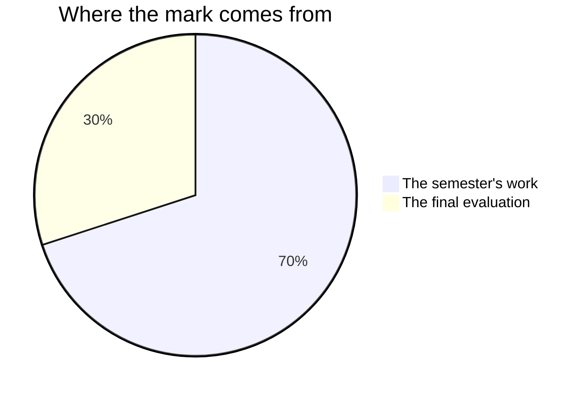

Marks in mathematics worry people, usually because of one misunderstanding:
that you are marked on speed, or on being a "math person". You are not —
no such person exists.[^1] You are marked on **reasoning, growth, and
communication** — things entirely inside your control.

## The seventy and the thirty

Every Grade 9 credit in Ontario is built the same way. Seventy per cent of
the mark comes from the work you do across the semester, weighted towards
your **most recent and most consistent** thinking rather than averaging the
start of the course against the end of it. The other thirty comes from one
final evaluation at the end of the course.

**The seventy** is the five tasks, in the order you meet them:
[[Fermi Festival]], [[Pattern Machines]], [[A Data Story]],
[[Design Under Constraints]], and [[The Money Decision]] — plus the
milestone entries in your [[Math Journal]]. They are not equally
weighted: [[A Data Story]] carries the most, because it runs longest
and asks for the whole arc of modelling at once, and the earlier tasks
are the rehearsals that make the later ones possible. Ask me for the
exact split any time you want it. It is not a secret; it is just not
the useful thing to memorise.

**The thirty** is [[The Math Fair]]: one exhibit, one growth statement,
and one conversation you defend. It reaches back across the whole
course on purpose — the concept you research and the problem you
re-solve can come from any unit, and the growth statement is built
from a journal that starts in week one.

Only the [[Math Journal]] entries written **in class, at a milestone**
carry a mark: your first entry, the entry written in class after each of
the three unit checkpoints, and the [[Final Reflection]]. Everything you
write between classes is yours. It is worth doing — it is where most of
your thinking gets caught — but practice done at home is practice, and I
do not mark it.

## Four kinds of thinking, not one

Every task asks for more than one of these, and the balance shifts from
task to task. A right answer is never the whole of it.

| What is being judged | What it means here |
| --- | --- |
| What you know | Facts, notation, and procedures you can carry out |
| How you think | Choosing a method, estimating, spotting what is wrong |
| How you communicate | Diagrams, graphs, written reasoning, what you say |
| Where you apply it | Using the mathematics on a problem nobody set up for you |

The last row is why [[The Money Decision]] uses somebody's real
situation and why [[The Math Fair]] asks you to re-solve a problem
differently. Anyone can finish the exercise that follows the lesson;
the course is asking whether the mathematics travels.

## Three kinds of evidence, and two of them are not paper

**What you make** is the obvious one: panels, machines, data stories,
designs, journal entries. **What I watch you do** is the second: how a
group at the boards tests an idea, whether an assumption gets written
down before or after the answer, what you do in the first minute of
being stuck. **What you tell me** is the third — the conferences during
working periods are not progress checks, they are evidence in their own
right.

If you are quiet and your page is unfinished, the conference is often
where the strongest evidence of the day comes from. That is not a
consolation prize. It is how the mark is meant to work.

## What is not in your mark

How you work is reported separately, on the same report card, as **E,
G, S or N** — six habits: responsibility, organization, independent
work, collaboration, initiative, and self-regulation. They matter, we
will talk about them often, and they do not move your percentage. The
mark is about the work; that column is about the worker, and mixing the
two tells you less about both.

Some courses have an exception, where a habit is itself named in the
curriculum and therefore marked like anything else in it. **This course
does not.** The one strand that names habits — the social-emotional
learning skills — is one the Ministry says is to be included in
classroom instruction but not in assessment, evaluation, or reporting.
So perseverance is why we work the way we do, and it is never a number.

Three more things carry no mark, deliberately:

- **Number talks and board work.** Whiteboard work is group work, and
  the thinking is shared — so a shared mark would tell me nothing about
  any one of you. It is where a great deal of the learning happens and
  none of the grading does.
- **The end-of-unit checkpoints.** You mark those against the posted
  solutions yourself, and write a revision list. Your own judgement of
  your work is not part of your mark — nor is a classmate's — so the
  checkpoint is free. Being wrong on it costs you nothing except the
  work of fixing it, which is the entire point.
- **The check-your-understanding questions** at the end of a class, and
  whatever you finish of them at home. They exist so that you, and not a
  checkpoint two weeks later, are the first to know what needs another
  pass.

You will judge your own work against the published criteria often — see
[[Judging Your Own Work]] — because it is the fastest way to get better.
The mark itself stays mine to determine, from evidence.

Where a task is done in a pair or a group, the mark is still yours
alone: every one of those task pages names the piece that is
individually judged, and that is the piece that carries your mark.

> [!important] First attempts are never penalised
> Rough work, wrong turns, and revised answers are how mathematics
> actually gets done. The mark follows where your understanding ends up
> and how visibly you got there.

Every task publishes its success criteria before you start, phrased as
things an observer could see in your work. In every unit you are given
class time to judge your own work against those criteria, and more class
time afterwards to change what you found — the next working period where
the schedule has one, and the rest of that period where it does not. If
a mark ever surprises you, ask: those criteria are the whole story, and
[[Getting Help]] lists the ways to reach me.

[^1]: Decades of research find no "math brain" — only differences in
    preparation, confidence, and how safe people feel making mistakes.
    That last one is why [[Our Classroom Norms]] exist.

%%curriculum-start%%
## Curriculum connection

![[A1. Mathematical Processes]]
%%curriculum-end%%
