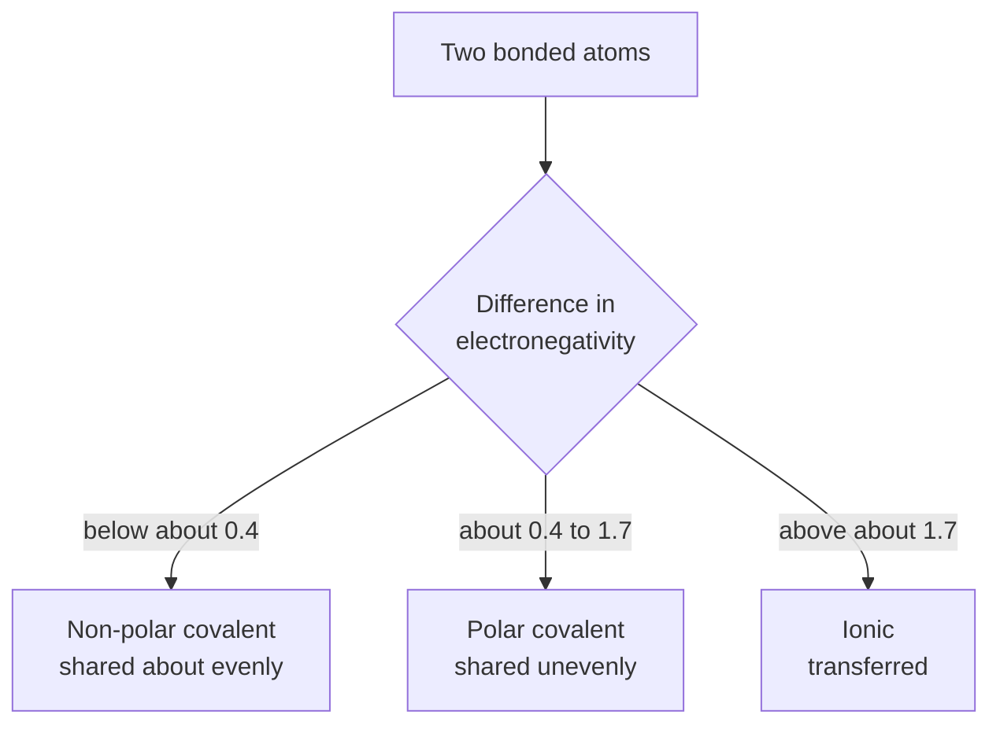

In [[Testing for Bond Type]] you had four unlabelled solids and three
tests: does it melt in a burner flame, does the solid conduct, does the
solution conduct. The results sorted themselves into two blunt groups
with almost nothing in between. That sorting is real, and it is not
about the substances looking different — it is about two genuinely
different ways of holding atoms together.

## Two ways to reach a filled outer shell

An atom is stable when its outer shell is full. There are exactly two
routes to that, and which one happens is decided by the trends in
[[Periodic Trends]].

**Transfer.** Put sodium next to chlorine. Sodium's outer electron is
held weakly — low ionization energy. Chlorine pulls hard on a stray
electron — high electron affinity. The electron moves across and stays
there. Now you have $\ce{Na+}$ and $\ce{Cl-}$, two oppositely
charged particles, and the **ionic bond** is nothing more exotic than
the electrostatic attraction between them.

The crucial consequence is that this attraction is not directional and
not paired off. A given $\ce{Na+}$ attracts *every* nearby
$\ce{Cl-}$, and each of those attracts every nearby $\ce{Na+}$, so
the ions stack into a three-dimensional **lattice** that continues to
the edge of the crystal. There is no such thing as a molecule of sodium
chloride. The formula $\ce{NaCl}$ states a ratio, not a particle.

**Sharing.** Put two chlorine atoms together instead. Both hold
electrons tightly; neither can take one from the other. What they can do
is put one electron each into a region between the two nuclei, where
both nuclei attract the pair at once. That shared pair is a **covalent
bond**, and because it belongs to those two atoms it *is* directional
and it *is* paired off. Two chlorine atoms make one $\ce{Cl2}$
molecule and then they are finished — the molecule has no leftover
attraction to offer, so the next $\ce{Cl2}$ along is held only by
weak forces.

That single structural difference explains everything you measured:

- Melting an ionic solid means overcoming attractions running through
  the entire lattice, which takes a great deal of energy. Sodium
  chloride melts at 801 °C.
- Melting a molecular solid means separating whole molecules from one
  another. The covalent bonds inside survive untouched — you are only
  breaking the weak attractions between molecules. Methane boils at
  −161 °C.
- Conduction needs charge carriers that can move. In a solid ionic
  lattice the ions are locked in place, so it does not conduct. Melt it
  or dissolve it and the ions are free, so it does. A molecular compound
  has no ions at any stage, so it never conducts.

## Electronegativity difference predicts the bond — usually

Transfer and sharing are the two extremes. Most real bonds sit
somewhere between, and the usual way to estimate where is to subtract
the two electronegativities.

Use it, and know what it is. Those cut-offs are a **convention**, not a
law of nature. Somebody chose them because they sort most compounds
into the categories chemists had already named from behaviour, and a
different textbook may print 1.8 or 2.0 without being wrong.

The counterexample to keep in mind is hydrogen fluoride. Fluorine is
3.98 and hydrogen is 2.20, a difference of 1.78 — over the line, so the
rule says ionic. Hydrogen fluoride is a gas at room temperature made of
discrete $\ce{HF}$ molecules. It is about as covalent as a compound
can be while still being ferociously polar.

So treat the number as evidence and the behaviour as the verdict. The
older heuristic — metal with non-metal is ionic, non-metal with
non-metal is covalent — agrees with electronegativity nearly always and
is quicker. When the two disagree, that is a compound worth looking at
rather than a rule to apply harder.

> [!tip] Say "mostly ionic", not "ionic"
> Bonding is a continuum. Even in sodium chloride the electron is not
> perfectly transferred, and even in $\ce{Cl2}$ the pair is not
> perfectly shared at every instant. Pure ionic and pure covalent are
> the ends of a line, and every real bond is a point somewhere on it.
> Writing "predominantly ionic, difference 2.23" is a better answer than
> "ionic" because it says what you measured as well as what you
> concluded.

## Polar bonds and polar molecules are not the same thing

When the sharing is uneven, the more electronegative atom takes more
than half the pair and picks up a partial negative charge, written
$\delta-$; the other end is $\delta+$. The bond has a direction to it —
it is a **dipole**.

A molecule with polar bonds is not automatically a polar molecule,
because dipoles can cancel. Carbon dioxide has two strongly polar
$\ce{C=O}$ bonds, and the molecule is linear, so the two pulls point
in exactly opposite directions and sum to nothing. $\ce{CO2}$ is a
non-polar molecule built entirely from polar bonds.

Water has the same two-polar-bond arrangement and is **bent**, so the
pulls do not cancel and the molecule has a definite negative end and
positive end. Everything unusual about water follows from that shape,
and [[Water and Solutions]] is that argument in full.

Getting the shape right is the point of building models, which is what
[[Lewis Structures and Models]] is for. Then [[Naming and Formulas]]
gives the two families their names — and once you can name a compound
from its formula, you can say what it will do before you touch it, which
is what [[The Unknown Substance]] asks of you.

%%curriculum-start%%
## Curriculum connection

![[B2.1]]

![[B2.5]]

![[B3.4]]
%%curriculum-end%%
