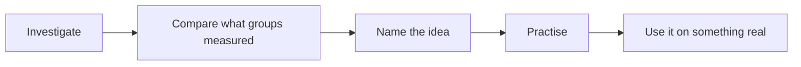

This is the first course you take that is only chemistry. Five units,
each building to a task where you do the thing rather than recite it,
and the last one culminating in work you present to the room.

## The five units

| Unit | What it is about | It ends with |
| --- | --- | --- |
| 1 | Matter, chemical trends, and bonding | [[The Unknown Substance]] |
| 2 | Chemical reactions | [[The Reaction Prediction]] |
| 3 | Quantities in chemical reactions | [[The Yield Investigation]] |
| 4 | Solutions and solubility | [[The Water Report]] |
| 5 | Gases and atmospheric chemistry | [[The Chemistry Showcase]] |

Unit 3 gets an extra class, deliberately. The mole is where this course
is actually difficult, and it is difficult for everybody, and building in
the time is cheaper than pretending otherwise.

## The shape of almost every topic

You meet an idea by working with it before it has a name. That is why
the investigation usually comes first and the concept page reads as
though you have already been there — you have.

When the room's numbers disagree, we spend the time on the
disagreement, because that is where the learning is. A class where every
group got the same tidy figure is usually a class where nobody had to
think, and it is also, quite often, a class where everybody made the
same systematic error and nobody noticed.

## What is different from Grade 10

| Last year | This year |
| --- | --- |
| You said what happened | You say **how much**, with units and the right significant figures |
| "The two were about the same" | "Unchanged to within the balance's resolution of 0.01 g" |
| You designed a fair test | You design the procedure and justify each controlled variable |
| A surprising result was a problem | A yield above 100% is information about your procedure |
| The report ended with the conclusion | The report ends with what your numbers cannot settle |
| Chemistry was one unit of four | Chemistry is the whole course, and the units build on each other hard |

None of that is harder because there is more to memorise. It is harder
because the answer stops being something I am holding, and starts being
something your measurements either support or do not — and because a
number, unlike a description, can be checked by anybody.

That last row is worth taking seriously. Unit 3 needs Units 1 and 2:
you cannot do stoichiometry on an equation you cannot write, and you
cannot write the equation without the formulas from Unit 1. Falling
behind in this course is not like falling behind in a survey course,
where the next unit starts fresh. Say something early.

## A typical unit

- **Lab days** are flagged on the class page the night before. Read the
  investigation first; you cannot design anything while standing at a
  bench reading the safety notes for the first time.
- **Consolidation days** are for comparing results and naming the idea.
  Bring your data — including the run that went badly.
- **Practice** happens in the Exercises pages, after the sense-making,
  never instead of it. These are the pages that make the mole automatic,
  and automatic is what you need it to be by Unit 4.
- **Journal entries** are written the day of the work, not the week
  before they are read. See [[Chemistry Journal]].

## What I expect

Turn up, bring your data, argue with each other, and say when you do not
follow something. The last one is the only one people find hard, and it
is the one that changes what you learn most. It is not itself part of
your mark — how you work is reported separately from what your work
shows, and [[How Marks Work]] explains where the line falls.

> [!note] Missing a class
> Read the class page — the agenda links everything we used, so you can
> reconstruct most of it on your own. What you cannot reconstruct is the
> lab, so come and see me and we will arrange the practical part. Do not
> quietly copy somebody's data; it will not tell you what the afternoon
> was for, and it is the one thing here that counts as dishonesty.

Next: [[How Marks Work]], [[What to Bring]], and [[Safety in the Lab]].
The goals for the whole course are set out in [[Learning Goals]].
