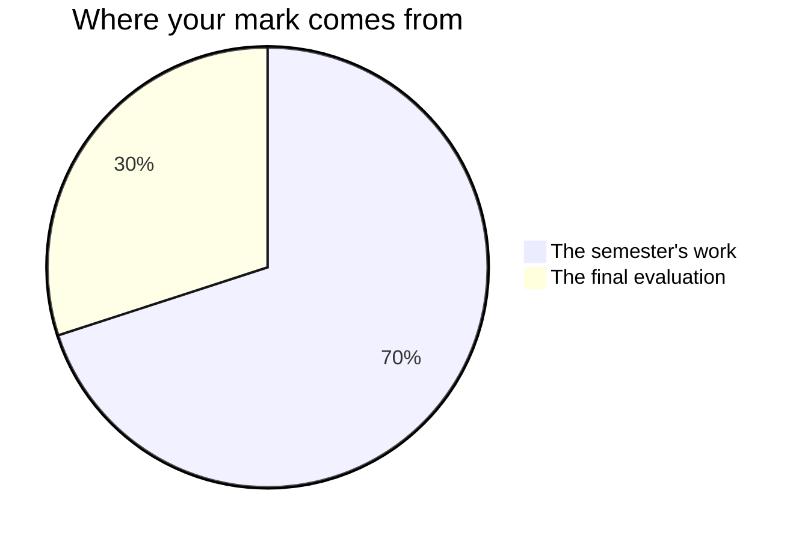

Everything I mark is written down before you start it. Every page in
[[Tasks/index|Tasks]] carries its criteria on the day it launches, every
page in [[Investigations/index|Investigations]] says what its analysis
has to answer and what you should not claim from it, and
[[Writing a Lab Report]] says what a complete report holds. If a task
page does not say how it will be judged, that is a bug — tell me and I
will fix the page.

## The seventy and the thirty

Every Grade 11 credit in Ontario is built the same way. Seventy per cent of
your mark comes from work spread across the whole semester, and it leans
towards your **most recent and most consistent** work rather than averaging
the start of the course against the end of it. The remaining thirty per cent
comes from a final evaluation at the end of the course.

**The seventy** is three things, and nothing else:

- the five term tasks — [[The Unknown Substance]],
  [[The Reaction Prediction]], [[The Yield Investigation]],
  [[The Water Report]] and [[The Air Quality Brief]];
- [[The Lab Reports]] — four write-ups, one per unit, each written in
  class in the period after the bench work;
- the milestone entries in your [[Chemistry Journal]], which means the
  ones written in class: the end-of-unit entries, the two
  [[Showing Growth]] comparisons, and [[Final Reflection]].

They are not equally weighted; the tasks carry most of it, because each
one asks for more at once, and the journal entries carry the least. Ask
me for the exact split whenever you want it — it is not a secret, it is
just not the useful thing to memorise.

**The thirty** is two things, on two different days:
[[The Chemistry Showcase]], where you explain and defend your own work
from across the whole semester, and the [[Final Examination]], written
under the same conditions as everybody else. Two very different rooms,
deliberately, so that neither one afternoon nor one investigation
decides this alone.

Nothing else moves your percentage. Practice sets, warm-ups, the mixed
clinics, the checkpoints you mark yourself, the six investigations that
are not written up formally, and being wrong out loud in a consolidation
discussion are all unmarked — so take more risks with them than you
probably will.

The rest of your [[Chemistry Journal]] is in that group too. What you
write between classes is yours: I read it, it is what makes the
milestone entries possible, and it is not something I mark.

## Four kinds of thinking, not one

Ontario reports chemistry in four categories, and they measure genuinely
different things.

| Category | The question it asks |
| --- | --- |
| Knowledge and understanding | Do you know the chemistry, and can you state it correctly? |
| Thinking and investigation | Can you design an investigation and reason from the data it gives you? |
| Communication | Could a reader who was not there follow you and check every number? |
| Application | Can you use the chemistry somewhere it has not been used for you? |

A perfect calculation with no unit, no route shown, and no sentence is
not a perfect answer. It is a strong Knowledge answer and a weak
Communication one, and the report card will say so. Every task asks for
more than one of these, and the balance shifts with the task.

## Where the weight actually sits

Thinking and investigation carries more of this course than any other
category, and that is deliberate. Following a procedure is not the skill
this course is about. **Deciding what to measure, choosing the glassware
that measures it well enough, noticing when a number is suspicious, and
judging what your data can and cannot support** — that is the thinking,
and this year you do it on procedures you designed yourself.

> [!important] The tidy report is not the strong report
> A careful investigation that names its limitations honestly — the
> balance's resolution, the precipitate you could not get off the filter
> paper, the endpoint you may have overshot — beats a beautifully
> presented one that quietly hides its problems. Every time, and by a
> long way.
>
> Naming a limitation costs you nothing and gains you everything,
> because it is direct evidence that you understand what your method
> could and could not do. Naming its **direction** — which way it pushed
> your number — gains you more, because that is evidence you understand
> the chemistry rather than the vocabulary.
>
> Hiding a limitation costs you the marks it would have earned **and**
> the trust that the rest of the report is accurate. And a percentage
> yield of exactly 100.0% is not the result that impresses me; it is the
> result I ask the most questions about.

## Significant figures are marked as a claim

This surprises people every year, so here it is in advance.

Reporting an answer to the wrong number of significant figures is not a
rounding nitpick and it is not a presentation issue. The digits you
write are a statement about how well you measured, so an answer with too
many digits is **overclaiming** — it says your balance was better than
it was — and an answer with too few is throwing away information the
instrument gave you.

Both are marked in the same category as any other unsupported claim.
This is not me being fussy; it is the one place in a school report where
the honesty of the whole thing is visible in a single character. See
[[Significant Figures in Practice]].

## Three kinds of evidence, and two of them are not paper

**What you make** is the obvious one: reports, briefs, data tables,
milestone journal entries. **What I watch you do** is the second, and in
a chemistry course it is the richest of the three: whether you rinse the
buret with the solution it will hold, whether you change one thing at a
time, whether you re-run a trial that looked wrong or quietly average
the tidier number in, whether the goggles go on before the bottle comes
out. **What you tell me** is the third — the conferences at the working
periods are not a progress check, they are evidence in their own right,
and some things you understand will only ever show up there.

If your report is unfinished and you are quiet, the two minutes at your
bench is often where the strongest evidence of the day comes from. That
is not a consolation. It is how the mark is meant to work.

## What a level 4 looks like here

| Category | Level 3 | Level 4 |
| --- | --- | --- |
| Knowledge | States the idea correctly | States it and knows where it stops applying |
| Thinking | Designs a workable procedure | Designs it, predicts with a mechanism, and explains the disagreement |
| Communication | Clear report, correct conventions | A reader who was not there can check every number |
| Application | Applies the idea to a new case | Chooses which idea applies, and justifies the choice |

The pattern down the right-hand column is the same every time: level 4
is not more work, it is **judgement**.

> [!question] Why do labs count as Thinking rather than Knowledge?
> Because the knowledge in a lab is the least demanding part of it. Any
> of you can be told a procedure and carry it out. Deciding what varies,
> what stays fixed, which glassware is precise enough for the claim you
> intend to make, how many trials are enough, and what the result is
> allowed to mean — that is the work, and that is what is assessed.

## What is not in your mark

How you work is reported separately, on the same report card, as **E,
G, S or N** — six habits: responsibility, organization, independent
work, collaboration, initiative, and self-regulation. They matter, we
will talk about them often, and they do not move your percentage. Your
mark is about the work; that column is about the worker, and mixing the
two tells you less about both.

There is one narrow exception, and in this course it is genuinely one.
Working **safely** at the bench is not only a habit here: expectation
A1.5 asks you to use materials and equipment safely, accurately and
effectively, so it is curriculum, and it is marked like any other part
of the curriculum. That is why [[Safety in the Lab]] is not a rule sheet
with no consequences attached. Nothing else on the habits list is
written into this course's expectations — organising your binder,
turning work in on time and pulling your weight in a pair are all real
and none of them is chemistry, so none of them is in your percentage.

Your own judgement of your work, and your classmates', are not part of
your mark either. You will assess your own work against the criteria
often — see [[Judging Your Own Work]] — because it is the fastest way to
get better. But the mark is mine to determine, from evidence.

> [!note] Work done with a partner
> Most of the bench work is done in pairs, and every task page that is
> done in pairs names the part that is written by you alone: the
> identification argument in [[The Unknown Substance]], the analysis of
> the gap in [[The Yield Investigation]], the limitations section in
> [[The Water Report]], the cumulative argument in
> [[The Air Quality Brief]], and everything from the analysis onward in
> [[The Lab Reports]]. That part, and what I see and hear at your bench,
> is what your mark rests on. [[The Reaction Prediction]] is yours from
> the first line: the two reactions you predict are given to you
> personally, and nobody else in the room has them.
>
> Nobody here is carried, and nobody is dragged down by a partner.

## Late work

Talk to me **before** the due date and we will make a plan that works.
After the fact is much harder for both of us, and there is far less I
can do. This is not a trick; the conversation genuinely goes better
early.

Related: [[Writing a Lab Report]], [[Judging Your Own Work]],
[[Journal Checklist]], and [[Getting Help]].
