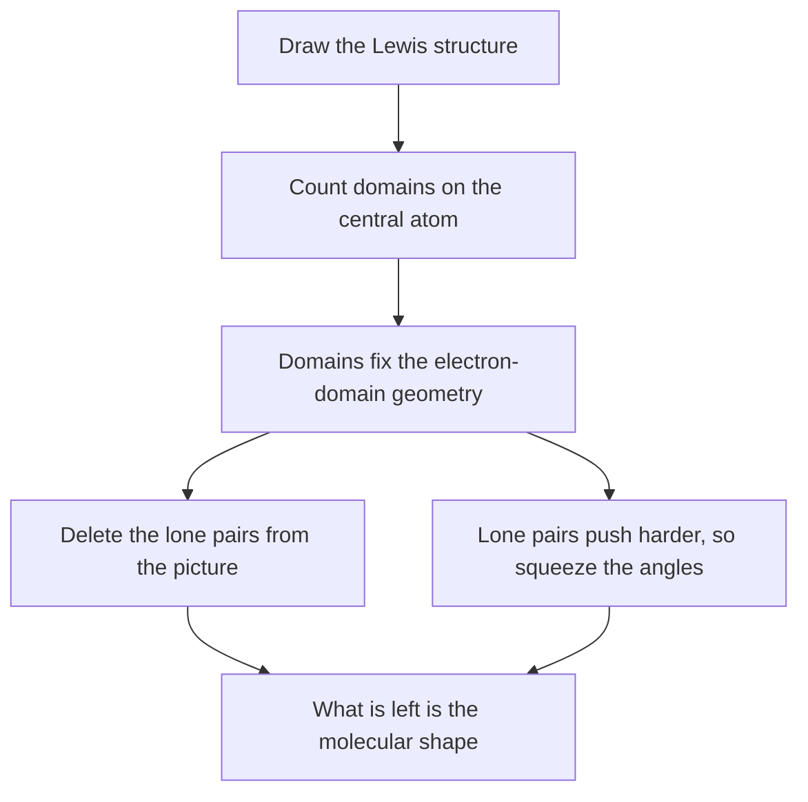

In [[Building and Testing Models]] you were asked to predict a shape
before you were allowed to look one up, and then build it. Some of those
predictions were right for the wrong reason. A Lewis structure is drawn
flat on a page, and nothing about the drawing tells you that the four
hydrogens of methane are not at the corners of a square.

They are not, and the reason is embarrassingly simple: **groups of
electrons around a central atom push each other as far apart as they can
get.** That is the whole of the valence shell electron pair repulsion
model. Everything below is consequences.

## Count domains, not atoms

An **electron domain** is one region of electron density around the
central atom. Count them like this:

- Every **single bond** is one domain.
- Every **double or triple bond** is *also* one domain. The extra pairs
  are in the same region of space, pointing the same way, so they do not
  buy an extra direction.
- Every **lone pair** on the central atom is one domain.

That second rule is the one people drop. Carbon dioxide has four bonding
pairs and only **two** domains, which is why it is linear.

The number of domains fixes the **electron-domain geometry** — how the
regions arrange themselves. What you then *see* is the **molecular
shape**, which is the arrangement of the atoms only, with the lone pairs
invisible. These two are not the same thing and naming them separately
is not pedantry: water and methane both have four domains and nobody
would call them the same shape.

## The shapes this course needs

| Domains | Lone pairs | Electron-domain geometry | Molecular shape | Ideal angle | Example |
| --- | --- | --- | --- | --- | --- |
| 2 | 0 | linear | linear | 180° | $\ce{CO2}$ |
| 3 | 0 | trigonal planar | trigonal planar | 120° | $\ce{SO3}$ |
| 3 | 1 | trigonal planar | bent | just under 120° | $\ce{SO2}$ |
| 4 | 0 | tetrahedral | tetrahedral | 109.5° | $\ce{CH4}$, $\ce{NH4+}$ |
| 4 | 1 | tetrahedral | trigonal pyramidal | about 107° | $\ce{NH3}$ |
| 4 | 2 | tetrahedral | bent | about 104.5° | $\ce{H2O}$ |

Two atoms are always linear, whatever else is going on, which is why
$\ce{O2}$ needs no model at all.

The full table, including the five- and six-domain shapes, lives in
[[VSEPR Shapes]]. Keep it beside you until the first six rows are
automatic — and they should become automatic, because
[[Polarity]] is built on top of them and you cannot do that page while
still deriving this one.

## Lone pairs push harder

Look at the last three rows of that table. Same four domains, same
tetrahedral arrangement of the domains, and the bond angle falls each
time a bonding pair is swapped for a lone pair: 109.5°, then about 107°,
then about 104.5°.

A lone pair is held by one nucleus. A bonding pair is held between two,
which draws it in and makes it narrower. So the lone pair is the fatter
region, and it takes more room. The repulsions rank:

$$\text{lone pair--lone pair} > \text{lone pair--bonding pair} > \text{bonding pair--bonding pair}$$

That single ordering predicts the compression, and it predicts that
water's angle is squeezed harder than ammonia's, because water is being
squeezed by two lone pairs rather than one. You can check that against a
measured value, and it holds.

> [!tip] Predict the number before you predict the shape
> The most common failure is not getting the geometry wrong — it is
> counting domains wrong, usually by treating a double bond as two. Say
> the count out loud before you say the shape. "Three domains, one of
> them a lone pair, so bent" is a sentence that can be checked at every
> comma.

## Where VSEPR stops being true

VSEPR is unreasonably good for its cost, and it has hard limits you
should be able to state.

- **It predicts geometry and nothing else.** It says nothing about bond
  strength, bond length, or why the bond formed at all. It is a model of
  *arrangement*, laid on top of a Lewis structure it did not derive.
- **A multiple bond is not really one domain.** Treating it as one is an
  approximation that works because the extra density points the same
  way — but it is slightly fatter than a single bond, so it squeezes its
  neighbours a little. That is why formaldehyde's H–C–H angle is not
  exactly 120°.
- **It fails outright on $\ce{O2}$.** Draw the Lewis structure and
  you get a double bond with all electrons paired, which predicts that
  liquid oxygen is not attracted to a magnet. It is — visibly. Oxygen is
  paramagnetic, it has two unpaired electrons, and neither Lewis
  structures nor VSEPR can say so. Explaining that needs molecular
  orbital theory, which is past this course but not past this century.

The last point is worth sitting with. VSEPR is right about the shape of
almost everything you will be asked about and wrong about the electronic
structure of the second-most common molecule in the room. Knowing which
question a model answers is the skill.

> [!info] A Canadian model
> VSEPR was developed by **Ronald J. Gillespie** at McMaster University
> in Hamilton, working with Ronald Nyholm. The curriculum names his work
> explicitly — see [[Atomic Structure and Orbitals]] for the other
> Canadian contributions to this part of chemistry.

Practise the counting in [[Shapes and Polarity Practice]], then carry
the shapes forward into [[Polarity]], where geometry stops being a
picture and starts predicting whether two liquids will mix.

%%curriculum-start%%
## Curriculum connection

![[C2.1]]

![[C2.3]]
%%curriculum-end%%
