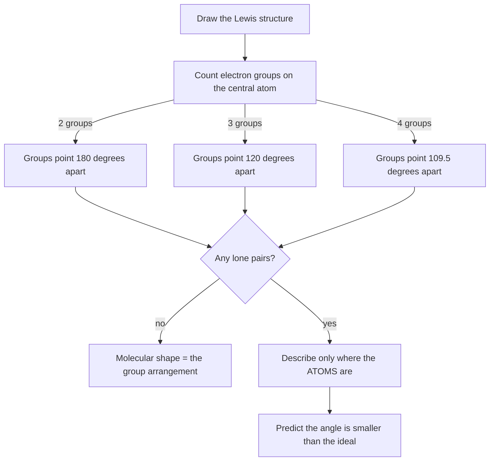

A chemical formula is a list of ingredients. It says $\ce{CH4}$ has
one carbon and four hydrogens, and it says nothing whatever about where
those hydrogens are. They could be in a flat cross. They could be in a
line. They are neither, and the difference matters enormously for
everything you measured last class.

Today you find out whether a shape can be **predicted from a count** —
before you build it, before you look it up, and before anybody gives you
a rule with a name on it.

## What you are trying to find out

Here is the claim you are going to test. It is a claim about electrons,
and it has exactly one moving part.

> Groups of electrons around a central atom push each other apart, and
> they arrange themselves as far apart as they can get. Count the
> groups, and the shape follows.

A "group" is a bond or a lone pair. A double bond counts once, because
both of its pairs are pinned between the same two atoms. That is the
whole model, and the point of this class is to find out how far it gets
you and where it stops.

Two things you are really testing:

1. **Can you predict, from a Lewis structure alone**, the arrangement a
   model kit will produce when you build it?
2. **Where does the prediction go wrong?** The model has a boundary. You
   will find it by building the molecules where a lone pair is involved
   and comparing the angle you predicted with the angle the data booklet
   reports.

## The counting path you are testing

Follow this for each molecule. It is written as a flow chart because
that is honestly what it is — a sequence of yes-or-no questions with a
shape at the end of every branch.

The last two boxes are the ones people skip, and they are where the
marks are. **The shape of a molecule is named after where its atoms
are**, not after where its electron groups are — a lone pair is real,
it takes up room, and it is invisible in the name.

## What you have to work with

- **Molecular model kits.** One per pair, shared honestly.
- **The molecule list**, which is on the board and includes at minimum
  $\ce{CH4}$, $\ce{NH3}$, $\ce{H2O}$,
  $\ce{NH4+}$, $\ce{SO3}$, $\ce{CO2}$, $\ce{O2}$,
  $\ce{BF3}$, and $\ce{CH3OH}$.
- **A protractor**, which is not a joke. You are going to measure angles
  on the models you build.
- The data booklet, **closed until your predictions are written down**.

Your design decisions, written before you open the kit:

- **The order you will work in.** Build the ones with no lone pairs
  first, or mix them? There is an argument for each and I want yours.
- **How you will measure an angle on a three-dimensional object.** A
  protractor is a flat instrument and a tetrahedron is not flat. Say how
  you will handle that, and what precision you think you can get. If
  your answer is "to the nearest 5 degrees", that is an honest answer
  and it is better than pretending to 0.1°.
- **What you will do with $\ce{O2}$.** It has no central atom. Decide
  in advance whether the model even applies to it, and say why. A model
  that is silent on a case is not the same as a model that gets the case
  wrong, and telling those apart is the skill.

> [!danger] A short safety section, because today is genuinely different
> There are no chemicals out today, and that is a decision rather than
> an accident — I made it so that the model kits could be handled
> freely. Today's hazards are small, real, and specific:
>
> - **Model kit parts are small and hard.** They are not put in mouths,
>   they are not flicked, and they are not thrown. A sprung plastic bond
>   travels surprisingly far and eyes are the obvious target.
> - **Everything gets picked up off the floor before anyone leaves.** A
>   dropped model piece is a slip hazard on a hard floor, and a missing
>   piece breaks the kit for the class after you.
> - **Eye protection is not required today** because nothing hazardous
>   is open. It goes back on for the whole of the next class without
>   being asked. The rule was never "wear goggles in a lab room" — it
>   was always "wear goggles when there is something that could reach
>   your eye", and part of learning safety is being able to tell which
>   day is which.
> - **The standing rules are not suspended.** Report anything that goes
>   wrong, including a cut finger from a stiff connector.

## The prediction you write first

For **every** molecule on the list, before you build anything and with
the data booklet closed, write down:

1. **The Lewis structure**, drawn.
2. **The number of electron groups** on the central atom, and how many
   of them are lone pairs.
3. **The predicted arrangement** of those groups, and the **predicted
   shape** of the molecule — remembering that those two answers are
   different whenever there is a lone pair.
4. **The predicted bond angle**, as a number in degrees. Not "about
   tetrahedral". A number.
5. **Polar or not polar**, with one sentence of reason. You are guessing
   at this stage and that is fine. Circle the ones you are unsure of, so
   that afterwards you can see whether your uncertainty was well aimed.

Only then open the kit.

## What to collect

| Molecule | Groups on central atom | Lone pairs | Predicted shape | Predicted angle | Angle measured on model | Booklet angle |
| --- | --- | --- | --- | --- | --- | --- |
| $\ce{CH4}$ | | | | | | |
| $\ce{NH3}$ | | | | | | |
| $\ce{H2O}$ | | | | | | |
| $\ce{NH4+}$ | | | | | | |
| $\ce{SO3}$ | | | | | | |
| $\ce{CO2}$ | | | | | | |
| $\ce{BF3}$ | | | | | | |
| $\ce{CH3OH}$ | | | | | | |

Two columns of that table are doing different jobs and you should not
let them blur. The **model** column tells you what the plastic did,
which is a fact about the kit. The **booklet** column tells you what the
real molecule does, which is a fact about the world. When those two
disagree, it is the kit that is wrong, and knowing that is the whole
reason we bothered with a protractor.[^1]

[^1]: A model kit builds every four-group centre at the same 109.5°,
    because the connector was moulded that way. Real
    $\ce{NH3}$ and real $\ce{H2O}$ do not manage 109.5° —
    the booklet reports roughly 107° and 104.5° respectively, and the
    gap grows with each lone pair added. The kit **cannot** show you
    that, no matter how carefully you measure it, because the
    information was never moulded into the plastic. This is the most
    important thing on the page: a model can only tell you what its
    maker built into it, and confirming a prediction against a model is
    not the same as confirming it against a molecule.

Add a sketch of each built model, drawn from an angle that shows the
three-dimensional arrangement. Wedges and dashes, not a flat cross.
Practise this now — you will be drawing organic structures for the whole
of the next unit and a flat drawing of a tetrahedral centre is the most
common way to lose a mark you understood perfectly.

## What to bring to the consolidation

- Your prediction sheet, with the wrong ones still legible.
- Your completed table, including the booklet column.
- **A count: how many did you get right before opening anything?**
  Report it as a fraction, not a feeling.
- **The two molecules where the predicted angle and the booklet angle
  disagree most**, with the size of the disagreement in degrees, and
  what those two molecules have in common. They have something in
  common. That is the finding.
- **Your $\ce{O2}$ decision**, and your reason. Groups will have
  split on this and the disagreement is worth five minutes.
- **One molecule you would like to see the model tried on**, and why you
  think it would be a hard case.

## What you should not claim

- **A model that agrees with a model has proved nothing.** If your
  prediction matched the plastic, all you have shown is that you and the
  kit's designer used the same rule. The test that counts is against the
  booklet.
- **You did not measure a bond angle.** You measured the angle of a
  plastic connector, to a precision of a few degrees, on an object built
  to be convenient. Report it that way. The booklet's angles come from
  spectroscopy and diffraction, and they are not the same kind of
  number as yours.
- **"The model works" is too strong, and so is "the model is wrong".**
  What you can defend is narrower and more useful: the counting rule
  predicts the **arrangement** reliably, predicts the **shape**
  reliably, and predicts the **angle** only when there are no lone
  pairs. Name the boundary; do not grade the model out of ten.
- **A lone pair is not a smaller version of a bond.** Your data will
  suggest it takes up more room than a bonding pair does, and the
  reasoning behind that belongs to the next class. Report the pattern;
  do not invent the mechanism.
- **Your protractor readings cannot separate 107° from 109.5°.** If your
  method is good to about 5°, then a 2.5° difference is inside your
  uncertainty and you did not detect it. Say that. Claiming to have
  measured a difference your instrument cannot resolve is a more serious
  error than getting the number wrong.

Where this goes next: [[Molecular Shapes]] names the rule you have just
been testing, [[Polarity]] takes the shapes and does something with
them, and [[VSEPR Shapes]] is the reference table to keep beside you.
For getting the arrangement onto paper properly, see
[[Reading a Data Table]] on the booklet's conventions.

%%curriculum-start%%
## Curriculum connection

![[A1.12]]

![[B2.3]]

![[B3.5]]

![[C2.3]]
%%curriculum-end%%
