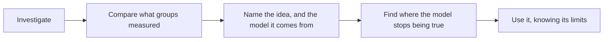

This is the second chemistry course you take and the last one before
whatever comes next. Five units, twenty-six classes, each unit building
to a task where you do the thing rather than recite it, and the last one
culminating in work you present to the room.

## The five units

| Unit | What it is about | It ends with |
| --- | --- | --- |
| 1 | Structure and properties of matter | [[The Property Prediction]] |
| 2 | Organic chemistry | [[The Molecule Dossier]] |
| 3 | Energy changes and rates of reaction | [[The Rate Investigation]] |
| 4 | Chemical systems and equilibrium | [[The Buffer Design]] |
| 5 | Electrochemistry | [[The Chemistry Showcase]] |

Units 3 and 4 get an extra class each, deliberately. Equilibrium is
where this course is genuinely difficult, and it is difficult for
everybody, and building in the time is cheaper than pretending
otherwise.

## The shape of almost every topic

The first three boxes are last year's course and you will recognise
them: you meet an idea by working with it before it has a name, which is
why the investigation usually comes first and the concept page reads as
though you have already been there — you have.

**The fourth box is the new one, and it is where the marks moved.** Every
model in this course is useful and every one of them fails somewhere,
and the failure point is not a footnote — it is the content. Collision
theory, VSEPR, Le Châtelier's principle, and the Arrhenius picture of
acids each get an explicit boundary in this course, and you are expected
to be able to state it.

When the room's numbers disagree, we spend the time on the
disagreement, because that is where the learning is. A class where every
group got the same tidy figure is usually a class where nobody had to
think, and quite often a class where everybody made the same systematic
error and nobody noticed.

## What is different from Grade 11

| Last year | This year |
| --- | --- |
| Reactions ran until something ran out | Reactions stop early, and you calculate where |
| You said how much, with units and significant figures | You say how much, **and why not more** |
| Energy was something a reaction released | Energy is a driver: enthalpy explains direction, kinetics explains speed, and they are different questions |
| Properties were catalogued | Properties are **predicted** from shape and polarity, before you look them up |
| A prediction needed a mechanism | A prediction needs a named model, and a statement of what would falsify it |
| The report ended with what your numbers could not settle | The report also says where the model, not the method, gave out |

None of that is harder because there is more to memorise. It is harder
because "downhill" stops meaning "fast", "finished" stops meaning
"complete", and the answer stops being something I am holding.

That last row about models is worth taking seriously, because it is the
difference between a level 3 and a level 4 all semester — see
[[How Marks Work]].

## A typical unit

- **Lab days** are flagged on the class page the night before. Read the
  investigation first; you cannot design anything while standing at a
  bench reading the safety notes for the first time, and this year the
  safety notes are not decorative.
- **Consolidation days** are for comparing results and naming the idea.
  Bring your data — including the run that went badly.
- **Practice** happens in the Exercises pages, after the sense-making,
  never instead of it. The arithmetic in Unit 4 has to become automatic,
  and automatic only comes from repetition.
- **Journal entries** are written the day of the work, not the week
  before they are read. See [[Chemistry Journal]].

## What I expect

Turn up, bring your data, argue with each other, and say when you do not
follow something. The last one is the only one people find hard, and it
is the one that changes what you can do by the most.

> [!note] Missing a class
> Read the class page — the agenda links everything we used, so you can
> reconstruct most of it on your own. What you cannot reconstruct is the
> lab, so come and see me and we will arrange the practical part. Do not
> quietly copy somebody's data; it will not tell you what the afternoon
> was for, and it is the one thing here that counts as dishonesty.
>
> This matters more than it did last year. Unit 4 needs Unit 3 — you
> cannot reason about how far a reaction goes without the energy ideas
> underneath it — and Unit 5 needs Unit 4. Say something early.

Next: [[How Marks Work]], [[What to Bring]], and [[Safety in the Lab]].
The goals for the whole course are set out in [[Learning Goals]].
