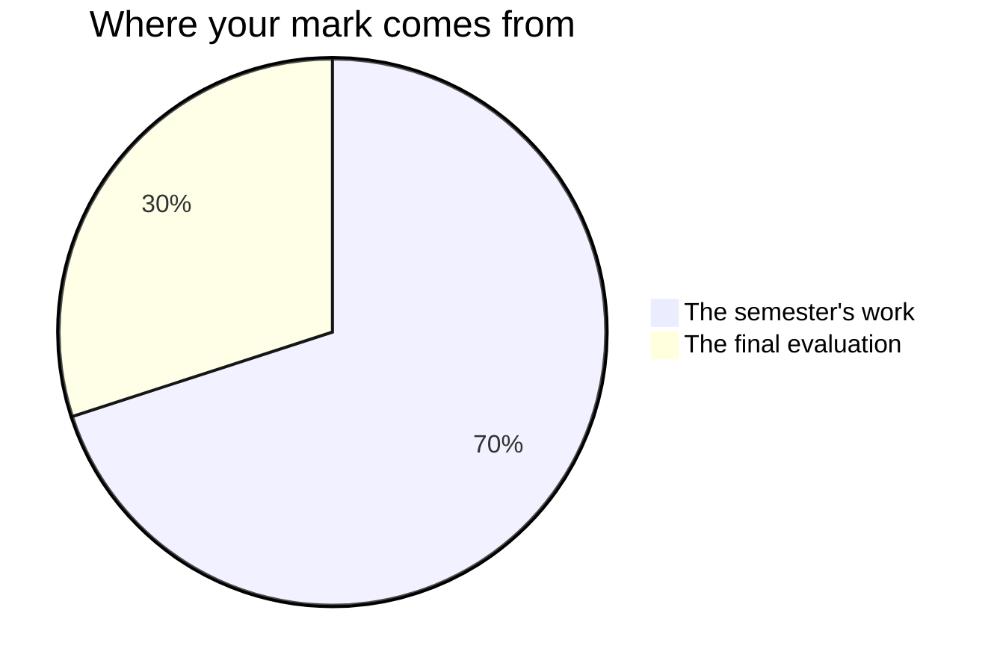

Everything that carries a mark in this course has its criteria written
down before you start it. Every page in [[Tasks/index|Tasks]] carries a
table of what I am looking for, every page in
[[Investigations/index|Investigations]] says what to collect and what you
should not claim from it, and
[[Writing a Lab Report]] says what a complete report holds. If something
is going to be marked and you cannot find its criteria, that is a fault
in the page — tell me and I will fix it.

## The seventy and the thirty

Every Grade 12 credit in Ontario is built the same way. Seventy per cent of
your mark comes from work spread across the whole semester, and it leans
towards your **most recent and most consistent** work rather than averaging
the start of the course against the end of it. The remaining thirty per cent
comes from a final evaluation at the end of the course.

**The seventy** is three things, and nothing else:

- the five term tasks — [[The Property Prediction]],
  [[The Molecule Dossier]], [[The Rate Investigation]],
  [[The Buffer Design]] and [[The Cell Report]];
- [[The Lab Reports]] — four write-ups, one in each of the first four
  units, each written in class and handed in before you leave that
  period;
- the milestone entries in your [[Chemistry Journal]], which means the
  ones written in class: the end-of-unit entries, the
  [[Showing Growth]] comparison, and [[Final Reflection]].

They are not equally weighted. The tasks carry most of it, because each
one asks for more at once and runs for a week; the four reports come
next, and the journal entries carry the least. Ask me for the exact
split whenever you want it — it is not a secret, it is just not the
useful thing to memorise.

**The thirty** is two things, on two different days: the
[[Final Examination]], written under the same conditions as everybody
else, and [[The Chemistry Showcase]], where you explain and defend your
own semester's work to people who were not at your bench. The
examination is the larger of the two. Two very different rooms,
deliberately, so that neither one afternoon nor one investigation
decides this alone.

Nothing else moves your percentage. The practice sets, the warm-ups, the
retrieval clinics, the end-of-unit checkpoints you mark yourself, the
four investigations that are not written up formally, and the
discussions are all unmarked — so take more risks in them than you
probably will. The rest of your journal is in that group as well: what
you write between classes is yours, I read it, it is what makes the
milestone entries possible, and it is not something I mark.

## Four kinds of thinking, not one

Ontario reports chemistry in four categories, and they ask genuinely
different questions of the same piece of work.

| Category | The question it asks, and where I look |
| --- | --- |
| Knowledge and understanding | Do you know the chemistry, and do you know where it stops applying? Mostly the examination, the identity section of the dossier, and the chemistry written out in the cell report |
| Thinking and investigation | Can you design an investigation and reason from the data it gives you? The four reports, and the two investigations you design yourself |
| Communication | Could a reader who was not there follow you and check every number? Every report, and the showcase |
| Application | Can you use the chemistry somewhere it has not been used for you? The property prediction, the buffer design, and the course of action in the dossier |

A perfect calculation with no unit, no route shown and no sentence is not
a perfect answer. It is a strong Knowledge answer and a weak
Communication one, and the report card will say so.

## Where the weight actually sits

Thinking and investigation is the largest category, and that is
deliberate. Following a procedure is not the skill this course is about.
**Choosing a model, deciding what to measure, choosing an instrument
that measures it well enough, noticing when a number is suspicious, and
judging what your data can and cannot support** — that is the thinking,
and this year you do it on procedures you designed yourself.

The five tasks and the four reports carry most of the seventy between
them, and that is not an accident of arithmetic. They are the places
where you have to put everything together at once, which is the only
place I can see whether you can.

## Three kinds of evidence, and two of them are not paper

**What you make** is the obvious one: reports, dossiers, specification
sheets, data tables, milestone journal entries. **What I watch you do**
is the second, and in a chemistry course it is the richest of the three:
whether you change one thing at a time, whether the control tube gets
looked at or only recorded, whether a reading you doubted is repeated or
quietly replaced by the tidier one, whether the goggles are on before
the bottle is opened. **What you tell me** is the third — the
conferences at the working periods are not a progress check, they are
evidence in their own right, and some of what you understand will only
ever show up there.

All three count, and they count towards the same expectations. If your
report is unfinished and you are quiet, the two minutes at your bench is
often where the strongest evidence of the day comes from. That is not a
consolation prize. It is how the mark is meant to work.

## A defensible wrong prediction beats a lucky right one

This is the sentence people find hardest to believe, so here it is in
plain words. **A prediction that turns out wrong, made from a stated
model, for a stated reason, is worth more here than a prediction that
turned out right and cannot be accounted for.**

That is not generosity and it is not a consolation prize. A prediction
is a test of your reasoning, and a test only tells you something if the
reasoning was written down first. A wrong prediction with a mechanism
attached tells you exactly which idea was bent, which is information you
can use tomorrow. A right prediction with nothing behind it tells you
nothing at all, including whether it was right for the reason you think.

The same applies to results. A percentage yield of exactly 100.0%, an
equilibrium constant that lands precisely on the booklet value, a cell
potential identical to $E^\circ$ — none of those impress me. They are
the results I ask the most questions about, because agreeing with a
table is something two cancelling errors do just as easily as a good
method does.

> [!important] Naming a model's limits is part of a full answer, not an extra
> Every model in this course is useful somewhere and false somewhere,
> and a question is not fully answered until you have said where the
> line is. "Le Châtelier's principle predicts the equilibrium shifts to
> the right" is a level 3 answer. "Le Châtelier's principle predicts a
> shift to the right; it gives a direction and not a magnitude, so it
> cannot tell us the new concentrations without $K_c$" is a level 4
> answer, and it took one extra clause.
>
> This applies on the examination as well as in reports. If a question
> asks you to predict from a model and you add a sentence about the
> model's boundary, that sentence is marked. If the boundary is the actual point
> of the question — and sometimes it is — the answer without it is
> incomplete rather than merely brief.
>
> Hiding a limitation costs you the marks it would have earned **and**
> the trust that the rest of the work is accurate.

## Significant figures are marked as a claim

This surprises people every year, so here it is in advance.

Reporting an answer to the wrong number of significant figures is not a
rounding nitpick and it is not a presentation issue. The digits you
write are a statement about how well you measured, so an answer with too
many digits is **overclaiming** — it says your thermometer was better
than it was — and an answer with too few throws away information the
instrument gave you.

Two Grade 12 versions of the same rule, both marked:

- **A pH is not counted like an ordinary number.** The digits before the
  decimal point come from the exponent, so pH 2.47 is a two-figure
  result. Quoting a pH to four decimals from a meter that resolves two
  is the same overclaim as quoting a mass to five figures from a
  two-place balance. [[Working with Logarithms in Chemistry]] has the
  whole rule.
- **A constant you calculated inherits your worst measurement**, not the
  precision of the booklet value you combined it with.

See [[Significant Figures and Units]] for the general case.

## What a level 4 looks like here

| Category | Level 3 | Level 4 |
| --- | --- | --- |
| Knowledge | States the idea correctly | States it and knows where it stops applying |
| Thinking | Designs a workable procedure | Designs it, predicts from a named model, and explains the disagreement using that model's assumptions |
| Communication | Clear report, correct conventions | A reader who was not there can check every number and every claim |
| Application | Applies the idea to a new case | Chooses **which** model applies, and justifies the choice against the alternative |

The pattern down the right-hand column is the same every time: level 4
is not more work, it is **judgement**. In this course, judgement almost
always takes the shape of a sentence about a boundary.

> [!question] Why do labs count as Thinking rather than Knowledge?
> Because the knowledge in a lab is the least demanding part of it. Any
> of you can be told a procedure and carry it out. Deciding what varies,
> what stays fixed, which instrument is precise enough for the claim you
> intend to make, how many trials are enough, which model you are
> reading the result through, and what the result is allowed to mean —
> that is the work, and that is what is assessed.

## What is not in your mark

How you work is reported separately, on the same report card, as **E, G,
S or N** — six habits: responsibility, organization, independent work,
collaboration, initiative, and self-regulation. They matter, we will
talk about them, and they do not move your percentage. Your mark is
about the work; that column is about the worker, and mixing the two
tells you less about both.

There is one narrow exception here and it is a real one. Working
**safely and effectively at the bench** is not only a habit in a
chemistry course: expectation A1.5 asks you to conduct inquiries using
materials and equipment safely, accurately and effectively, so it is
curriculum, and it is marked like any other part of the curriculum —
which is why [[The Lab Reports]] carries a row for it, and why that one
row is judged at the bench rather than from the page.
Nothing else on the habits list is written into this course's
expectations. Keeping your binder in order, handing things in on time
and pulling your weight in a pair are all real and none of them is
chemistry, so none of them is in your percentage.

Your own judgement of your work is not part of your mark either, and
neither is a classmate's. You will judge your own drafts against the
criteria often — see [[Judging Your Own Work]] — and you will challenge
each other's claims in nearly every working period, because both are the
fastest way to get better. But the mark is mine to determine, from
evidence.

> [!note] Work done with a partner
> Most of the bench work is done in pairs, and every task that is done
> in pairs names the part written by you alone: everything from the
> analysis onward in [[The Lab Reports]]; the specification sheet, the
> prediction and the analysis of the gap in [[The Buffer Design]]; the
> report from the analysis onward in [[The Rate Investigation]]; and the
> verdict and the safety section in [[The Cell Report]]. That part, and
> what I see and hear at your bench, is what your own mark rests on.
>
> [[The Property Prediction]] and [[The Molecule Dossier]] are yours
> from the first line — you are given your own coded substance, and no
> two people in a class take the same compound.
>
> Nobody here is carried, and nobody is dragged down by a partner.

## Late work

Talk to me **before** the due date and we will make a plan that works.
After the fact is much harder for both of us, and there is far less I
can do. This is not a trick; the conversation genuinely goes better
early.

Related: [[Writing a Lab Report]], [[Judging Your Own Work]],
[[Journal Checklist]], and [[Getting Help]].
