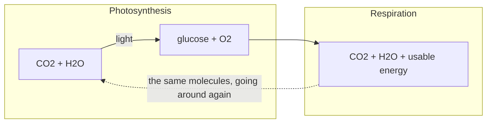

## The idea

Respiration is photosynthesis run backwards. Cells take the sugar and the oxygen
and release the stored energy in a form the cell can spend.

$$
\ce{C6H12O6 + 6O2 -> 6CO2 + 6H2O + energy}
$$

## Compare the two

| | Photosynthesis | Cellular respiration |
| --- | --- | --- |
| Who does it | Producers | **Every** living thing, producers included |
| Energy | Stored | Released |
| Takes in | $\ce{CO2}$, $\ce{H2O}$ | $\ce{C6H12O6}$, $\ce{O2}$ |
| Gives off | $\ce{C6H12O6}$, $\ce{O2}$ | $\ce{CO2}$, $\ce{H2O}$ |
| When | Only in light | All the time |

> [!important] The pairing is the point
> The outputs of one are the inputs of the other. That is what keeps the
> composition of the atmosphere roughly steady — and it is the clearest example
> of ==dynamic equilibrium== you will meet all semester.

%%curriculum-start%%
## Curriculum connection

![[B2.3]]

![[B2.2]]
%%curriculum-end%%
