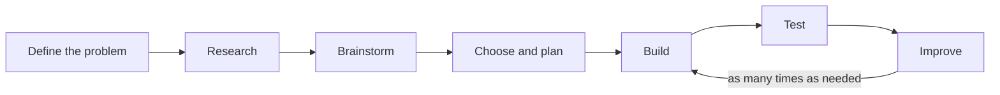

> [!abstract] At a glance
> Pairs · **four class periods** of work time — Unit 4, Days 8, 9, 12 and
> 13 — then demonstrated on Day 14 · **Format:** a built prototype, a design
> log, and a plan of action

The device is built by the two of you and it is shared. **Your design log is
yours alone**, kept in your own words, and so is your page on where the power
comes from. I mark each of you on your own log and your own diagram, against
the rows below — those two documents are the whole of your mark, and there is
no common group mark on this task. The demonstration is how the class sees
what you built; it is not separately marked.

## The task

Design, build, and test a working device that solves a real problem using an
electric circuit. Constraints: battery power only, under \$15 in materials,
must fit in a shoebox.

## The engineering design process

The loop is not decoration. I expect **at least two** trips around it, and your
log must show what failed the first time.

## Past examples that worked well

- A moisture sensor that lights up when a plant needs water
- A door alarm using a reed switch
- A hand-crank generator charging a capacitor
- A continuity tester for finding breaks in cables

## Your design log

Keep it as you go, not afterwards. It carries most of the marks.

| Section | What goes in it |
| --- | --- |
| Problem | Who has it, and how you know |
| Research | What exists already; what you borrowed |
| Design | Circuit diagram with component values |
| Build | What actually happened, including mistakes |
| Test | Data, not impressions |
| Improve | What you changed and what it did |

> [!warning] A working device with no log scores lower than a failed device with a good one
> The curriculum expectation is about the **process**. A prototype that failed
> for reasons you understood and documented demonstrates more than one that
> worked by luck.

## Where the power comes from

Your device runs on a battery. One page, alongside the build:

- **The energy behind it.** Trace the electricity in this building back
  to how it was generated, and name one benefit and one cost of that
  method — social, environmental, or economic.
- **Who is affected.** Generation and consumption land differently on
  different communities. Name one community affected by the method that
  powers this school, and say how.
- **A plan of action.** One realistic change — in this room, this
  building, or your home — that would reduce electrical energy use or
  shift when it is used. Say what it would save, what it would cost, and
  whose decision it is. A plan nobody could act on is a wish.

## Success criteria

| Quality | What it looks like in your work |
| --- | --- |
| A problem that is really somebody's | The person who has it is named, and how you found out is in the log |
| A circuit you can account for | Drawn to convention with component values, and every part in it doing a job you can name out loud |
| Two trips around the loop, visible | The first version, what failed, what you changed, and what the change did — one change at a time |
| Tests that produce numbers | Measurements with units, taken the same way each time, instead of "it worked better" |
| The energy behind it, followed | Where the electricity in this building comes from, one benefit, one cost, and a community affected |
| A plan somebody could act on | One realistic change, what it saves, what it costs, and whose decision it is |

Run these over your own log at the start of the last working period —
[[Judging Your Own Work]] is the routine — and spend the rest of that period
on the row you called weakest.

## Hand in

- [ ] The device
- [ ] Design log, one per person
- [ ] Circuit diagram drawn to convention — see [[Circuit Diagram Practice]]
- [ ] Two minutes demonstrating it to the class

%%curriculum-start%%
## Curriculum connection

![[A1.3]]

![[A2.1]]

![[D1.1]]

![[D1.2]]

![[D1.3]]

![[D2.3]]

![[D2.8]]
%%curriculum-end%%

%%
Triangulation — the evidence you will not have unless you go and get it.

This is a paired task with an individual mark, so the conversation is not
optional garnish here — it is how you find out which of the two people in
front of you can account for the thing on the bench. Both prompts sit on
periods that already exist.

OBSERVE — Unit 4, Day 9, the first build period
  Watch for: whether the circuit gets drawn before it gets built. A diagram is
  on the hand-in list, so both benches will produce one; what the hand-in
  cannot tell you is whether it guided the build or was drawn afterwards to
  match a thing that already worked. Day 8's homework asked for two sketches,
  so the paper should be there.
  Going well: a sketch on the bench with component values written on it, and
  somebody pointing at the sketch while the other one wires.
  Stuck: leads being pushed into a breadboard until the lamp comes on, with no
  paper anywhere and nobody able to say which change did it.
  Record: one mark per bench on your seating plan — paper out, or not. One
  circuit of the room. That is A1.3 watched: an engineering design process
  applied, rather than a device that happened.

TALK — Unit 4, Day 12, the conference already on that agenda
  The agenda's own question — what does your test actually show — is spent by
  the time you sit down. Ask these of each partner separately, even if they
  answer over each other, because this is where the individual mark comes from.
  This page's criteria already ask for every part doing a job they can name,
  so do not ask for that back — ask about the parts that are not.
  Ask: "What is in there that you would take out now, and what were you afraid
  would break if you did?"
  Then: "Something in there gets warm. Where, and is that heat doing any of the
  work you wanted?"
  A strong first answer names a component that turned out to be doing nothing —
  the second resistor added in a panic, the switch that was only ever a spare —
  and can say what they had thought it was for. Getting a component's function
  wrong and then finding out is D2.3 heard far more convincingly than getting
  it right the first time. A strong second answer names the transformation and
  where it goes: electrical energy into heat in the resistor, which does nothing for
  the alarm and comes straight out of the battery. That is D2.8 heard, and it
  is the half of efficiency a working prototype never has to admit to.
  Record: two ticks per person, not per bench, on the seating plan. The bench
  where one partner answers both and the other answers neither is exactly what
  this task's individual mark exists to catch.

The product evidence is the device, the two logs, and the demonstration on
Unit 4, Day 14.
%%
