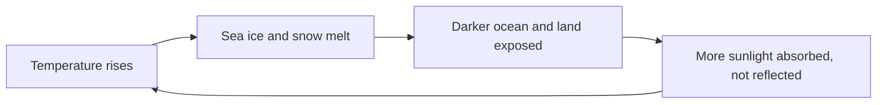

In [[Modelling the Greenhouse Effect]] you changed one variable and watched
one thing happen. The whole reason climate is difficult is that the real
system will not hold still while you do that — change one part and it changes
the others, and some of those changes come back around and change the first
part again.

That is a **feedback**, and until you can talk about feedbacks you cannot
explain why the climate system is not simply proportional to what we put into
it.

## The system that is doing the responding

Before the loops, the parts. Earth's climate system has five components that
exchange energy and matter continuously.

The **Sun** supplies essentially all the energy. The **atmosphere** carries
heat and moisture quickly and holds very little of either. The **hydrosphere**
— oceans, lakes, rivers, groundwater — is slow, holds an enormous amount of
energy, and moves it around the globe. The **cryosphere**, meaning ice and
snow, is bright and reflects sunlight straight back out. The **land surface**
supplies topography that steers winds and currents, and the **biosphere**
exchanges carbon with all of it.

What makes it a system rather than a list is that the Sun heats it unevenly.
The equator receives sunlight nearly head-on; the poles receive the same beam
spread across a much larger area, and at a low angle. That permanent imbalance
is what drives every wind and every current: the atmosphere and ocean are
continuously carrying heat from where there is a surplus toward where there is
a deficit.

## How heat actually moves

Three mechanisms, and the interesting one is the third.

**Radiation** brings energy in from the Sun and is the only way energy leaves
the planet. **Conduction** matters only at surfaces — air is a poor conductor,
which is why it is not what warms the atmosphere from below in any useful
quantity. **Convection** does most of the work: warm air and warm water are
less dense, rise, and are replaced by cooler fluid flowing in underneath,
producing the great circulation cells of the atmosphere and the currents of
the ocean.

Riding on top of convection is **latent heat**, and it is the part students
usually miss. Evaporating water absorbs a large amount of energy without
changing temperature at all, and releases exactly that energy again when the
vapour condenses somewhere else. So water evaporating from a warm tropical
ocean carries energy invisibly upward and poleward, and dumps it wherever
cloud forms. A storm is that transfer made visible.

Water does one more thing. Its specific heat capacity is unusually high, so a
body of water changes temperature far more slowly than the land beside it.
That is why coastal places have milder winters and cooler summers than inland
places at the same latitude, why a lake breeze picks up on a hot afternoon,
and why the ocean sets the pace at which the whole system responds to change.
**Ocean currents** extend this globally: surface currents driven by wind, and
a slower deep circulation driven by differences in temperature and saltiness,
together move heat between hemispheres and set regional climates far from
where the heat was absorbed.

## Positive and negative, which do not mean good and bad

A **feedback** exists when the output of a process comes back to change its
own input.

A **positive** feedback amplifies the original change: the response pushes in
the same direction as the thing that caused it. A **negative** feedback damps
it: the response pushes back. Neither word is a value judgement. A positive
feedback in the climate is bad news and a positive feedback in a healing wound
is good news; the sign describes the mathematics, not the outcome.

Here is the one you can see from a plane.

That is the **ice–albedo** feedback. Albedo is the fraction of incoming light
a surface reflects: fresh snow reflects most of what hits it, open ocean
absorbs almost all of it. Warm the Arctic slightly, lose some summer sea ice,
and the water underneath absorbs sunlight the ice used to send back — which
warms things further, which melts more ice. It is the main reason the Arctic
has warmed considerably faster than the global average.

The **water vapour** feedback is larger and less visible. Warmer air can hold
more water vapour, water vapour is itself a strong greenhouse gas, so warming
puts more of it into the air, which produces more warming. This is why water
vapour is a feedback and not a driver: nothing we do adds water vapour to the
atmosphere directly for long, because it rains out within days, and the amount
present is set by the temperature.

The **permafrost carbon** feedback is the slow one to worry about. Northern
soils hold a very large amount of frozen organic material. As they thaw, that
material decomposes and releases carbon dioxide and methane, which cause
further warming and further thaw. This matters a great deal in Canada, which
holds a great deal of permafrost.

## The negative feedbacks, honestly

If every feedback were positive, the first warm summer in Earth's history
would have run away and the planet would have cooked long before anyone was
here to notice. It did not, and the reason must be stated.

The dominant stabilising feedback is **radiative cooling**. Any object
radiates more energy as it gets hotter, and steeply so — the outgoing
radiation rises much faster than the temperature does. Warm the surface and it
sends more infrared upward, which is a direct push back toward balance. This
is why the climate settles at a new, higher equilibrium instead of escalating
without limit, and it is the single most important negative feedback in the
system.

Over vastly longer times, **rock weathering** does something similar:
chemical weathering runs faster in a warm, wet climate, and weathering
consumes carbon dioxide. It is a genuine thermostat and it operates over
hundreds of thousands of years, which is far too slow to help with anything
happening this century.

**Clouds** are the honest uncertainty. Low, thick cloud reflects sunlight and
cools; high, thin cloud traps outgoing infrared and warms. Both effects are
large, they partly cancel, and how the balance shifts as the planet warms
remains the biggest single uncertainty in climate projections. Anyone who
tells you clouds settle the question — in either direction — is telling you
more than is known.

Two consequences follow from all of this, and they are the reason the topic is
not merely interesting.

**The response is not proportional.** Feedbacks mean the temperature change
you get is not a simple multiple of the carbon dioxide you add, and parts of
the system — an ice sheet, a permafrost region, a current — can pass a
threshold beyond which change continues on its own. That is what a **tipping
point** means, and it is why "we will just stop when it gets bad" is a weaker
plan than it sounds.

**The system lags.** The ocean's heat capacity means the surface takes decades
to finish responding to a change already made. Some warming is therefore
already committed, which is why adaptation is discussed alongside mitigation
rather than instead of it.

Take this into a decision that affects real people in [[The Climate Brief]],
and argue about who carries the cost in [[Whose Climate, Whose Cost]].

%%curriculum-start%%
## Curriculum connection

![[D2.4]]

![[D2.6]]

![[D2.7]]

![[D2.9]]

![[D3.1]]

![[D3.2]]

![[D3.4]]

![[D3.6]]

![[D3.7]]

![[D3.8]]
%%curriculum-end%%
