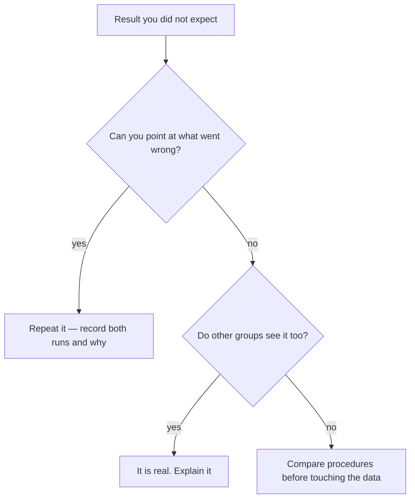

A result you did not expect is information. It is only a failure if you
throw it away without finding out which kind of unexpected it was.

## The question we are arguing about

When is it honest to leave a data point out of your analysis, and when
is leaving it out the same thing as making the data up?

## Three different things people call a mistake

| Kind | Example | What you do about it |
| --- | --- | --- |
| A blunder | Read the wrong scale; used the wrong reagent | Repeat the trial, and record that you did |
| A limitation of the method | Heat escaping to the room; a thermometer that only resolves whole degrees | Report it, estimate its size, and say which way it pushed the result |
| A genuine anomaly | Everything was done right and the result still disagrees | Investigate it — this is the interesting case |

The distinction matters because the three belong in different parts of
a report. Blunders belong in your notes. Limitations belong in the
conclusion of [[Writing a Lab Report]], where they earn marks.
Anomalies belong in the discussion, where they earn respect.

## Deciding, in the moment

Notice what the diagram never offers: a branch where you quietly delete
the point.

## The rule about outliers

You may exclude a measurement **only** for a reason that is independent
of the fact that you disliked the answer — the stopwatch was started
late, the sample was contaminated, the meter had not settled. Write the
reason down. "It did not fit the trend" is not a reason; it is the
result you were trying to test.

## Two results that were nearly binned

Fleming's mould was a contaminated plate that most people would have
washed up. Penzias and Wilson spent months chasing a persistent hiss in
their antenna, checking the electronics and cleaning out the horn,
convinced it was a fault. In both cases the annoying, wrong-looking
thing turned out to be the finding. Neither of them went looking for it;
they just refused to discard something they could not explain.

> [!important] What I actually want from you
> Not perfect data. I want to be able to reconstruct, from your record,
> exactly what happened — including the run that went badly and what you
> did next. A careful investigation that names its problems is worth
> more here than a tidy one that hides them, and
> [[How Marks Work]] says so plainly.

Bring one thing that went wrong in an investigation this unit. We will
sort the room's examples into the three kinds above and argue about the
borderline cases, which is where all the interesting ones live. Related:
[[What Counts as Evidence]] and [[Showing Growth]].
