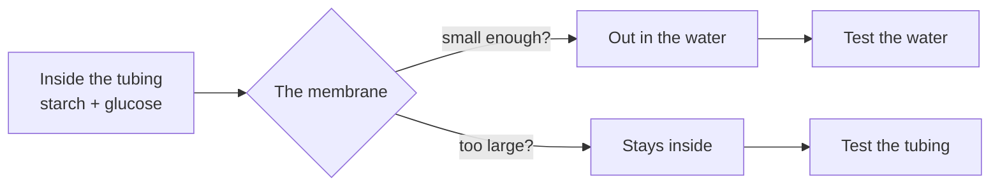

A sandwich goes in one end of you and never appears in your blood as a
sandwich. Something takes it apart, and something else lets the pieces
through a wall that the sandwich itself cannot cross. Today you build a
crude version of that wall and find out what it lets through.

## What you are trying to find out

Why does food have to be broken down at all? A body could, in
principle, absorb whatever it swallowed. It does not. Your model is
built to test one candidate reason: **the wall is selective, and
selective by size.**

If that is right, a small molecule should cross a membrane that a large
one cannot, and the whole of digestion becomes a size problem with a
chemical solution.

## What you have to work with

- Visking (dialysis) tubing, thread, a beaker, distilled water
- A starch suspension and a glucose solution, both provided
- Iodine solution, in a dropping bottle
- Glucose test strips **or** Benedict's solution with a hot water bath
- Test tubes, rack, holder, stirring rod, timer, marker
- A computer-simulated dissection, set up on the class machines

Three design decisions are yours, and each one goes in your journal
before you start.

- **The control.** Your model has an obvious failure mode: molecules on
  the outside of the tubing at the start would look exactly like
  molecules that crossed. Design the control that rules this out, and
  say what result would tell you the control had failed.
- **What you hold constant.** Volume inside the tubing, length of
  tubing, volume of water outside, temperature, and how thoroughly you
  rinsed the outside are all candidates. Name the ones you controlled,
  the one you deliberately varied if any, and the ones you could not
  control.
- **When you sample.** One test at the end tells you whether something
  crossed. Several tests over time tell you something about rate. Pick,
  and justify the interval.

## Safety

> [!danger] Heat, stain, and glass
> - Eye protection from the first move until the bench is clear.
> - **Iodine solution stains skin, clothing, and benches, and is an
>   irritant.** Drops only, and rinse a splash immediately with plenty
>   of water. Tell me either way.
> - If you use **Benedict's solution**: it is an irritant, so treat a
>   splash the same way. Heat it in a **hot water bath**, never in a
>   flame — a directly heated tube bumps and throws its contents.
> - **Hot glassware looks exactly like cold glassware.** Use the test
>   tube holder, and assume anything near the bath is hot.
> - Point the open end of any warmed tube **away from every person in
>   the room**, including you.
> - Never pipette by mouth, with any liquid, ever. Nothing in this room
>   is tasted, including the glucose solution — it is a laboratory
>   chemical, not food.
> - Tie back hair and secure sleeves before you go anywhere near the
>   bath.
> - Report every spill, splash, and break the moment it happens. You
>   will never be in trouble for reporting one.

## The prediction you write first

Before the tubing goes in the water, write down — with a mechanism, not
a hunch:

1. Which of the two substances, if either, you expect to find outside
   the tubing, and **why that one**.
2. What you expect the control to show.
3. What result would make you abandon the "selective by size" idea
   entirely.

That third one is the Grade 10 question. A prediction that nothing
could contradict is not a prediction. Write the observation that would
sink yours.

## What to collect

| Time | Test on the water outside — iodine | Test on the water outside — glucose | Control |
| --- | --- | --- | --- |
| Start | | | |
| | | | |
| | | | |
| End | | | |

Record what you actually saw — "pale orange, unchanged" is data;
"negative" is an interpretation you have not shown your working for.
Note the colour a positive result is supposed to give **before** you
run it, so you are not deciding the standard after seeing the tube.

Then the simulated dissection. Follow one nutrient molecule from the
gut wall to a working cell somewhere else, and record the **hand-offs**:
where one system stops being responsible and another takes over.

| Step | System doing the work | What it does to the molecule or where it moves it |
| --- | --- | --- |
| | | |

## What to bring to the consolidation discussion

- Your table, your control result, and one sentence saying what the
  evidence supports.
- The strongest alternative explanation for your result that you cannot
  rule out.
- From the dissection: one specific example of two systems that would
  each be useless without the other, and the exchange between them.

## What you should not claim

- **Your tubing is not an intestine.** It has no villi, no folding, no
  enzymes, no blood flow removing molecules from the far side, and
  nothing doing work to move a substance against a concentration
  difference. It shows that a size-selective membrane is *possible*,
  not that this is how your gut does it.
- **You measured presence, not rate.** Unless you sampled repeatedly
  and can defend the interval, "glucose crossed quickly" is not
  something your data says.
- **A colour test is not an identification.** Iodine responds to
  starch; it does not certify that the substance is the starch you put
  in. A single indicator narrows the possibilities, it does not close
  them.
- **One tubing is one trial.** A leaking knot and a real result look
  identical on a single run.

%%curriculum-start%%
## Curriculum connection

![[A1.5]]

![[B2.5]]

![[B2.6]]

![[B2.7]]

![[B3.5]]
%%curriculum-end%%
