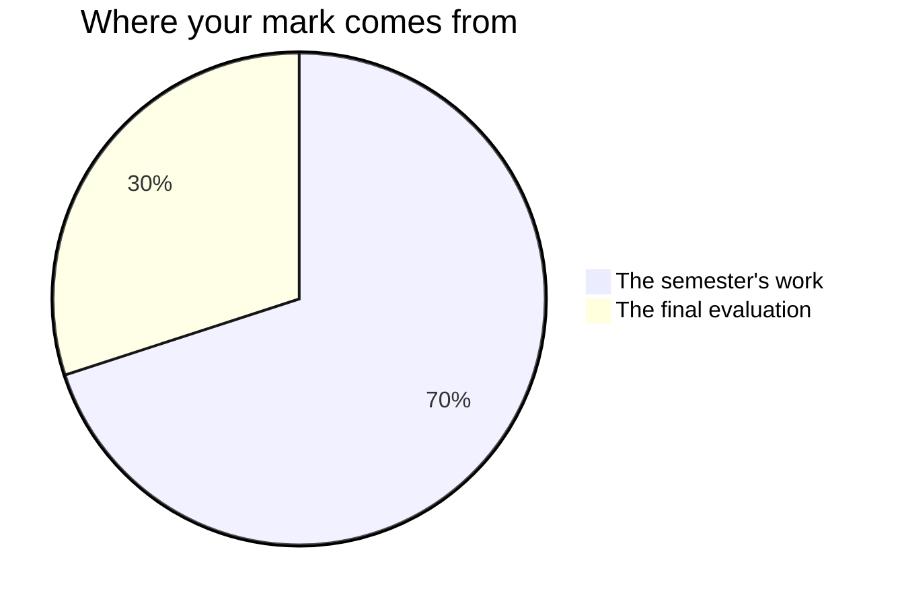

Every Grade 10 credit in Ontario is built the same way, and this one is no
exception. It is worth reading once properly at the start of the course
rather than guessing at it at the end of the course.

## The seventy and the thirty

**Seventy per cent** of your mark comes from work spread across the whole
semester. It is not an average of the start of the course against the end of
it: it leans towards your **most recent and most consistent** work, because
what you can do in the last month is a better description of you than what
you could do in the first.

The seventy comes from three places, in the order you meet them:

- the four unit tasks — [[The Systems Case Study]],
  [[The Reaction Investigation]], [[The Climate Brief]], and
  [[The Optics Design]];
- the four write-ups on [[Lab Reports]], one per unit, each written in class
  in the period after the bench work;
- the three milestone entries in your [[Science Journal]] — the Unit 1
  entry, the [[Showing Growth]] comparison, and [[Final Reflection]] —
  which are also written in class, and are the only journal entries that
  carry a mark.

They are not equally weighted. The four unit tasks are the heavy end, and
[[The Optics Design]] is the heaviest of those, because it runs longest and
asks for everything at once. Ask me for the exact split whenever you want
it; it is not a secret, it is just not the useful thing to memorise.

**Thirty per cent** comes from a final evaluation at the end of the course,
in two rooms rather than one: the [[Final Examination]], written on paper
under the same conditions as everybody else, and [[The Science Showcase]],
where you explain and defend your work to people who ask about it. The
examination is the larger of the two. Splitting it deliberately means
neither one afternoon nor one conversation decides this alone.

What you do between classes is practice, and practice is never the marked
thing. The checkbox list on every class page is there to keep you ready for
the next period; when it reminds you to submit a task, that is a reminder,
not a piece of homework being marked.

## Four kinds of thinking, not one

Every piece of work above asks for more than one of these, and the balance
shifts between them. A result that came out right is never the whole of it.

| What is being judged | What it means here |
| --- | --- |
| What you know | Terminology, mechanisms, what a model does and where it stops |
| How you think | Designing the test, choosing what to control, deciding what a result is allowed to mean |
| How you communicate | Reports, diagrams, graphs, briefs, and explaining it out loud |
| Where you apply it | Using the science on a situation nobody walked you through |

**How you think** carries the most weight in this course, and that is
deliberate. Following a procedure is not the skill Grade 10 is about.
Deciding what to measure, noticing when a result is suspicious, and judging
what your data can and cannot support — that is the work, and this year you
do it on procedures you designed yourself.

> [!question] Why do labs count as thinking rather than knowledge?
> Because the knowledge in a lab is the least demanding part of it. Any of
> you can be told a procedure and carry it out. Deciding what varies, what
> stays fixed, how many trials are enough, and what the result is allowed to
> mean — that is the work, and that is what is assessed.

## Three kinds of evidence, and two of them are not paper

**What you make** is the obvious one: reports, briefs, case studies,
devices, journal entries. **What I watch you do** is the second — how you
set up a comparison, whether you check the two containers against each other
before switching the lamp on, what you do with the reading that does not
fit. **What you tell me** is the third: the conference in every task's
working period is not a progress check, it is evidence in its own right, and
some of what you understand will only ever show up there.

If your device is unfinished and you are quiet in a large room, the
conference is often where the strongest evidence of that week comes from.
That is not a consolation. It is how the mark is meant to work.

## What a level 4 looks like here

| Category | Level 3 | Level 4 |
| --- | --- | --- |
| Knowledge | States the idea correctly | States it and knows where it stops applying |
| Thinking | Designs a fair test | Designs it, predicts, and explains the disagreement |
| Communication | Clear report, correct conventions | A reader who was not there can check the reasoning |
| Application | Applies the idea to a new case | Chooses which idea applies, and justifies the choice |

The pattern down the right-hand column is the same one every time: level 4
is not more work, it is **judgement**.

> [!important] The tidy report is not the strong report
> A careful investigation that names its limitations honestly — the
> thermometer's resolution, the variable you could not control, the
> classification that a single trial cannot settle — beats a beautifully
> presented one that quietly hides its problems. Every time, and by a
> long way. Naming a limitation costs you nothing and gains you
> everything, because it is direct evidence that you understand what
> your method could and could not do.
>
> Hiding one costs you the marks it would have earned **and** the trust
> that the rest of the report is accurate.

## What is not in your mark

**How you work** is reported separately on the same report card, as **E, G,
S or N**, under six headings: responsibility, organization, independent
work, collaboration, initiative, and self-regulation. They matter, we will
talk about them, and they do not move your percentage. Your mark describes
the work; that column describes the worker, and mixing the two tells you
less about both.

There is one narrow exception, and it exists because the curriculum itself
puts it there. Two expectations of this course are about safe practice: one
asks you to apply what you know about hazards **when planning** an
investigation, and one asks you to use equipment and materials **safely,
accurately, and effectively** while you collect data. Where a habit is named
in the curriculum, it is marked like anything in the curriculum — which is
why [[Lab Reports]] carries a safety row and why the hazard analysis on
[[The Reaction Investigation]] is marked. Everything else about how you
conduct yourself in the room is a learning skill and stays out of the
percentage. The boundary is set out at the end of [[Lab Reports]].

**Your own judgement of your work, and your classmates', are not part of
your mark.** You will hold your drafts up against the published criteria
often — see [[Judging Your Own Work]] — and you will challenge each other's
claims in the working periods, because both make the work better. Neither
one is a mark, and the checkpoints you mark yourselves at the end of Units
1, 2, and 3 are not marks either. They exist so that you and I both find out
what needs another period before it costs you anything.

## What the schedule actually gives you

Every unit task follows the same shape, and it is worth knowing what you are
entitled to.

- The criteria are published on the task page on the day the task launches,
  not on the day it is due.
- There is a **conference with me** in one of the working periods, where I
  tell you what I am seeing.
- There are at least **two working periods after that conference** before
  anything is handed in.
- On the last working period before submission, the **first fifteen minutes**
  are yours to judge your own draft against the criteria and fix your weakest
  row. That is [[Judging Your Own Work]], and it is on the class page.

If a mark ever surprises you, start with the criteria table on the task
page. It is the whole story.

## Late work

Talk to me **before** the due date and we will make a plan that works.
After the fact is much harder for both of us, and there is far less I
can do. This is not a trick; the conversation genuinely goes better
early.

Related: [[Writing a Lab Report]], [[Journal Checklist]], and
[[Getting Help]].
