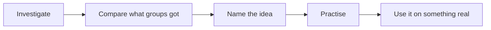

Four units, one each from biology, chemistry, earth and space science,
and physics. Each ends in a task where you do the thing rather than
recite it, and the last one is the culminating design.

## The shape of almost every topic

You meet an idea by working with it before it has a name. That is why
the lab usually comes first and the concept page reads as though you
have already been there — you have. When the room's results disagree,
we spend the time on the disagreement, because that is where the
learning is; a class where every group got the same tidy number is
usually a class where nobody had to think.

## What is different from Grade 9

| Last year | This year |
| --- | --- |
| You followed a procedure | You design the procedure and defend the choices |
| Variables were given to you | You name the independent, dependent, and controlled variables |
| You described the pattern | You propose the mechanism behind it |
| "It worked" | "The evidence supports this, with these limitations" |
| The lab report was the end | The report is a claim other people get to question |

None of that is harder because there is more to memorise. It is harder
because the answer stops being something I am holding and starts being
something your evidence either supports or does not.

## A typical week

- **Lab days** are marked on the class page the night before. Read the
  investigation first; you cannot design anything while standing at a
  bench reading the safety notes for the first time.
- **Consolidation days** are for comparing results and naming the idea.
  Bring your data — including the run that went badly.
- **Practice** happens in the Exercises pages, after the sense-making,
  never instead of it.
- **Journal entries** are written the day of the work, not the week
  before they are read. Three of them are written in class, and those are
  the three that carry a mark. See [[Science Journal]].

## What I expect

Turn up, bring your data, argue with each other, and say when you do
not follow something. The last one is the only one people find hard, and
it is the one that changes the work most. None of the four is marked —
how you work is reported separately from your percentage, and
[[How Marks Work]] sets out where that line falls.

> [!note] Missing a class
> Read the class page — the agenda links everything we used, so you can
> reconstruct most of it on your own. What you cannot reconstruct is the
> lab, so come and see me and we will arrange the practical part. Do not
> quietly copy somebody's data; it will not tell you what the afternoon
> was for, and it is the one thing here that counts as dishonesty.

Next: [[How Marks Work]], [[What to Bring]], and
[[Safety in the Lab]].
