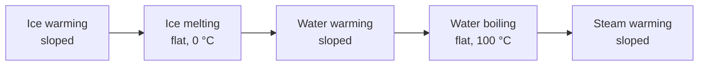

Put a beaker of ice on a hotplate that delivers energy at a steady rate,
plot temperature against time, and you get the most informative graph in
this unit — because its FLAT parts say more than its sloped ones.

## What the graph does

Energy goes in at a constant rate the whole time. So why does the
temperature stop rising twice?

| Part of the curve | Where the energy goes | The equation |
| --- | --- | --- |
| Sloped | Speeding the particles up — the temperature rises | $Q = mc\Delta T$ |
| Flat | Breaking the bonds holding the particles together | $Q = mL$ |

On a flat section the substance is absorbing energy at full rate and not
getting any hotter. That is not a pause; it is the most energy-hungry
part of the whole graph.

## Reading a curve you did not draw

Four things are recoverable from a heating curve, and a test question
will ask for at least two:

1. **The melting and boiling points** — the temperatures of the two flat
   sections.
2. **Which state change takes more energy** — the longer flat section.
   For water, vaporisation takes about seven times as much energy as
   melting, which is why steam burns are so much worse than hot-water
   burns.
3. **The specific heat capacities** — from the slopes. A shallower slope
   means more joules per degree, so a larger $c$.
4. **The mass**, if you know the power of the heater and can read a time
   off the graph.

> [!question] The cooling curve is not the mirror image
> Run the experiment backwards and the flat sections appear at the same
> temperatures — but a liquid can be cooled BELOW its freezing point
> without freezing if it is undisturbed and clean. Tap the flask and it
> crystallises in seconds, and the temperature jumps back UP to the
> freezing point. That is the latent heat coming back out. Freezing rain
> is this, happening to a whole city.

## The three ways energy moves

Nothing on the curve happens without energy getting from the element to
the water, and there are exactly three routes:

| Route | What carries the energy | Where you see it here |
| --- | --- | --- |
| **Conduction** | Collisions between neighbouring particles; no material moves | The hotplate into the glass, the glass into the water at the bottom |
| **Convection** | Bulk movement of a heated fluid, which expands, becomes less dense, and rises | The circulation you can watch with a drop of food colouring in the beaker |
| **Radiation** | Infrared, needing no material at all | What you feel from the element with your hand held beside it, and how the Sun heats the Earth |

A vacuum flask is the argument for knowing all three: a vacuum stops
conduction and convection, and the silvered surface reflects the
radiation. Every part of the design targets one route.

%%curriculum-start%%
## Curriculum connection

![[D2.10]]

![[D2.11]]

![[D3.7]]

![[D3.8]]
%%curriculum-end%%
