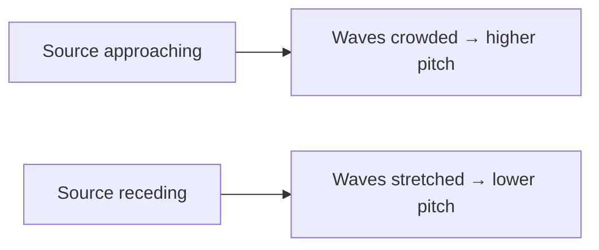

An ambulance approaching sounds higher than the same siren going away. The
siren has not changed; the spacing of the waves reaching you has.

Moving toward you, the source chases its own waves, crowding them into a
shorter wavelength — higher frequency. Moving away, it stretches them.

## The moment of the drop

The pitch does not slide down gradually as the vehicle nears. It stays
high while approaching and drops as it passes — the change happens at the
moment the motion stops being toward you.

## Where it earns its keep

- **Weather radar** measures how fast rain is moving toward the antenna.
- **Ultrasound** measures blood flow, including in a fetal heartbeat.
- **Astronomy** reads the shift in starlight to find how fast a galaxy is
  receding, which is how we know the universe is expanding.

The same physics, from a siren to the edge of the observable universe.

%%curriculum-start%%
## Curriculum connection

![[E2.1]]

![[E3.6]]
%%curriculum-end%%
