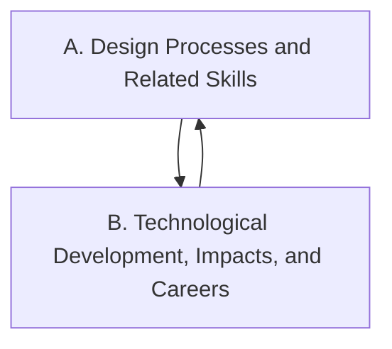

Everything we do in this course points at one or more of these
expectations, from **TAS2O — Technology and the Skilled Trades, Grade 10,
Open**. Lesson pages link here so you can always see *why* we are
doing something.

> [!info] Where these come from
> The wording below is the Ontario curriculum's own. See
> [[About These Expectations]].

Strand A is the design process itself, and it runs through every
project; Strand B is the world those projects live in — who needs them,
what they change, and where the work can lead.

## Strand A. Design Processes and Related Skills
Students engage in an engineering design process throughout this strand.

*By the end of this course, students will:*

![[A1. Initiating and Planning]]
![[A1.1]]
![[A1.2]]
![[A1.3]]
![[A1.4]]
![[A1.5]]
![[A1.6]]
![[A1.7]]

![[A2. Designing and Performing]]
![[A2.1]]
![[A2.2]]
![[A2.3]]
![[A2.4]]
![[A2.5]]
![[A2.6]]
![[A2.7]]

![[A3. Analyzing and Refining]]
![[A3.1]]
![[A3.2]]
![[A3.3]]
![[A3.4]]
![[A3.5]]

![[A4. Applying Health and Safety Principles]]
![[A4.1]]
![[A4.2]]
![[A4.3]]
![[A4.4]]
![[A4.5]]
![[A4.6]]

## Strand B. Technological Development, Impacts, and Careers
*By the end of this course, students will:*

![[B1. Fundamentals of Technological Development]]
![[B1.1]]
![[B1.2]]
![[B1.3]]
![[B1.4]]

![[B2. Impacts of Technology]]
![[B2.1]]
![[B2.2]]
![[B2.3]]

![[B3. Careers and Pathways in Technology and the Skilled Trades]]
![[B3.1]]
![[B3.2]]
![[B3.3]]
![[B3.4]]
