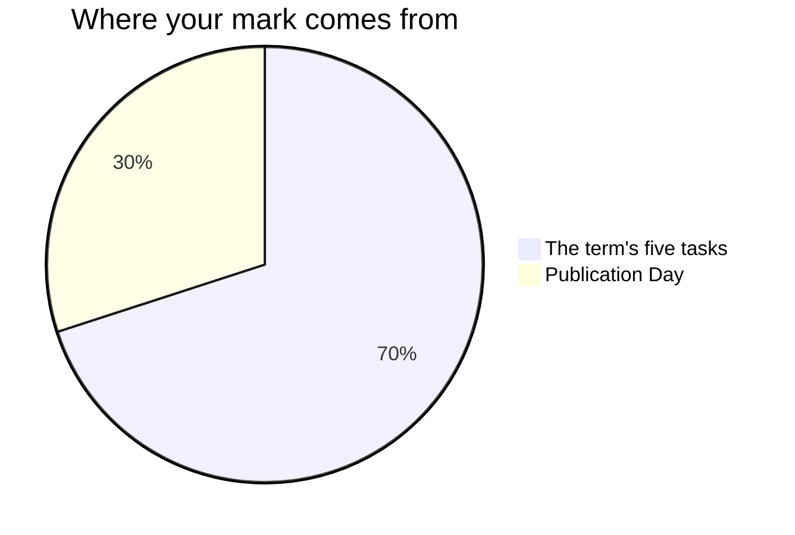

Marks in this course worry people for one wrong reason: the belief that
some people are "naturals" — born writers, born photographers — and
the rest should hold the tripod. No such split exists. Reporting,
shooting, editing, designing, and making are learned crafts, and you
are marked on what your work does for a reader or a user.

## The seventy and the thirty

Every Grade 10 credit in Ontario is built the same way. Seventy per cent of
your mark comes from work spread across the whole semester, and it leans
towards your **most recent and most consistent** work rather than averaging
the start of the course against the end of it — a reporter is judged on the
beat they are filing now, not the one they filed in week two. The other
thirty per cent comes from a final evaluation at the end of the term.

**The seventy** is the five tasks you finish during the term, in the
order you meet them: [[Your First Byline]], [[The Athletics Package]],
[[The Sign Shop]], [[The Rig]], and [[The Front Page]]. They are not
equally weighted. [[The Rig]] runs the longest and asks for everything
at once — a problem, a model, two prints, and the numbers to prove the
second is better — so it carries the most; [[Your First Byline]] is
the shortest, because it is the rehearsal that makes the others
possible. The
exact weights are pinned on the newsroom board and I will read them out
to anyone who asks; knowing them changes nothing about what to do next,
which is why they are not on this page.

**The thirty** is [[Publication Day]]: the term's work published across
all four channels, the portfolio you select from it, and the two
minutes you spend standing beside one piece telling invited readers
what it is and what it took. It lands with eight classes of term still
to run, deliberately — so that the corrections, the portfolio, and the
reading-back all still have somewhere to go afterwards.

## Four kinds of judgement, not one

Every task asks for more than one of these, and the balance shifts with
the task. A publishable story or a working part is never only one of them.

| What is being judged | What it means at this desk |
| --- | --- |
| What you know | Terms, tools, how a message travels to a reader |
| How you think | News judgement, verification, and what to cut |
| How you communicate | The story, the photograph, the page, your talk |
| Where you apply it | A task nobody has walked you through first |

The fourth is why the shop unit exists. Anyone can cover the game they
were told to cover; [[The Rig]] asks whether you can take the design
process you learned on paper and screen and solve a real problem with
a machine and a material you have never used before.

## Three kinds of evidence, and two of them are not paper

**What you make** is the obvious one: stories, photographs, cuts,
pages, cards. **What I watch you do** is the second: whether a crew
logs its cards before anything is edited, what you do in the first two
minutes after an edit note lands, whether you reopen the recording or
work from what you remember hearing. **What you tell me** is the
third — the conferences already on the schedule are not progress
checks, they are evidence in their own right, and some of what you
understand will only ever show up there.

If your package is unfinished and you are quiet, the conference is
often where the strongest evidence of the day comes from. That is not a
consolation prize. It is how the mark is meant to work.

## What is not in your mark

How you work is reported separately, in its own column on the same
report card, as **E, G, S or N** — six habits: responsibility,
organisation, independent work, collaboration, initiative, and
self-regulation. They matter, we will talk about them often, and they
do not move your percentage. The mark is about the work; that column is
about the worker, and mixing the two tells you less about both.

Nor is anybody's opinion of your work, including your own. A desk edit
changes the story, not the mark; that is what makes it safe to be blunt
at the edit desk. You will still judge your own work against the
criteria constantly — [[Judging Your Own Work]] is the routine — because
it is the quickest way to make a piece better before it is judged. The
judging is my job, and I do it from evidence.

Your [[Newsroom Journal]] is **not marked**. It is collected each unit,
I read every page and write back, and nothing in it moves your
percentage — which is exactly what makes it usable. An honest entry
about a spiked story is worth more to both of us than a performed one,
and you will only risk the honest one if it cannot cost you anything.
The same goes for your [[Final Reflection]] at the end: it is the
record you keep, not a paper I grade.

### Where the curriculum itself names a skill

There is one narrow exception, and this course genuinely has it.
[[B3.4|One expectation]] asks you to evaluate the transferable skills
you are developing — collaboration among them — and say where you are
strong and where you are still growing. So on
[[The Athletics Package]] you name the technique that settled your
crew's biggest disagreement and say where you stand with it, and on
[[Publication Day]] your talk names a habit the job needs and why. That
account is marked like anything else in the curriculum. What is marked
is the evidence and your reasoning about it, never whether you were
easy to work with.

The course also teaches what these careers actually ask of people —
see [[Careers and Pathways]]. That is
[[B3.1|knowledge about the field]], examinable the way any other
knowledge is, and no judgement about your own reliability goes anywhere
near your percentage.

### Deadlines, honestly

A deadline here is a property of the product, not a comment on your
character. A recap filed a week after the final whistle is not a
recap — timeliness is the first of the tests in [[News Values]], which
is why [[The Athletics Package]] wants the recap on the desk two days
after the whistle, and still reading as news on the day the beat
publishes. What is being judged is the work, and whether you used a
schedule to get it there. That second half is a curriculum expectation
of its own — [[A2.1|project management skills, used to get a thing made]]
— and a real, teachable skill. Whether you are generally punctual is
Responsibility, and it lives in the other column.

## Where the feedback lands

Every task has a checkpoint before it is due — a conference at your
desk, a peer edit under [[Our Newsroom Standards]], a fact-check
clinic, a pin-up another desk writes three notes on, a proof read by
somebody who did not write the page, a prototype tested at distance
with the person who will use it, a first print measured against its
numbers — and desk time afterwards, the
same period or the next one, whose stated job on the class page is
acting on what the checkpoint found. That is not a
courtesy. It is the only reason handing a first draft to anyone is
worth doing, and the version I evaluate is the one that came out the
far side.

> [!important] First drafts are never penalised as first drafts
> Version one of everything gets edited — that is what editors are
> for. The mark follows where your work ends up, not where it
> started. Your revision notes are the record of that distance, and
> your journal is where you keep it for yourself.

Each task publishes its success criteria before you start, phrased as
things a reader or an editor could see. If a mark ever surprises you,
ask — those criteria are the whole story, and [[Getting Help]] lists
the ways to reach me.

%%curriculum-start%%
## Curriculum connection

![[B3.4]]
%%curriculum-end%%
