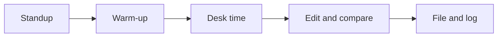

This class is a newsroom, and you are its founding team. We cover real
stories — school life, our school's athletics — and we publish what we
make: on the site, on social media, in print, and on our news program.
Halfway through the term the newsroom also opens a shop, and makes
things you can hold: signs on a laser cutter, and a piece of camera gear
on a 3D printer. The routines below are how newsrooms everywhere turn a
room of people into a publication.

## Why a newsroom and a shop

This is Technology and the Skilled Trades, a course the Ministry writes
to reach across a *variety* of technology areas rather than one. We
give it a communications flavour — writing, photography, video, sound,
layout, publishing — because that is what this room is built for, and
then we reach into manufacturing for Unit 3: a laser-cut sign for a
real user, and a 3D-printed rig that fixes a real problem your Unit 2
crew had. The design process is the same in both places — plan it,
make it, test it, make it better, keep everyone safe — and meeting it
twice, in two very different materials, is the point.

> [!info] What this course assumes the room has
> For the ink-and-pixels units: cameras or phones, a microphone kit,
> tripods, headphones, and editing software. For the shop unit:
>
> - **one enclosed laser cutter**, with its fume extraction running
>   whenever it does, and a **fire extinguisher** of the type its
>   maker's manual specifies, within reach of the machine;
> - **one 3D printer** that prints PLA;
> - **digital calipers** — a few pairs to share;
> - **¼″-20 nuts** (the thread every camera tripod uses), because a
>   thread printed in plastic is rarely strong enough to trust with a
>   phone;
> - **safety glasses** for everyone on shop days;
> - **accounts for a free browser-based 3D modelling program** such as
>   Tinkercad, approved the way your school approves any online
>   account, and a free vector drawing program such as Inkscape for the
>   cut files.
>
> Every shop plan in Unit 3 is budgeted for exactly one laser and one
> printer shared by the whole class, run only while somebody is
> standing at them. If your room has more, the plan gets easier.

## Standup

Two minutes, everyone: what are you working on, what do you need, what
is blocking you. Real newsrooms open this way because a team that knows
what everyone is chasing never chases the same thing twice.

## Warm-up

Five minutes of reps — [[Caption This]], [[Headline Help Desk]], a
[[News or Not]] round. Small daily judgement calls compound into news
sense.

## Desk time

The heart of class: reporting, shooting, recording, writing, editing,
and later cutting and printing —
often at a [[Studio/index|studio session]] where you make the thing
BEFORE the principle gets its name. You will shoot a five-shot sequence
before any lesson names coverage; you will fix a buried lede before
anyone says "inverted pyramid".

## Edit and compare

Work goes up on the screen — drafts, contact sheets, cuts — and the
room edits together: what works, what would make it stronger, what
questions a reader would still have. Editing someone's work is a
service; receiving edits without flinching is a professional skill,
practised here daily under [[Our Newsroom Standards]].

## File and log

Work is filed properly ([[Filing a Story]] is the workflow) and the
last minutes belong to your [[Newsroom Journal]]: what you covered,
what you learned, what you would chase next. Every reporter keeps one
in some form; yours starts now.

## Safety first, every period

Newsrooms and shops both hurt people in the same way: slowly and
quietly, on a day when everyone was in a hurry. So the order never
changes — the safety check before the work, not after it, whether that
means taping a cable across the studio floor or checking the laser's
extraction is running before the lid closes. Nobody waits to be told.
[[Safety in the Newsroom]] and, from Unit 3, [[Safety in the Shop]] are
the two agreements; this sentence is the habit underneath them.

> [!tip] If you were away
> Check the class page in All Classes, then check the assignment desk —
> your team may have filed while you were out, and the fastest way back
> in is asking your editor what needs doing.

%%curriculum-start%%
## Curriculum connection

![[A1.6]]

![[A4.6]]
%%curriculum-end%%
