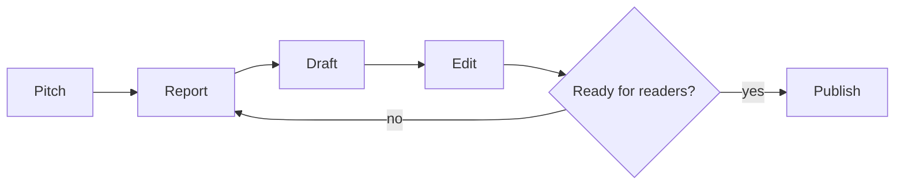
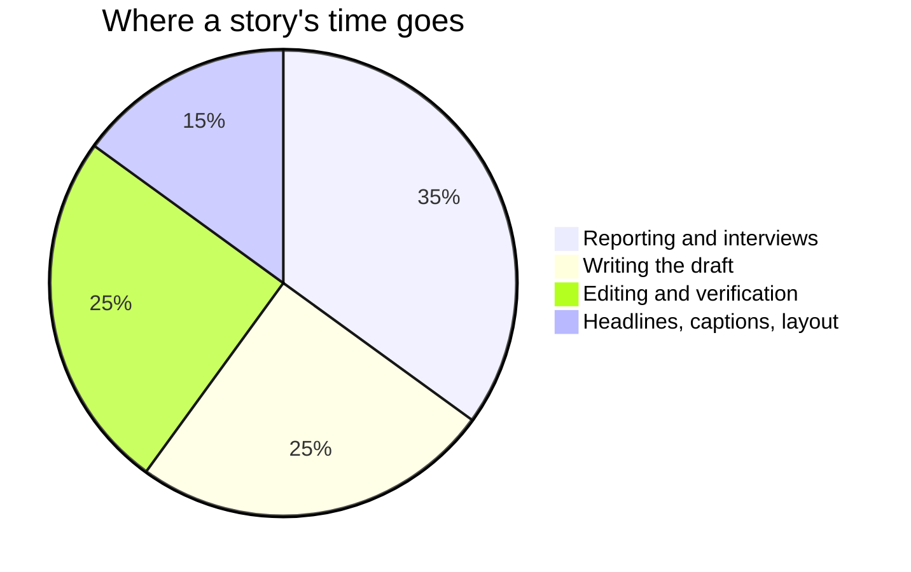
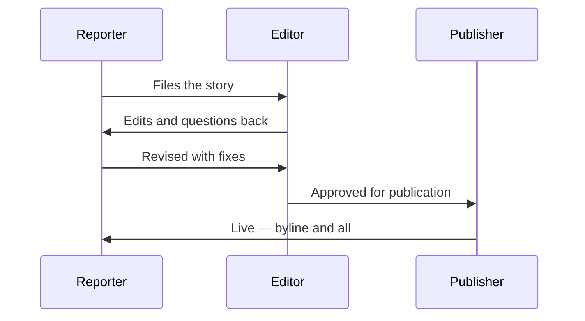
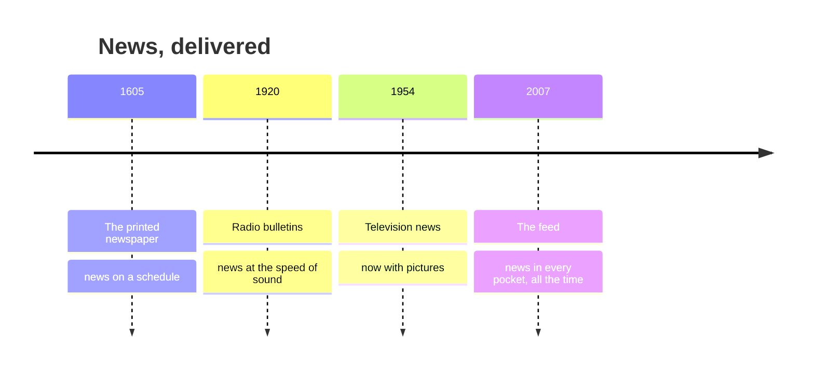

This page exists for two audiences. Students: it shows why the notes look the
way they do. Teachers: it is a working reference for everything you can put in a
page, with the source visible in every example.

Everything below is written in **Markdown** — plain text with a few marks of
punctuation that mean something. If you can write a text message, you can write
this.

---

## Text that carries meaning

You get **bold**, *italic*, ~~struck through~~, and ==highlighted== text.
Highlighting is the one worth knowing: it draws the eye better than bold when
you want a single ==key term== to stand out in a paragraph.

**How that was made:**

```markdown
**bold**, *italic*, ~~struck through~~, ==highlighted==
```

Arrows written as `->` become proper arrows: pitch -> report -> publish.

Keyboard keys look like keys: press <kbd>⌘</kbd> + <kbd>K</kbd> to search.

---

## Headings, and the table of contents

Every `##` heading on a page becomes a link in **Navigate this page**, over on
the right. Nothing builds that list by hand — it is made from the headings as
the page is built, so it can never fall out of step with the page.

Deeper headings nest underneath: a `###` sits inside the `##` above it, which
is why "Foldable callouts" appears indented under "Callouts".

**How that was made:** `##` at the start of a line, and `###` for a
sub-heading.

```markdown
## Callouts

### Foldable callouts
```

> [!tip] Write headings for the person skimming
> The table of contents is the first thing many students read. "Filing
> checklist" tells them what is there; "More on this" does not.

### Turning it off

A short page, or one that is mostly a list, reads better without a contents
panel. Add one line to the frontmatter:

```yaml
---
enableToc: false
---
```

Every class page in [[All Classes/index|All Classes]] uses this. Open
[[Unit 1, Day 1]] and you will see no "Navigate this page" panel on the right,
even though the page has headings that would otherwise appear there — an agenda
of six items does not need navigating.

---

## Callouts

Callouts pull something out of the flow of the page. There are a dozen kinds and
each has its own colour and icon, so students learn to recognise them at a
glance.

> [!note] Note
> Neutral information worth setting apart.

> [!tip] Tip
> A shortcut, a habit, or something that makes the work easier.

> [!important] Important
> The one thing to take away if you take away nothing else.

> [!warning] Warning
> Where people usually go wrong.

> [!danger] Safety
> Used in this course for consent, privacy, and equipment care — see
> [[Our Newsroom Standards]].

> [!question] Question
> Something to think about rather than something to know.

> [!example] Example
> A worked case.

> [!abstract] At a glance
> Used at the top of task pages for deadlines and format.

**How that was made:** a blockquote with the kind named in brackets.

```markdown
> [!warning] Where people usually go wrong
> The text of the callout goes here.
```

### Foldable callouts

Add a `-` to start a callout collapsed — useful for hints, side-coaching notes,
and anything you do not want an audience to see immediately.

> [!success]- One strong photo choice (click to expand)
> Move until something in the foreground frames your subject — a
> doorway, a shoulder, a hoop — and suddenly the picture has depth
> instead of a wall.

**How that was made:** the `-` after the kind is the whole difference.

```markdown
> [!success]- One strong choice (click to expand)
> The hidden content.
```

---

## Diagrams

Diagrams are **written, not drawn** — which means they can be edited in seconds
and never need a graphics program.

### Flowchart



**How that was made:** not a picture — these lines of text, between two fence
lines that say `mermaid`.

````markdown

````

`-->` draws an arrow, `["…"]` makes a box, `{"…"}` makes a decision diamond,
and `-->|yes|` labels the arrow. Change a word and the diagram redraws — no
graphics program, and the change shows up in a diff.

### Proportions



### Sequence

Who says what to whom, in order — here, how a lighting cue gets called:



### Timeline



---

## Tables

**How that was made:** rows of text separated by `|`, with a line of dashes
under the headings.

| Element | What it asks | A question to test it |
| --- | --- | --- |
| Lead | What happened? | Could a reader stop here and know? |
| Quote | Who says so? | Would the source recognise their words? |
| Caption | What am I looking at? | Names, action, and when? |

---

## Checklists

**How that was made:** a list where each line starts with `- [ ]`, or `- [x]`
for one already done.

- [ ] Names spelled right, and checked twice
- [x] Quotes verified against the recording
- [ ] Consent noted for every recognisable face
- [ ] Caption, credit, and byline in place

On the site they are read-only — the boxes show what the page says, and
clicking one does nothing. Copied into a notebook, they are useful for
keeping your place while setting up a shoot.

---

## Links between pages

This is what makes the site more than a pile of documents.

- A plain link: [[News Values]]
- A link with different words: [[News Values|what makes news]]
- A link to a section: [[News Values#The seven tests]]

**How that was made:** double square brackets.

```markdown
[[News Values]]
[[News Values|different words for the link]]
[[News Values#The seven tests]]
```

### Transclusion — one page inside another

**How that was made:** `![[Page name]]` — a link with an exclamation mark in
front of it.
%%curriculum-start%%
Here is a curriculum expectation, embedded live rather than copied:

![[A2.6]]

Change the source page and every page that embeds it updates. This is how each
task page shows the expectations it addresses without anyone maintaining
duplicates.
%%curriculum-end%%

### Backlinks

Scroll to the bottom of any page and you will find **Backlinks** — every page
that links *to* this one, gathered automatically. Nobody maintains that list.
It is why linking generously costs nothing and pays off later.

---

## Hover previews

Hover over [[Filing a Story]] without clicking. The page appears in a small
window. Checking the workflow mid-edit does not cost you your place.

---

## Footnotes

**How that was made:** `[^1]` where the marker goes, and a matching `[^1]:`
line anywhere in the page.

The word "deadline" began as a literal line.[^1]

[^1]: In Civil War prison camps, it marked the boundary a prisoner
    crossed at their peril; printers borrowed it for the hour past
    which copy was dead. Newsrooms kept the urgency.

---

## Tags

**How that was made:** a `tags` list in the frontmatter at the very top of the
page.

```yaml
---
tags:
  - concepts
  - unit-1
---
```

Every tag becomes a page listing everything filed under it.

---

## Mathematics (not used in this course — but here if you need it)

A newsroom has no equations, so you will not meet these in our pages. The
site can typeset them anyway, which matters if you also teach a course that
needs them. Inline maths sits in a sentence, like $E = mc^2$; display maths
gets its own centred line:

$$
\text{aspect ratio} = \frac{\text{width}}{\text{height}} = \frac{16}{9}
$$

**How that was made:** single dollar signs keep it in the sentence, double
ones give it a line of its own.

```markdown
Inline: $E = mc^2$

Display:
$$
\text{a fraction} = \frac{\text{top}}{\text{bottom}}
$$
```

## Code (also not used in this course)

The same is true of program code: fence it with three backticks, name the
language, and it comes out coloured and exact — spacing preserved, quotation
marks untouched. Useful in computer science; here, only as proof it works.

```python
def call_cue(number):
    return f"LX {number}, go"
```

---

## What you cannot see

Two things on this page are invisible in the browser:

1. **Comments.** Text wrapped in `%%` double percent marks `%%` never reaches
   the site. Useful for notes to yourself in a page you are still writing —
   editor's notes, source reminders, next year's fixes.
2. **Holding a page back.** A page with `publish: false` in its frontmatter is
   left out when the site is built. Write next week's lesson today and publish
   it when you are ready — exactly how embargoed stories work. A page with no
   `publish` line is published, so forgetting it can never make your work
   vanish.

%% This sentence is a comment. If you can read it on the website, something is broken. %%

> [!tip] For teachers reading this
> With more than one section, per-section keys like `publishForSection1` and
> `publishForSection2` let one shared page be published to one class and held
> back from another — useful when your two sections sit a few days apart.

---

## The point of all this

None of it is decoration. Each feature removes a reason for a page to be out of
date:

| Feature | The problem it solves |
| --- | --- |
| Transclusion | The same text copied into six places, five of them stale |
| Backlinks | "Where did we use this again?" |
| Diagrams as text | Rebuilding a diagram from scratch to change one arrow |
| Holding a page back | Keeping unpublished work in a separate file somewhere |
| Checklists | The publication-day scramble |

Write it once, link to it everywhere.
