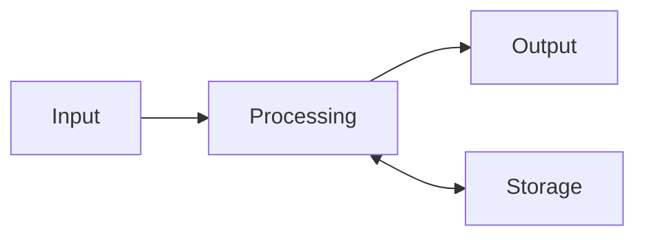

The case came off in [[Take It Apart]] and most of the mystery went
with it — a fan, some boards, a surprising amount of cable. What was
left is the idea this page pins down: every computer, from the bench
machine to a phone to the brain of a washing machine, has the same
four-part shape.

## Four jobs, one shape

A computer takes something in, works on it, remembers what it needs,
and puts something out. Everything in the case exists to serve one of
those four jobs.

Input and output are the machine's conversation with the world;
processing and storage are what happens in between, where you cannot
watch.

## Finding the shape in the case

Sort the parts you catalogued in the teardown and the shape appears.
Keyboard and mouse ports are input. The monitor connector is output.
The [[The CPU and Memory|CPU]] is processing, and the
[[Storage and Drives|drives]] are storage. The power supply and the
fans serve no job directly — they exist to keep the four that matter
alive. [[Name That Part]] is quick practice at exactly this kind of
sorting.

## Everything "smart" is this shape

A smart thermostat is a thermometer (input), a small processor, a
saved schedule (storage), and a relay wired to the furnace (output).
A game console, a car dashboard, a hospital monitor — same shape,
different proportions. When a device is advertised as smart, this is
the claim actually being made: *there is a computer in here.* And
once you can see the shape, you can ask the first useful repair
question — which of the four jobs has failed?

## Software layers: how programs tell hardware what to do

Hardware needs instructions to perform these four jobs. Software splits
into two fundamental categories:

- **System software (operating systems and drivers):** Manages the
  physical hardware, allocates memory, handles file systems, and runs
  background maintenance utilities. Without an OS, the CPU has no
  instructions to execute after POST.
- **Application software:** Programs designed for end users to accomplish
  specific tasks — typing documents, designing circuits, editing audio,
  or browsing the web. Applications rely on the OS to interact with
  hardware safely.

Understanding the difference between the operating system layer and the
application layer is essential when diagnosing whether a computer fault
is caused by physical hardware, corrupt system files, or a misbehaving
app.

%%curriculum-start%%
## Curriculum connection

![[A1.3]]

![[B4.1]]
%%curriculum-end%%
