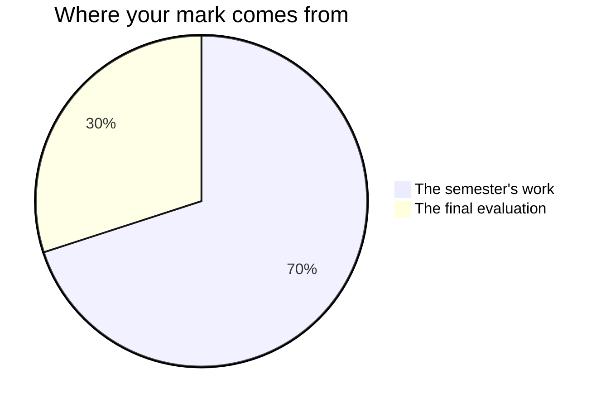

Marks in this course worry people for one wrong reason: the belief that
some people are "good with their hands" and the rest should stay back
from the bench. No such split exists — building, wiring, and diagnosing
are learned skills, and what gets marked is the work itself: what it
does, what it shows, and what somebody else could do with it.

## The seventy and the thirty

Every Grade 10 credit in Ontario is built the same way. Seventy per cent of
your mark comes from work spread across the whole semester, and it leans
towards your **most recent and most consistent** work rather than averaging
the start of the course against the end of it — the technician you are in
the most recent evidence is what is reported on. The other thirty per cent
comes from a final evaluation towards the end of the course.

**The seventy** is the four jobs you take on during the semester, in
the order you meet them: [[The Build Sheet]], [[The Network Job]],
[[The Gadget]], and [[The Refurb Report]] — plus the milestone entries
in your [[Tech Journal]], collected at the end of each unit. The four
are not equally weighted. The Gadget and The Refurb Report carry more
than the earlier two, because they ask for everything at once, and
because they are the more recent evidence of what you can do.
Ask me for the exact split any time you want it; it is not a secret, it
is just not the useful thing to memorise.

**The thirty** is [[The Shop Showcase]]: one artifact from the course
presented technician-style to guests, its documentation open on the
bench beside it, your growth statement, and the [[Final Reflection]] you
finish in our last class. It reaches back across the whole semester on
purpose — it is the one piece of work that asks what the entire course
left you with, rather than what one unit did.

The [[Tech Journal]] entries that carry a mark are the ones written
**in class, at the bench, in the last minutes of a bench day** — the
days whose agenda ends by sending you to your journal. What you add at
home is yours, and it is worth doing, but practice you do between
classes is practice, and I do not mark it.

Two other things you do often carry no mark at all, deliberately. The
**bench checks** that close the first three units are marked by you,
against the class standard, and exist to tell you what to practise. So
does every warm-up. Nothing you or a classmate scores can move your
percentage — that decision is mine, made from evidence, and
[[Judging Your Own Work]] explains why keeping it that way is what makes
an honest self-check safe to write.

## Four kinds of thinking, not one

Every task asks for more than one of these, and the balance shifts from
job to job. A build that powers on is never the whole of it.

| What is being judged | What it means at this bench |
| --- | --- |
| What you know | Parts, ports, numbers, and what each one actually does |
| How you think | Diagnosing rather than swapping; choosing between parts |
| How you communicate | Build sheets, binders, comments, labels, your talk |
| Where you apply it | Making it work for a client nobody walked you through |

The fourth is why every task has a client in it — a pair across the
aisle playing a café owner, a studio that needs two rooms wired, a
stranger's donated machine. Anyone can rebuild the machine we took
apart together; the course is asking whether you can specify, build,
and defend one for somebody whose problem nobody has solved in front of
you.

## Three kinds of evidence, and two of them are not paper

**What you make** is the obvious one: sheets, binders, gadgets,
reports, journal entries. **What I watch you do** is the second: which
end of the cable you reach for, whether you measure before you blame
the code, whether the tester goes on the finished run or the offcut.
**What you tell me** is the third — the conference each task schedules,
where I come to your bench and ask, is not a progress check; it is
evidence in its own right, and some of what you understand will only
ever show up there.

If your hands are slower than your head, the conference is often where
the strongest evidence of the week comes from. That is not a
consolation prize. It is how the mark is meant to work.

Every task has a checkpoint where I read your work in progress against
the criteria table and leave you one written note, and the next bench
period opens with fifteen minutes for acting on it. That fifteen
minutes is on the schedule because feedback you have no time to use is
just a verdict arriving early.

## What is not in your mark

How you work is reported separately, on the same report card, as **E,
G, S or N** — six habits: responsibility, organisation, independent
work, collaboration, initiative, and self-regulation. They matter, we
will talk about them all term, and they do not move your percentage.
Your mark is about the work; that column is about the worker, and
mixing the two tells you less about both.

> [!warning] The one exception, and it is a narrow one
> A shop is the place where a habit really is curriculum. Expectation
> [[D1.1|health and safety procedures]] asks you to "use appropriate
> equipment, procedures, and techniques… to protect health and ensure
> safety when working with computers", and
> [[B2.2|procedures to prevent hardware damage]] to "use appropriate
> procedures to prevent damage to computer hardware and electronic
> components". Both are marked, because the curriculum names them — and
> only where a task's criteria table says in words what they look like
> at a bench. D1.1 has that row on [[The Network Job]], [[The Gadget]],
> [[The Refurb Report]] and [[The Shop Showcase]]; B2.2 has it on the
> two where you handle bare boards and components, The Gadget and The
> Refurb Report. Nowhere else.
>
> That is the whole exception. Being punctual, tidy, willing or
> pleasant is not in it. Neither is
> [[D3.5|work habits understanding]], which asks you to "demonstrate an
> understanding of the work habits that are important for success in
> the computer industry" — you name two of them in your growth statement
> and show what is behind them, and it is that naming and that evidence
> which are marked, never whether you had them.

> [!important] Broken builds are never penalised as broken
> Version one of everything fails to POST. The mark follows where your
> work ends up and how visibly you got there — your journal and your
> documentation are how "visibly" happens, which is why
> [[Writing About Technology|writing it down]] is most of the trade.

If a mark ever surprises you, ask — the criteria table on each task
page is the whole story, published before the work starts, and
[[Getting Help]] lists the ways to reach me.
