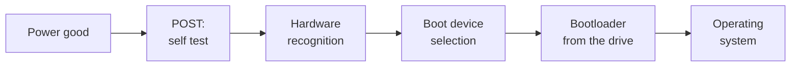

Between pressing the power button and seeing a login screen, a machine
runs software that is not on the drive at all. Knowing what it does, in
order, turns "it will not boot" from a mystery into a sequence you can
test.

## What firmware is

Firmware is software stored in non-volatile memory on the board itself
— traditionally called the **BIOS**, and on modern machines a **UEFI**
implementation. It is the first code the processor executes, and it
exists because the machine needs someone to find and start the
operating system before there is an operating system.

## The boot sequence, in order

1. **POST — power on self test.** The firmware checks that the
   processor, memory, and essential devices respond. Failures here are
   reported by beeps, board LEDs, or a code display, *before* any
   screen output is possible. That is why a beep code is diagnostic
   gold: the machine is telling you what it found before it had a
   display.
2. **Hardware recognition.** Drives, controllers, and expansion cards
   are detected and initialised, and the results appear in the firmware
   setup screens.
3. **Boot device selection.** The firmware works down a configured
   order — internal drive, USB, network — and hands control to the
   first bootable device it finds.
4. **The bootloader**, on the drive, loads the operating system kernel.
5. **The operating system** takes over, loads drivers, and starts
   services.

Faults divide neatly at step 5. Anything before it is firmware or
hardware; anything after it is the operating system. That single
question — *did it POST?* — halves the diagnosis.

## How BIOS, hardware, and the OS interact

Early operating systems called firmware routines to reach hardware.
Modern ones do not: after boot, the operating system talks to hardware
through its **own drivers**, and the firmware's job is largely done.
What the firmware still owns is the low-level configuration the OS
inherits — boot order, secure boot, virtualisation support, memory
timings, fan curves, and which devices are enabled at all.

That division explains a fault students find baffling: a feature can be
missing in the operating system because it is switched off in firmware,
and no amount of reinstalling will bring it back.

## Updating firmware, and when not to

| Reason to update | Reason to hold off |
| --- | --- |
| Support for a new processor or drive | The machine is working and the release notes do not mention your problem |
| A published security fix | No mains power or UPS — an interrupted flash can brick the board |
| A documented bug you actually have | An unverified download; firmware comes from the manufacturer or not at all |

> [!warning] Before any firmware update
> Record the current version, read the release notes to the end, and
> make sure the machine cannot lose power. This is the one routine
> maintenance operation that can destroy a board outright, and it is on
> the checklist in [[The Client Build]] for that reason.

## Upgrades that need more than a screwdriver

Adding hardware often means firmware and driver work, not just
installation: a BIOS update for a newer processor, drivers for a new
card, a resource conflict to resolve, or a storage mode setting that
must match how the operating system was installed. Plan those before
opening the case — the machine that will not boot after a "simple"
upgrade is usually a setting, not a broken part.

%%curriculum-start%%
## Curriculum connection

![[A2.2]]

![[A2.3]]

![[A2.4]]

![[B2.3]]
%%curriculum-end%%
