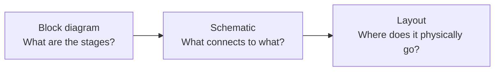
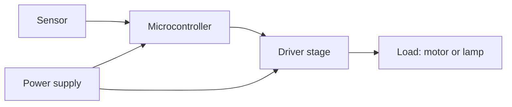

The first time a schematic went up in [[Read the Schematic]] somebody
said it looked nothing like the breadboard in front of them. Correct. A
schematic is not a picture of a circuit — it is a map of what is
*connected to what*, drawn so the connections are readable rather than
so the parts are in the right places. Once you accept that, it stops
being a puzzle.

## What the drawing promises and what it does not

A schematic promises three things and nothing else: which components are
present, what value each one has, and which terminals share an electrical
connection. It says nothing about where a part physically sits, how long
a wire is, or which side of the board it is on. That is the job of a
layout drawing, which is a different document for a different purpose.

The conventions that make it readable:

- **Positive supply at the top, ground at the bottom**, so current flows
  down the page. A drawing that follows this is instantly scannable; a
  drawing that ignores it is technically valid and awful to read.
- **A dot at a crossing means a connection. No dot means the lines cross
  without touching.** This single convention causes more student errors
  than everything else combined. When in doubt, look for the dot.
- **Reference designators**: R for resistors, C for capacitors, D for
  diodes and LEDs, Q for transistors, U for integrated circuits, SW for
  switches. R3 is the third resistor, and the parts list will call it R3
  too.
- **Ground symbols repeat instead of joining.** Every ground symbol on
  the page is the same node. Drawing them all connected would turn the
  sheet into spaghetti, so they are drawn separately and understood to be
  one net.

> [!warning] The two-terminal trap
> Not every symbol is symmetrical. A diode, an LED, an electrolytic
> capacitor, and a transistor all care which way round they go, and the
> schematic tells you: the bar on the diode is the cathode, the longer
> lead on an LED is the anode, the stripe on the electrolytic marks
> negative. Fit one backwards and the circuit does not merely misbehave —
> the electrolytic can vent. [[Components and Their Markings]] is where
> the physical part meets the drawn symbol.

## Three drawings, three questions

A schematic is one of three drawings you will produce for a build, and
they answer different questions.

The block diagram comes first and is deliberately vague — boxes with
names and arrows for signals. It is what you draw on the whiteboard when
the design is still an argument. Here is the block diagram of nearly
every project in Unit 3:

Two things worth noticing in that second diagram. The power supply feeds
both the controller and the driver, but the signal path only runs one
way. And the driver stage exists as its own box precisely because the
microcontroller cannot drive the load directly — a fact
[[Driving Outputs Safely]] spends a whole page on.

## Reading one for real

Tracing a schematic is a physical activity. Put a fingertip on the
positive rail, follow the line, and say aloud what you pass through. When
the path branches, note it and take one branch at a time. When you reach
ground, you have traced one complete loop; a circuit with three loops
needs tracing three times.

- [ ] Every component identified by designator and value
- [ ] Every junction dot found, and every crossing without one confirmed
- [ ] The supply rail traced to ground at least once, out loud
- [ ] Predicted voltage written beside at least two points before power
      is applied

Schematic capture software — the kind that also draws the printed circuit
board and can simulate the circuit before you cut anything — enforces
most of these checks for you. It will not let a wire *almost* touch a
pin, and its simulator will tell you the node voltages your prediction
should have matched. That is a rehearsal, not a replacement: a simulator
happily models a resistor dissipating four watts, and only
[[Power and Heat]] will warn you what that smells like.

Take a drawing to [[Series and Parallel Practice]] to check that you can
compute from it, and to [[Measure a Circuit]] to confirm the board you
built is the board you drew.

%%curriculum-start%%
## Curriculum connection

![[A3.1]]

![[B3.3]]

![[B3.4]]
%%curriculum-end%%
