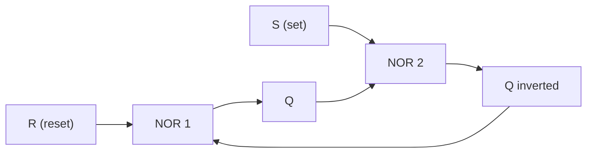

Everything in [[Logic Gates]] forgets instantly. Take the inputs away and
the output goes with them, because a combinational circuit's output
depends on nothing but what is on its inputs *right now*. That is fine
for a decision and useless for a count, a lock, or a stored setting. In
[[Build the Logic Machine]] the moment you needed the circuit to remember
that a button had been pressed, you needed something new.

## Memory is a gate looking at itself

Feed a gate's output back to its own input and the circuit acquires a
past. Two NOR gates cross-connected make the simplest memory element
there is, the **SR latch**:

Walk it round. Pulse S to 1 while R is 0 and the second gate is forced
low, which frees the first gate to go high: Q becomes 1. Now drop S back
to 0 — and nothing changes, because Q is holding the second gate low by
itself. The latch has *remembered* the pulse. Pulse R instead and it
flips the other way, and again it stays there. With both inputs at 0 the
latch holds whatever it was last told.

| S | R | What Q does |
| --- | --- | --- |
| 0 | 0 | Holds its previous value |
| 1 | 0 | Set to 1 |
| 0 | 1 | Reset to 0 |
| 1 | 1 | Not allowed — both outputs go low and the "inverted" output is a lie |

That last row is not a curiosity, it is a design rule. A latch driven
into the forbidden state lands unpredictably when the inputs are released,
and unpredictable is exactly what a memory element must never be.

## Clocks turn a latch into a flip-flop

A bare latch changes the instant its inputs change, which makes a circuit
full of them nearly impossible to reason about — signals arrive at
slightly different times and the machine races itself. The fix is a
**clock**: a shared square wave that says *now*.

A D flip-flop has one data input and one clock input. On the clock's
rising edge it copies whatever D happens to be at that instant, and it
then ignores D completely until the next edge. Everything downstream sees
a value that is stable for a whole clock period. That is the bargain the
entire digital world runs on: give up continuous response, buy the
ability to reason about the circuit.

Chain flip-flops and useful things appear immediately. Eight of them side
by side, sharing a clock, make a **register** that stores a byte. A chain
where each one toggles the next makes a **counter**, and a counter driven
by a known clock frequency is a timer — the same mechanism behind
`time.ticks_ms()` in [[Structuring Embedded Code]].

> [!warning] Setup and hold are real constraints
> A flip-flop needs its data input to be steady for a short window before
> the clock edge and a short window after it. Violate that and the output
> is genuinely undefined for a while. This is why clock speed has a
> ceiling: run the clock faster than the logic can settle and the
> flip-flops start capturing values that were still on their way. Your
> bench circuits are nowhere near this limit; the processor in your
> laptop lives right up against it.

## From flip-flops to the memory in a machine

The same idea scales all the way up, and the trade-offs are consistent:
the faster and more convenient a store is, the less of it you get.

| Store | Built from | Volatile? | Character |
| --- | --- | --- | --- |
| CPU registers | Flip-flops, on the processor itself | Yes | Tiny, immediate |
| Cache | Fast static RAM cells | Yes | Small, close to the CPU |
| Main RAM | Dynamic cells, one capacitor each | Yes | Large, must be refreshed constantly |
| Flash / SSD | Cells that trap charge | **No** | Keeps data with the power off, wears out with writes |

Dynamic RAM is the odd one: each bit is a charge on a tiny capacitor that
leaks, so the chip rereads and rewrites every cell thousands of times a
second just to stand still. That is why RAM forgets the instant you cut
power, and why "save your work" remains sound advice.

The trend across every row of that table has run the same direction for
decades — more bits per chip, less cost per bit, less energy per access —
and it is the reason a microcontroller you can buy for pocket money now
holds more memory than a desktop machine did within living memory. It is
also why the bottleneck moved: processors got fast enough that waiting
for memory, not computing, is what modern designs spend their effort
avoiding.

Keep the gate work sharp in [[Logic Gates Practice]], then take the
ideas back to the bench in [[Build the Logic Machine]], where a latch is
what makes your circuit remember which button was pressed first.

%%curriculum-start%%
## Curriculum connection

![[A1.1]]

![[A1.3]]

![[A5.3]]
%%curriculum-end%%
