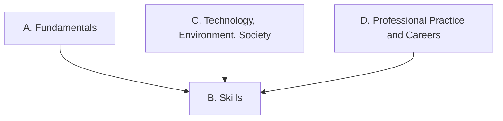

Everything we do in this course points at one or more of these
expectations, from **TEJ3M — Computer Engineering Technology,
Grade 11, University/College Preparation**. Lesson pages link
here so you can always see *why* we are doing something.

> [!info] Where these come from
> The wording below is the Ontario curriculum's own. See
> [[About These Expectations]] — including a note about the codes.

## Overall and specific expectations

### Strand A. Computer Technology Fundamentals
*By the end of this course, students will:*

![[A1. Computer Hardware]]
![[A1.1]]
![[A1.2]]
![[A1.3]]
![[A2. Computer Systems]]
![[A2.1]]
![[A2.2]]
![[A2.3]]
![[A2.4]]
![[A3. Electronics, Robotics, and Computer Interfacing]]
![[A3.1]]
![[A3.2]]
![[A3.3]]
![[A3.4]]
![[A3.5]]
![[A4. Networking Concepts]]
![[A4.1]]
![[A4.2]]
![[A4.3]]
![[A4.4]]
![[A5. Data Representation and Digital Logic]]
![[A5.1]]
![[A5.2]]
![[A5.3]]

### Strand B. Computer Technology Skills
*By the end of this course, students will:*

![[B1. Hardware Solutions]]
![[B1.1]]
![[B1.2]]
![[B1.3]]
![[B1.4]]
![[B2. Computer Systems]]
![[B2.1]]
![[B2.2]]
![[B2.3]]
![[B3. Electronics, Robotics, and Computer Interfacing]]
![[B3.1]]
![[B3.2]]
![[B3.3]]
![[B3.4]]
![[B4. Network Setup and Management]]
![[B4.1]]
![[B4.2]]
![[B4.3]]
![[B4.4]]
![[B4.5]]
![[B5. Computer Programming]]
![[B5.1]]
![[B5.2]]
![[B5.3]]

### Strand C. Technology, the Environment, and Society
*By the end of this course, students will:*

![[C1. Technology and the Environment]]
![[C1.1]]
![[C1.2]]
![[C2. Technology and Society]]
![[C2.1]]
![[C2.2]]

### Strand D. Professional Practice and Career Opportunities
*By the end of this course, students will:*

![[D1. Health and Safety]]
![[D1.1]]
![[D1.2]]
![[D2. Ethics and Security]]
![[D2.1]]
![[D2.2]]
![[D2.3]]
![[D3. Career Opportunities]]
![[D3.1]]
![[D3.2]]
![[D3.3]]
![[D3.4]]
![[D3.5]]
![[D3.6]]
