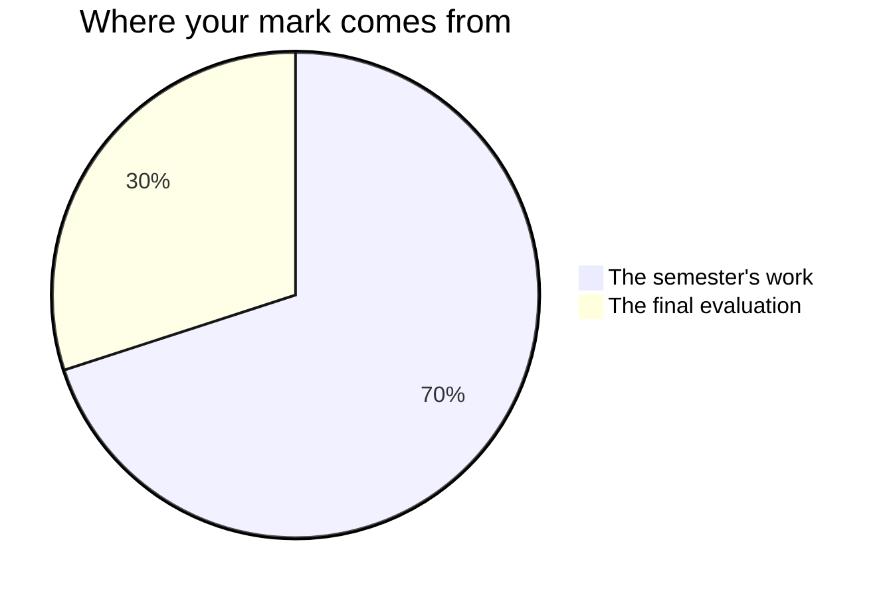

Marks in this course worry people for one wrong reason: a belief that
some people are "good with their hands" and everyone else should stay
back from the bench. No such division exists. Measuring, calculating,
soldering, and diagnosing are learned skills, every one of them, and
you are marked on what your work does and on what you can show about
how it got that way.

## The seventy and the thirty

Ontario builds a Grade 11 credit out of two unequal parts, and this one
is no different. Seventy of your hundred marks come from the term
itself, weighted towards what you were doing **most recently and most
consistently** — the technician you are at the end is not marked as the average of
themselves and the one you were at the start. The remaining thirty come from a single
final evaluation at the end.

**The seventy** is the five jobs you take on during the semester, in
the order you meet them: [[The Working Circuit]],
[[The Logic Machine]], [[The Embedded Device]], [[The Client Build]],
and [[The Engineering Project]]. They do not weigh the same. The Client
Build and the Engineering Project carry the most, because they run
longest and ask for everything at once, and the three before them are
the rehearsals that make those two survivable. The exact split is yours
for the asking, any time — it is not confidential, it is just a worse
thing to carry around than the criteria are.

**The thirty** is [[The Engineering Showcase]] on the last day: you
stand beside a working thing you built, demonstrate it, defend a
measured claim about it, and answer questions. The questions are not
confined to your own project — they range across the whole semester,
which is what the last three classes are for.

Every one of those five jobs has a conference with me before it is due,
and at least one working period after that conference. That is where
feedback lands. Nothing about a mark should first reach you on the day
the work is collected.

## Four kinds of thinking, not one

No job in this course lands in only one of these rows, and which row
carries the weight moves with the job. Working is the floor here, not
the ceiling.

| What is being judged | What it means here |
| --- | --- |
| What you know | Components, ratings, gates, boot order, what an address means |
| How you think | Choosing a design, budgeting current, cornering a fault |
| How you communicate | Schematics, documentation, readable code, what you say at the bench |
| Where you apply it | Making it work for a job nobody walked you through |

The fourth row is the reason [[The Engineering Project]] exists at all.
Building the circuit you were shown is a starting point; the course is
asking whether you can build one for a problem nobody has solved in
front of you.

## Three kinds of evidence, and two of them leave no paper

**What you make** arrives on its own: boards, code, schematics,
measurement sheets, handover packages, journal entries. **What I watch
you do** does not. Whether the strap goes on before the tube opens,
whether you change one thing at a time when you are chasing a fault,
whether you reach for the meter or for another opinion — none of that
survives the period unless I write it down while it is happening.
**What you tell me** is the third: the conference at each task's
milestone is not me checking up on you, it is evidence being gathered
the only way some of it can be gathered.

A bench that says little and finishes late can still produce the best
evidence in the room, and it usually arrives in the conference. That is
not a consolation prize. It is the design.

Your [[Tech Journal]] sits across all three. The entries that carry
marks are the ones a task's criteria table asks for by name and that are
written **in class**, at the milestone they belong to: the calculation
sheet, the fault log, the trial data, the build log, and
[[Final Reflection]], which is written in the last two review classes
rather than taken home. Anything else you add to the journal between
classes belongs to you and is worth writing, but practice is practice,
and practice is not marked.

## What your percentage is not made of

There is a second column on your report card, and it is not a smaller
version of the first. It carries a letter — **E, G, S or N** — for each
of the six learning skills and work habits every Ontario course reports
on, and it is where responsibility, organisation, independent work,
collaboration, initiative and self-regulation are judged. We will talk
about that column, sometimes at length. It never moves your percentage.
The two describe different things — one the build, one the builder —
and averaging them together would tell you less about either.

This course has exactly one genuine exception, and it comes out of the
curriculum rather than out of my preferences. Expectation
[[D3.5|the work habits this industry runs on]] asks you to understand and
*apply* the habits the computer technology industry runs on — working safely,
teamwork, reliability, organisation, initiative — as the Ontario Skills
Passport sets them out. Where [[The Engineering Showcase]] marks those, it
marks what they produced — a station set up and ready when the period began,
a critique specific enough to act on, a tidy and safe bench managed
professionally — never how hard somebody appeared to be trying. Nothing else
on that report-card column is in your percentage.

No opinion of your work decides your mark except mine. Not yours: you
will hold your own build against the criteria table often, because
[[Judging Your Own Work]] is the cheapest way there is to improve one,
and none of those verdicts is worth a single per cent either way. Not a
classmate's either — the critique written about your project at the
showcase reaches you as feedback and never as a number.

The bench checks near the end of Units 1, 2 and 3 work on the same
principle. You mark those yourself, they move nobody's percentage, and
their whole job is telling us both what still needs practice while
there is still a class left to practise in.

> [!important] Broken circuits are never penalised as broken
> Version one of everything smokes, blinks wrongly, or does nothing at
> all. The mark follows where your work ends up and how visibly you
> got there — your journal, your documentation, and your measurements
> are how "visibly" happens. A circuit that never worked, fully
> diagnosed and honestly written up, can score higher than one that
> worked immediately and was never understood.

If a mark ever surprises you, ask. The criteria on each task page are
published before you start and they are the whole story, and
[[Getting Help]] lists every way to reach me.
