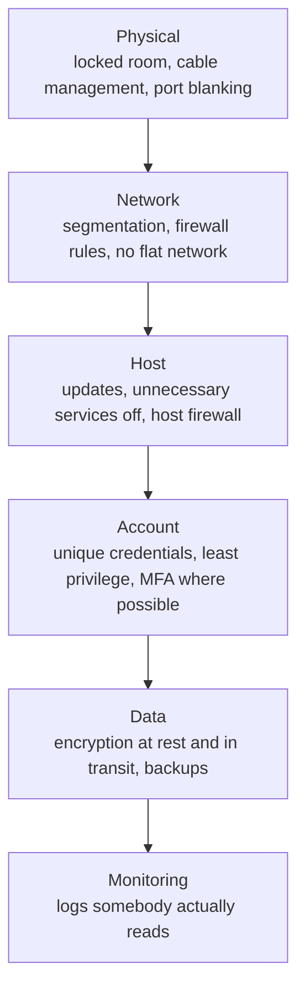

When the network from [[Design and Test a Network]] was handed over, one
group's write-up said "the network is secure". Asked *against what*, they
could not answer, and that is the honest beginning of this topic. Secure
is not a property a system has. It is a claim about which attacks, by
whom, with what access, a design is expected to survive — and every such
claim has an edge past which it is no longer true.

## Threat modelling fits on one page

Before you can defend anything, write down four things.

1. **What is worth protecting?** Marks and student records, the firmware
   on a device, network access itself, the availability of a machine
   somebody depends on. Not everything is equally valuable.
2. **Who might want it, and what can they already do?** A curious
   classmate on the same network is a different adversary from somebody
   with a screwdriver and ten minutes alone with the device.
3. **What would going wrong look like?** Data read, data changed, service
   stopped, identity impersonated. These need different defences.
4. **What are you accepting?** Every design accepts some risk. The
   professional act is naming it, not eliminating it.

That page is short, it is not technical, and it is the difference between
security engineering and buying padlocks at random.

## Defence in depth

No single control holds. Layer them, so that the failure of any one does
not hand over everything.

Read the layers downward and each one buys time and evidence for the
next. Segmentation means the compromise of one lab machine is not the
compromise of the servers. Least privilege means an account that is taken
over cannot do everything. Backups mean the answer to "our files are
encrypted by someone else" is a bad afternoon rather than a catastrophe —
provided the backups are tested, kept in more than one place, and at
least one copy is offline, because a backup an attacker can reach is a
backup an attacker can delete.

## The boring controls that do most of the work

There is no glamour in this list and it prevents more real trouble than
anything clever.

- **Change every default credential** before a device is connected to
  anything. Published default passwords are the single most reliable way
  into small networked devices.
- **Keep firmware and software updated**, and know how you will do it in
  a year — a device with no update path is a device with a shelf life.
- **Least privilege, on every account and every folder.** Administrator
  rights for administration only; per-folder permissions that reflect who
  genuinely needs access. This is exactly the file and folder permission
  work in [[A2.1|the permissions expectation]], applied with intent
  rather than as a menu exercise.
- **Turn off what you are not using.** Every running service is a way in.
  A network share nobody needed and nobody watched is the classic.
- **Encrypt in transit and at rest**, and know which one you have.
  Encryption at rest protects a stolen drive; it does nothing about a
  logged-in machine.
- **Long, unique passphrases and a password manager**, plus multi-factor
  authentication wherever it is offered. Multi-factor is the single
  highest-value control available to a school-sized network.
- **Log, and then read the logs.** Evidence collected and never examined
  has cost you disk space and bought you nothing.
- **Write it down.** An acceptable-use policy that names what is
  permitted, who owns what, and what happens when the rules are broken is
  part of the security design, not paperwork beside it — see
  [[D2.1|the acceptable-use expectation]] and the argument in
  [[Security Is a Trade-Off]].

## The honest limits

Three of these will be on the design review, and pretending otherwise is
how student security work goes wrong.

**Physical access usually wins.** Someone alone with your device, with
time and tools, can generally reach the storage, the debug port, or the
memory. You can raise the cost — enclosures, tamper-evident seals,
encrypted storage, disabling debug interfaces on a production build — but
"raise the cost" is the honest verb, not "prevent".

**Obscurity is not a control.** A hidden network name, a nonstandard
port, or a secret you keep in the source code buys you nothing against
anybody who looks. Design as though the attacker has read your
documentation, because eventually one will.

**Security trades against usability, cost, and function**, always. A
password policy so harsh that people write passwords on monitors has made
the system less secure. Say what you traded and why; a design review will
respect a stated trade-off and will not respect a claim of perfection.

Finally, security is a maintenance activity, not a build activity. The
network that was well configured a year ago is running unpatched
software within months unless somebody owns the job — which is why
[[B4.2|maintaining and checking a network's security]] is written as
ongoing work in the curriculum, and why your handover documentation has
to name who does it and how often. Take the arguments about who gets to
decide any of this to [[Who Owns the Firmware]], and bring the
threat-model page itself to [[The Engineering Design Project]]; a device
with a network connection and no threat model is not finished. The
address plan and the isolation rules it depends on get drilled in
[[Network Design Practice]], where the last question is a security
argument dressed as a network one.

%%curriculum-start%%
## Curriculum connection

![[A2.1]]

![[B4.2]]

![[D2.1]]

![[D2.3]]
%%curriculum-end%%
