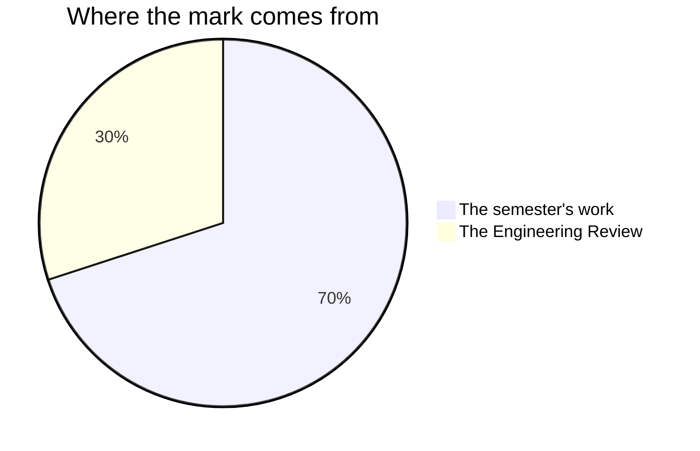

Marks in this course worry people for one wrong reason: a belief that
some people are "good with their hands" and everyone else should stay
back from the bench. No such division exists, and after two years in
this room you have the evidence in your own journal. Measuring,
calculating, specifying, and diagnosing are learned skills, every one
of them, and what is marked is the work they produce.

## The seventy and the thirty

Every Grade 12 credit in Ontario is built the same way. Seventy per cent of
your mark comes from work spread across the whole semester, and it leans
towards your **most recent and most consistent** work rather than averaging
the start of the course against the end of it — which matters in a course
where almost everybody is visibly better at the end of the course than they
were at the start of the course. The other thirty per cent comes from one
final evaluation at the end.

**The seventy** is everything you hand in between the first class and the
last build day. In the order you meet them: your ten
[[The Bench Record|bench records]], one for each lab;
[[The Specification]] in Unit 1; [[The Interface]] in Unit 2;
[[The Control System]] in Unit 3; [[The Deployment]] and then
[[The Engineering Design Project]] in Unit 4; and your [[Tech Journal]],
collected at the end of Units 1, 2 and 3.

They are not equally weighted. The capstone is worth several of the
smaller pieces on its own, because it runs longest and asks for
everything at once, and the four unit tasks are the rehearsals that
make it possible. The exact split is not a secret — ask me for it
whenever you like. It is simply not the useful thing to memorise, and
printing it to the nearest per cent would present my professional
judgement as arithmetic.

**The thirty** is [[The Engineering Review]], the last class of the
course. You demonstrate the device you built, answer three published
questions about it — two about the design and one about what the thing
costs the world it goes into — critique three other projects in
writing, and hand in your journal with [[Final Reflection]] attached,
and your handover package with its career and work-habit note at the
front. It is deliberately not a fifth unit
test: the questions reach back across the whole semester, which is why
you have had them since Unit 4 began.

Each of the five tasks that runs across several periods — the four unit
tasks and the capstone — has a point before hand-in where you get
feedback rather than a mark, and a named slot afterwards for acting on
what it found. On four of them that slot is the first job of the next
period; on [[The Specification]] it is a whole revision period. Either
way it is written on the class page, so you can see it coming.

## Four kinds of thinking, not one

Every task asks for more than one of these, and the balance shifts with
the task.

| What is judged | What it means at this bench |
| --- | --- |
| What you know | The parts, the laws, the protocols, the standards, and what a datasheet figure actually promises |
| How you think | Choosing between two designs, finding the fault nobody else located, deciding what to cut and when |
| How you communicate | A schematic that matches the board, a log somebody can follow, an answer to a hard question |
| Where you apply it | Making it work in conditions nobody rehearsed with you |

The balance in *this* course leans towards the last two, because the
curriculum it is built from mostly asks you to design, build, test and
hand over rather than to recite. That is also why the capstone is a
problem you found rather than one I set: applying what you know in a
situation nobody walked you through is the hardest of the four, and the
only place it can be seen is somewhere unrehearsed.

## Three kinds of evidence, and two of them are not paper

**What you make** is the obvious one: records, traces, logs, code,
documentation. **What I watch you do** is the second — whether the
predicted column is written before the supply comes on, whether a fault
is halved or guessed at, whether the current limit is set before the
leads go on. **What you tell me** is the third: the bench-side
questions while you work, the feedback checkpoint before each of those
five tasks is collected, the design review, and the defence at the end.

The last two are not a softer substitute for the first. Some of what
you understand will only ever appear there — and if your build is
unfinished on the day, the conversation is often the strongest evidence
in the room. That is not a consolation. It is how the mark is meant to
work.

## What is not in your mark

**How you work** is reported separately, on the same report card, as
**E, G, S or N** — responsibility, organization, independent work,
collaboration, initiative, and self-regulation. They matter, we will
talk about them, and they do not move your percentage. The mark is
about the work; that column is about the worker, and mixing the two
tells you less about both.

There is one exception, and it is written into the curriculum rather
than invented here. Two expectations in this course are themselves
about habits: [[D3.4|the work habits this industry runs on]] and
[[D3.3|the essential skills it expects]], both as the Ontario Skills
Passport names them. Where [[The Engineering Review]] marks those, it
marks what they produced — a handover package that was complete when
the period began, a critique specific enough to act on, the career and
work-habit note at the front of your package — never how hard somebody
appeared to be trying.

**Your own judgement, and your bench partner's, are not part of your
mark either.** You will judge your own work often, because
[[Judging Your Own Work]] is the cheapest way there is to raise a mark
before it is given. The determination is still mine, from evidence.
The same goes for the bench checks you mark yourself in Units 1, 2 and
3: they exist so you know what to practise, and I never see a score
from one.

**Practice between classes is practice.** Nothing on a "things to do
before our next class" list carries a mark of its own. It is
preparation — the marks live in each task's own criteria, and a journal
prompt in that list is a question to bring to your next entry rather
than something I read. The [[Tech Journal]] entries I do read for a
mark are the ones written in class: at tools-away on a bench day, and
at the unit collections. Every task in the seventy is given real
periods to be built in, because work that carries a mark belongs where
I can watch it happen and where nobody's mark turns on what they have
at home.

**Shared benches, individual marks.** [[The Interface]] and
[[The Control System]] are done in pairs, [[The Deployment]] at a bench
of two or three, and a capstone may be built in a pair. Each of those
pages names exactly which piece of the evidence is yours and marked as
yours. Nobody in this course receives a mark for work somebody else
did, in either direction.

> [!important] Broken circuits are never penalised as broken
> Version one of everything smokes, blinks wrongly, or does nothing at
> all. The mark follows where your work ends up and how visibly you got
> there — your journal, your documentation, and your measurements are
> how "visibly" happens. A design that never fully worked, honestly
> diagnosed, properly documented, and defended with real numbers can
> score higher than one that worked immediately and was never
> understood.

> [!tip] The capstone is not marked on ambition
> A modest device that is specified, measured, documented, and
> defended will beat an ambitious one held together by luck and
> optimism every single time. Choose a project you can finish and then
> make the engineering deep rather than the feature list long. That
> advice arrives in this folder because by the time it arrives in
> [[The Engineering Design Project]] you will have already chosen.

If a mark ever surprises you, ask. The criteria on each task page are
the whole story, and [[Getting Help]] lists every way to reach me.
