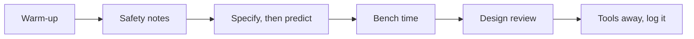

This course is a shop with instruments in it, and most days you will
have hardware in your hands. The bench-first rhythm has not changed
since Grade 10: you meet a phenomenon before anybody names it. What has
changed is what happens at either end of bench time. Before it, you now
write down what the thing has to do. After it, somebody else asks you
why you did it that way.

## Warm-up

Five minutes at the door: [[Name That Part]], [[Read the Waveform]],
[[Read the Schematic]], or [[Spot the Hazard]] on the projector. Small
daily reps compound, and none of them needs the benches powered.

## Safety notes

Every lab opens with its own specific hazards, read together.
[[Safety in the Lab]] is the standing agreement; the thirty seconds of
walkthrough at the start of each lab is what keeps bench time generous,
because a shop that has to stop is a shop that gets less time at the
bench.

## Specify, then predict

The Grade 12 addition, and it takes about four minutes. Before anything
is built, each bench writes down two things:

1. **What it has to do**, as something testable. Not "the motor should
   go" — "holds the setpoint within ±2 °C, from a 12 V supply, drawing
   under 500 mA average". That is a specification, and
   [[Writing a Specification]] is where it gets rigorous.
2. **What you expect to measure**, with units and conditions, exactly
   as [[Predict the Circuit]] has been drilling for two years.

Predictions and specifications are collected before they can be
revised. A design that met a requirement you wrote after seeing the
result has not met anything.

## Bench time

The heart of class: a [[Labs/index|lab]] in pairs or threes, hands on
real hardware and real instruments. Roles rotate — hands, instrument,
recorder — so that nobody spends the semester holding the same tool.
The recorder's job is real and it is bigger this year: units,
conditions, the supply setting, the scale settings on any trace, and
the decisions the bench made along the way. That table belongs to the
bench and everybody copies it; the rest of
[[The Bench Record|your bench record]] you write yourself, in your own
words, and it goes in when the bench is reset.

## Design review

This replaces the "compare and name it" round from Grade 11, and it is
the single biggest change in how this room works.

Benches present to benches. Ten minutes, no slides. You state what your
thing has to do, what you built, what you measured, and — the part that
matters — **one decision and the alternative you rejected**. The
audience's job is to ask real questions: what happens when that part
fails, what conditions did you measure under, why that margin, what
would you change with another week.

Two rules make it work, and they come straight from
[[Our Classroom Norms]]. Critique the design, never the designer. And
every criticism names the requirement it comes from — "that will not
meet the 500 mA budget" is a review comment; "I would have done it
differently" is not.

A disagreement between two benches is still the most productive event
that can happen in this room, and it is still always worth ten minutes
to chase down with an instrument.

## Tools away, log it

The bench is reset — supplies off and turned down, outputs off, meters
back on the voltage jacks, probes coiled, components bagged, straps
hung. The last minutes belong to your [[Tech Journal]]: what you built,
what you predicted, what the instrument said, what fought back, what
you learned, and what you decided.

> [!tip] If you were away
> Check the class page in [[All Classes/index|All Classes]] first. Most
> labs can be caught up at lunch — times are on [[Help Sessions]] — and
> the [[Concepts/index|concept pages]] hold what the bench taught
> everybody else. Do not skip the measurements and read the
> conclusions; the numbers are the lesson, and this year the decisions
> are too.
