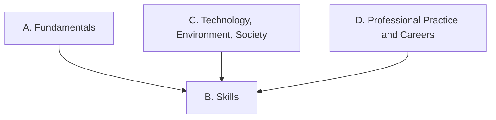

Everything we do in this newsroom points at one or more of these
expectations, from **TGJ2O — Communications Technology, Grade 10,
Open**. Lesson pages link here so you can always see *why* we are
doing something.

> [!info] Where these come from
> The wording below is the Ontario curriculum's own. See
> [[About These Expectations]] — including an important note about
> this course's status.

## Strand A. Communications Technology Fundamentals
*By the end of this course, students will:*

![[A1. Core Concepts, Techniques, and Skills]]
![[A1.1]]
![[A1.2]]
![[A1.3]]
![[A1.4]]
![[A1.5]]

![[A2. Technical Terminology and Scientific and Mathematical Concepts]]
![[A2.1]]
![[A2.2]]
![[A2.3]]

![[A3. Teamwork]]
![[A3.1]]
![[A3.2]]
![[A3.3]]

## Strand B. Communications Technology Skills
*By the end of this course, students will:*

![[B1. Project Management]]
![[B1.1]]
![[B1.2]]

![[B2. Problem Solving]]
![[B2.1]]
![[B2.2]]
![[B2.3]]
![[B2.4]]
![[B2.5]]
![[B2.6]]

![[B3. Process and Production Skills]]
![[B3.1]]
![[B3.2]]

## Strand C. Technology, the Environment, and Society
*By the end of this course, students will:*

![[C1. Technology and the Environment]]
![[C1.1]]
![[C1.2]]

![[C2. Technology and Society]]
![[C2.1]]
![[C2.2]]
![[C2.3]]
![[C2.4]]
![[C2.5]]

## Strand D. Professional Practice and Career Opportunities
*By the end of this course, students will:*

![[D1. Health and Safety]]
![[D1.1]]
![[D1.2]]

![[D2. Career Opportunities]]
![[D2.1]]
![[D2.2]]
![[D2.3]]
![[D2.4]]
![[D2.5]]
