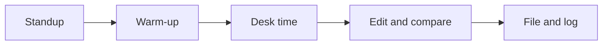

This class is a newsroom, and you are its founding team. We cover real
stories — investigations in our community, our school's athletics — and
we publish what we make: on the site, on social media, in print, and on
our news program. The routines below are how newsrooms everywhere turn
a room of people into a publication.

## Standup

Two minutes, everyone: what are you working on, what do you need, what
is blocking you. Real newsrooms open this way because a team that knows
what everyone is chasing never chases the same thing twice.

## Warm-up

Five minutes of reps — [[Caption This]], [[Headline Help Desk]], a
[[News or Not]] round. Small daily judgement calls compound into news
sense.

## Desk time

The heart of class: reporting, shooting, recording, writing, editing —
often at a [[Studio/index|studio session]] where you make the thing
BEFORE the principle gets its name. You will shoot a five-shot sequence
before any lesson names coverage; you will fix a buried lede before
anyone says "inverted pyramid".

## Edit and compare

Work goes up on the screen — drafts, contact sheets, cuts — and the
room edits together: what works, what would make it stronger, what
questions a reader would still have. Editing someone's work is a
service; receiving edits without flinching is a professional skill,
practised here daily under [[Our Newsroom Standards]].

## File and log

Work is filed properly ([[Filing a Story]] is the workflow) and the
last minutes belong to your [[Newsroom Journal]]: what you covered,
what you learned, what you would chase next. Every reporter keeps one
in some form; yours starts now.

> [!tip] If you were away
> Check the class page in All Classes, then check the assignment desk —
> your team may have filed while you were out, and the fastest way back
> in is asking your editor what needs doing.

%%curriculum-start%%
## Curriculum connection

![[D1.1]]

![[D2.4]]

![[A3.1]]
%%curriculum-end%%
