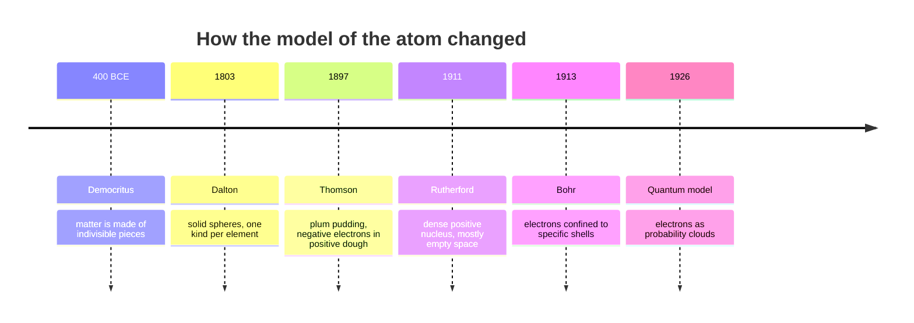

## The idea

The model of the atom changed five times in a century, and every change was
forced by an **experiment** that the old model could not explain. This is the
best story in chemistry for showing how science actually works.

## The experiment that broke each model

| Model | Killed by | What was seen |
| --- | --- | --- |
| Dalton's solid sphere | Thomson's cathode ray tube | Something *smaller* than an atom, and negative |
| Thomson's plum pudding | Rutherford's gold foil | A few alpha particles bounced almost straight back |
| Rutherford's nucleus | Atomic emission spectra | Elements emit only specific colours, not a smear |

> [!important] Rutherford's own words, roughly
> He described the gold foil result as being about as believable as firing a
> naval shell at tissue paper and having it come back at you. If the atom were
> uniform dough, that could not happen. Something tiny, dense, and positive had
> to be in there.

## The lesson to take

A model is not "the truth". It is the simplest thing that explains every
observation so far. When an observation does not fit, the model changes — not
the observation.

## Curriculum connection

![[C2.2]]
