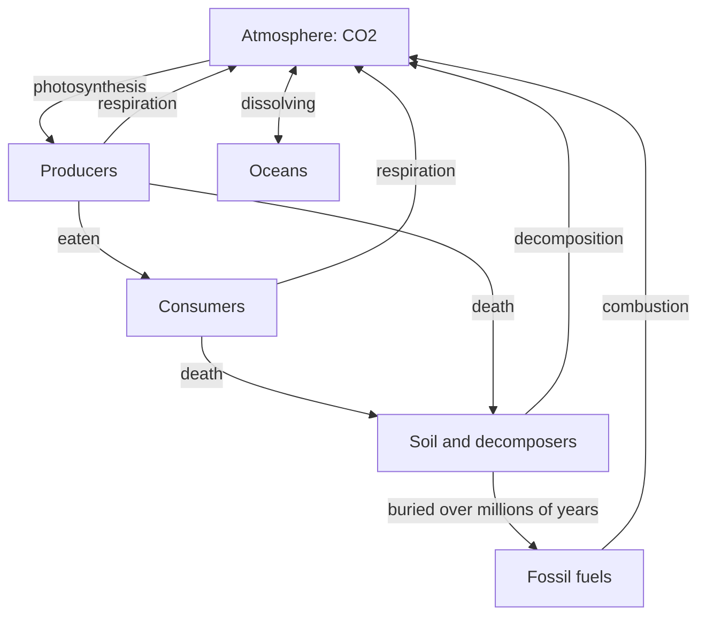

## The idea

Carbon atoms move between the atmosphere, living things, the oceans, soil, and
rock. Not one atom is created or destroyed — the same carbon has been through
countless organisms before you.

## The slow loop and the fast loop

Two paths matter here, and they run at wildly different speeds:

- **The fast loop** — photosynthesis, respiration, decomposition. Days to
  decades. Balanced for most of human history.
- **The slow loop** — burial into fossil fuels and weathering back out.
  *Millions* of years.

Burning fossil fuels takes carbon out of the slow loop and injects it into the
fast one. That is climate change in a sentence.

> [!question] Something to sit with
> The carbon dioxide released by a car this afternoon may spend the next century
> in the atmosphere. Which of the arrows above decides how long it stays?

## Curriculum connection

![[B2.2]]

![[B2.6]]
