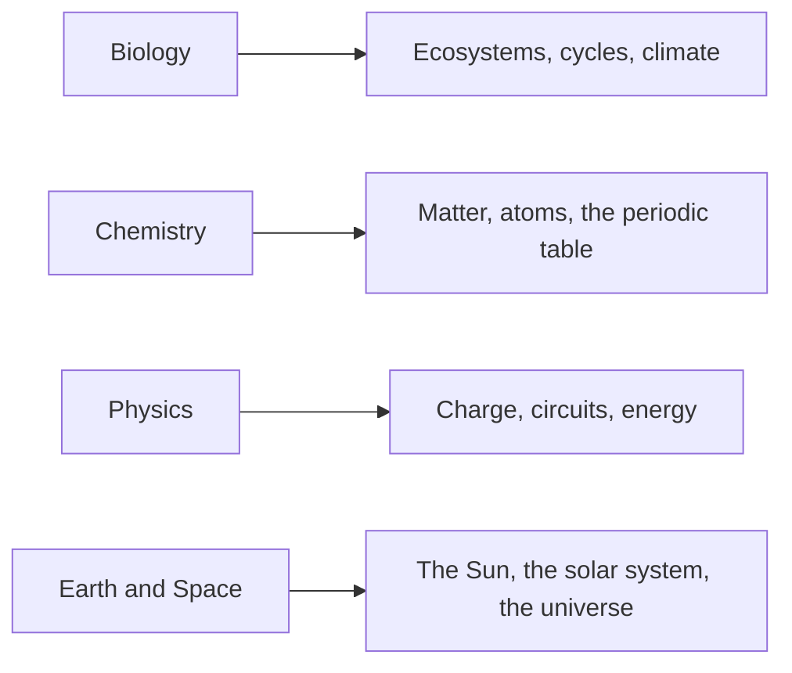

When we meet an idea for the first time, the explanation lands here — and stays
here. Class pages link to these; these do not go stale.

Start here when you are studying, when you missed a class, or when a lab makes
no sense.

Here is everything that lives in this folder, in the order we meet it.

**Biology**

- [[Biotic and Abiotic Factors]]
- [[Ecosystems and Sustainability]]
- [[Food Webs and Trophic Levels]]
- [[Energy Flow in Ecosystems]]
- [[Photosynthesis]]
- [[Cellular Respiration]]
- [[The Carbon Cycle]]
- [[The Nitrogen Cycle]]
- [[The Water Cycle]]
- [[Biodiversity]]
- [[Ecological Succession]]
- [[The Greenhouse Effect]]
- [[Indicators of Climate Change]]

**Chemistry**

- [[WHMIS and Lab Safety]]
- [[The Particle Theory of Matter]]
- [[Physical and Chemical Properties]]
- [[Physical and Chemical Changes]]
- [[Atomic Models Through Time]]
- [[The Bohr-Rutherford Model]]
- [[The Periodic Table]]
- [[Ions and Ionic Compounds]]
- [[Molecular Compounds]]

**Physics**

- [[Static Electricity]]
- [[Current Electricity]]
- [[Circuit Components and Symbols]]
- [[Ohm's Law]]
- [[Series and Parallel Circuits]]
- [[Electrical Power and Efficiency]]
- [[Where Our Electricity Comes From]]

**Earth and Space**

- [[The Sun]]
- [[The Solar System]]
- [[Astronomical Phenomena]]
- [[Distances in Space]]
- [[The Origin of the Universe]]
- [[Technology From Space Exploration]]

> [!tip] Use the backlinks
> At the bottom of each concept page is a list of every class and lab that used
> it. That is the fastest way to find *when* we did something.
