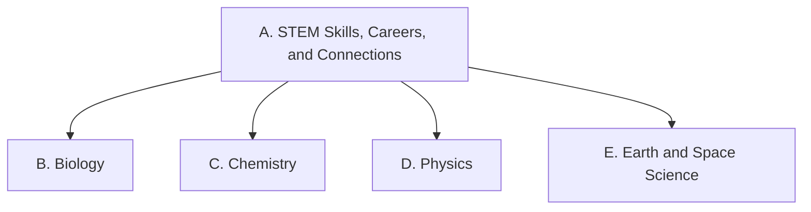

Everything we do in this course points at one or more of these expectations,
from **SNC1W — Science, Grade 9, De-streamed**. Lesson pages link here so you
can always see *why* we are doing something.

> [!info] Where these come from
> The wording below is the Ontario curriculum's own. See
> [[About These Expectations]].

Strand A runs through all of the others: you practise those skills while
learning biology, chemistry, physics, and Earth and space science.

## Overall and specific expectations

### Strand A. STEM Skills, Careers, and Connections
*Throughout this course, in connection with the learning in the other strands, students will:*

![[A1. STEM Investigation Skills]]
![[A1.1]]
![[A1.2]]
![[A1.3]]
![[A1.4]]
![[A1.5]]

![[A2. Applications, Careers, and Connections]]
![[A2.1]]
![[A2.2]]
![[A2.3]]
![[A2.4]]
![[A2.5]]

### Strand B. Biology — Sustainable Ecosystems and Climate Change
*By the end of this course, students will:*

![[B1. Relating Science to Our Changing World]]
![[B1.1]]
![[B1.2]]
![[B1.3]]

![[B2. Investigating and Understanding Concepts]]
![[B2.1]]
![[B2.2]]
![[B2.3]]
![[B2.4]]
![[B2.5]]
![[B2.6]]
![[B2.7]]

### Strand C. Chemistry — The Nature of Matter
*By the end of this course, students will:*

![[C1. Relating Science to Our Changing World]]
![[C1.1]]
![[C1.2]]

![[C2. Investigating and Understanding Concepts]]
![[C2.1]]
![[C2.2]]
![[C2.3]]
![[C2.4]]
![[C2.5]]
![[C2.6]]
![[C2.7]]

### Strand D. Physics — Principles and Applications of Electricity
*By the end of this course, students will:*

![[D1. Relating Science to Our Changing World]]
![[D1.1]]
![[D1.2]]
![[D1.3]]
![[D1.4]]

![[D2. Investigating and Understanding Concepts]]
![[D2.1]]
![[D2.2]]
![[D2.3]]
![[D2.4]]
![[D2.5]]
![[D2.6]]
![[D2.7]]
![[D2.8]]

### Strand E. Earth and Space Science — Space Exploration
*By the end of this course, students will:*

![[E1. Relating Science to Our Changing World]]
![[E1.1]]
![[E1.2]]
![[E1.3]]

![[E2. Investigating and Understanding Concepts]]
![[E2.1]]
![[E2.2]]
![[E2.3]]
![[E2.4]]
![[E2.5]]
![[E2.6]]
