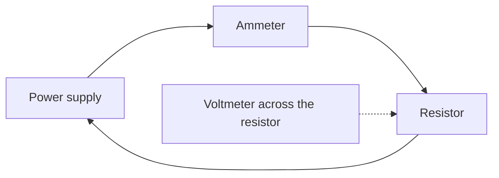

## Purpose

Determine the relationship between potential difference and current for a
resistor, and find its resistance from your own data.

> [!danger] Safety
> Low-voltage supplies only. Ammeter **in series**, voltmeter **in parallel** —
> get this backwards and you will short the supply. Have me check the circuit
> before you switch on.

## Materials

- Variable DC supply (0–12 V), known resistor, ammeter, voltmeter, leads

## Procedure

1. Build the circuit below. Have it checked.
2. Set the supply to 2.0 V. Record both meter readings.
3. Increase in 2.0 V steps to 10.0 V, recording each time.
4. Switch off between readings so the resistor does not heat up.

## Data

| $V$ (V) | $I$ (A) | $\frac{V}{I}$ ($\Omega$) |
| --- | --- | --- |
| 2.0 | | |
| 4.0 | | |
| 6.0 | | |
| 8.0 | | |
| 10.0 | | |

## Analysis

1. Plot $V$ (vertical) against $I$ (horizontal). Draw a best-fit line.
2. Calculate the slope. What quantity is it, and what are its units?
3. Compare the slope with the resistor's marked value. Give the percent
   difference:

$$\text{percent difference} = \frac{|\text{measured} - \text{marked}|}{\text{marked}} \times 100\%$$

4. Should your line pass through the origin? What would a non-zero intercept
   mean?

> [!tip] Do not force it through zero
> Draw the line your data actually supports. Explaining an unexpected intercept
> is worth more marks than hiding it.

## Hand in

- [ ] Data table with all three columns
- [ ] Graph with best-fit line and slope calculation shown
- [ ] Analysis answers

## Curriculum connection

![[D2.4]]

![[A1.2]]
