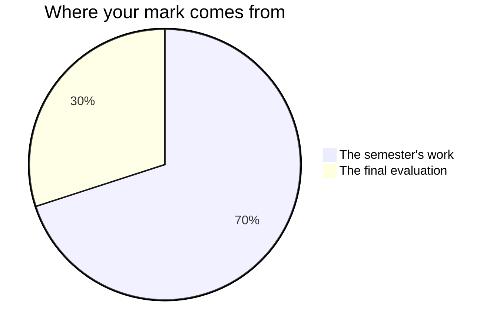

Nothing on this page is a secret and none of it is decided at the end. Every
task tells you what it is looking for before you start; this page tells you
how the pieces add up.

## The seventy and the thirty

Every Grade 9 credit in Ontario is built the same way. **Seventy per cent** of
your mark comes from work spread across the whole semester — and it is not an
average of September against January. It leans towards your **most recent**
work, and towards the level you reach **most consistently**, because what you
can do in January is the better answer to the question the report card is
actually asking.

**Thirty per cent** comes from a final evaluation at the very end: the
[[Final Examination]], your [[Culminating Reflection]], and your
[[Final Portfolio]]. Three different rooms and three different kinds of
thinking, deliberately, so that one difficult afternoon does not decide this
on its own.

The seventy is the seven marked [[Lab Reports]]; your three
[[Science in the News]] submissions; [[Coding a Scientific Model]];
[[Climate Change Action Plan]]; [[Product Life Cycle Analysis]];
[[Design Challenge]]; [[Space Mission Proposal]]; and the [[Unit 2 Test]].
They are not equally weighted — the four big tasks are each worth several of the
smaller pieces, because they run for a week or more and ask for everything at
once. Ask me for the exact split whenever you want it. It is not a secret; it
is just not the useful thing to memorise.

The lab reports matter more than their size suggests. Seven pieces arriving
steadily from September to January are what let a mark describe your most
recent and most consistent work rather than four busy weeks.

## Four kinds of thinking, not one

Every task asks for more than one of these, and the balance shifts with the
task.

| What is being judged | What that means in science |
| --- | --- |
| What you know | Terminology, the models, what the periodic table tells you |
| How you think | Designing a fair test, reading data, spotting the result that cannot be right |
| How you communicate | Reports, graphs, circuit diagrams, and what you say about them |
| Where you apply it | Using all of it on a situation nobody walked you through |

> [!question] Why does a lab count as thinking rather than recall?
> Because following a procedure is not the skill. Deciding what to measure,
> noticing when a result is suspicious, and judging what your data can
> actually support — that is thinking, and that is where the marks in a
> report are.

The last row is why the tasks get harder to predict as the course goes on.
Anyone can repeat an investigation they were shown. The course is asking
whether you can take the method to a product nobody has traced, a device
nobody has built, or a mission nobody has flown.

## Three kinds of evidence, and two of them are not paper

**What you make** is the obvious one: reports, plans, a working program, a
working device, an examination paper. **What I watch you do** is the second:
how you set up a circuit, whether you change one thing at a time, whether
the goggles are on before the bottle is opened. **What you tell me** is the
third — the conference partway through each of the big tasks is not a
progress check, it is evidence in its own right, and some of what you
understand will only ever show up there.

If your report is unfinished but your bench work was careful and you can
explain what your numbers mean, the watching and the conversation are where
the strongest evidence of that day comes from. That is not a consolation
prize. It is how the mark is meant to work.

## Feedback, and where it lands

Each of the four big tasks — [[Climate Change Action Plan]],
[[Product Life Cycle Analysis]], [[Design Challenge]] and
[[Space Mission Proposal]] — gets a conference with me partway through, and
at least one full working period afterwards that begins from what we said.
That is the point of the conference. Feedback you have no time to use is just
a mark arriving early.

The unit checkpoints are different: you mark those yourself, they count for
nothing, and the class after each one starts with the revision list you
wrote.

## What is not in your mark

How you work is reported separately on the same report card, as **E, G, S or
N**, across six habits: responsibility, organization, independent work,
collaboration, initiative, and self-regulation. They matter, we will talk
about them, and they do not move your percentage. Your mark is about the
work; that column is about the worker, and mixing the two tells you less
about both.

The one exception is where the curriculum itself names the habit. Working
safely at a bench is [[A1.5|an expectation of this course]] — written into it
as something you must be able to do — so it is marked like anything else in
the curriculum. [[Lab Reports]] says exactly what that looks like. That is
the only place a habit touches your percentage.

The mark you would give yourself is not part of your percentage, and neither
is a mark a classmate would give you. Judging your work well is a different
thing, and that does count: your [[Final Portfolio]] asks you to do it in
writing, and the writing is marked as writing. The private version — see
[[Judging Your Own Work]] — costs you nothing at all, which is exactly what
makes it worth doing honestly. When the class trades drafts,
challenges each other's numbers, or votes on which mission it would fund,
that is for learning. The mark is mine to determine, from evidence.

Practice between classes is practice. The checklist at the bottom of every
class page is how you get ready for the next period, and none of it is
marked — though it will sometimes remind you that something we spent class
time on is due.

Every marked piece in this course gets real working periods with me in the
room, because that is where the work is meant to happen. The seven lab
reports and the three news submissions are written here from start to
finish, and each of the big tasks gets three or four periods. What is left
for home is finishing and tidying — plus finding your
[[Science in the News]] article, which is the one job that is genuinely
yours. Nobody should be building any of this from scratch at a kitchen
table; if that is what is happening, tell me.

## Group work

Some tasks are built in pairs or threes, because that is how the work is
really done. In every one of them there is a named piece that is yours
alone, and it is that piece I mark: your own design log, your own section of
a proposal, your own analysis of shared data. Nobody in this course receives
a mark for standing next to somebody who did the work.

## Late work

Talk to me **before** the due date and we will make a plan. After the fact is
much harder for both of us.
